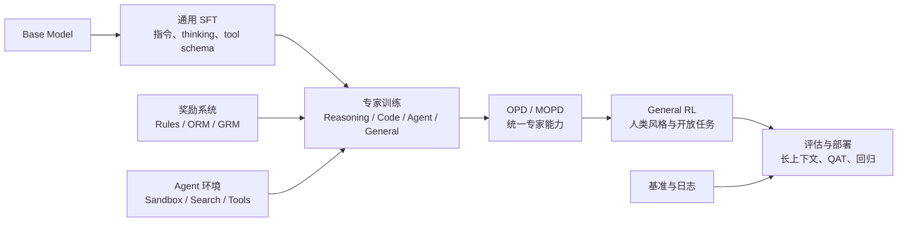

# LLM Post-Training Cookbook

<div class="hero-panel">

**一份面向中文读者的大模型后训练教程。**

这套教程从零解释 LLM Post-Training 的核心问题：怎样把一个“会续写文本”的基础模型，训练成能遵循指令、会推理、会调用工具、能在复杂任务和长程 agent 工作流中稳定行动的模型。

你会依次学到现代后训练流水线、SFT、Reasoning RL、Agentic RL、RLVR、RLHF、DPO、GRPO、OPD/MOPD、SDFT、LoRA、评估与部署。教程的实战主线以 `Qwen/Qwen3-4B-Base` 为起点，用本地 `verl-main` 作为训练框架，给出数据样式、配置参数、训练命令和调试方法。

**在线阅读：** [LLM Post-Training Cookbook](https://mssssss123.github.io/LLM-PostTrain-CookBook/)

</div>

## 这门课解决什么问题

很多人第一次接触 post-training 时，会同时被一堆缩写砸中：SFT、RM、PPO、GRPO、RLHF、DPO、ORPO、KTO、OPD、SDFT、LoRA、Eval。真正困难的不是记住名词，而是理解它们在一条训练流水线里的位置。

这份教程用一个主线串起来：



读完之后，你应该能回答这些问题：

- 什么时候该用 SFT，什么时候该用 DPO，什么时候必须上 RL？
- 为什么 RL 训练里要关心 KL、advantage、group size 和 reward hacking？
- OPD，也就是 On-Policy Distillation，为什么和普通“拿教师答案做 SFT”不一样？
- Agentic RL 为什么已经成为现代模型的主线能力，而不只是工具调用格式训练？
- 多教师 OPD/MOPD 如何把数学、代码、agent、写作等专家能力合并成一个统一模型？
- 如何设计一个小实验，在不浪费算力的情况下验证训练思路？
- 如何用日志、checkpoint、benchmark 判断一次训练到底有没有成功？

## 推荐学习路径

<div class="lesson-grid">
  <div class="path-card">
    <strong>完全小白</strong>
    先读快速入门、全景、数据模板，再读 SFT。不要急着看 RL，先理解 token、mask 和 renderer。
  </div>
  <div class="path-card">
    <strong>想做推理模型</strong>
    重点读 RL 基础、GRPO/RLVR、评估、超参稳定性，再回头补偏好优化和 OPD。
  </div>
  <div class="path-card">
    <strong>想做产品微调</strong>
    重点读 SFT、偏好优化、SDFT、评估和部署。RL 不一定第一天就需要。
  </div>
</div>

## 课程章节

| 章节 | 主题 | 你会获得 |
|---|---|---|
| [快速入门](./docs/quick-start.md) | 10 分钟建立全局地图 | 各技术的用途、优先级和选择表 |
| [0. 现代后训练标准流水线](./docs/00-modern-pipeline.md) | 从 Base 到统一模型的现代顺序 | SFT、专家 RL、Agentic RL、OPD/MOPD、General RL 的完整主线 |
| [1. Post-Training 全景](./docs/01-overview.md) | 为什么预训练不等于产品能力 | 后训练目标、训练信号、常见流水线 |
| [2. 数据、模板与 Renderer](./docs/02-data-rendering.md) | 模型到底在看什么 token | chat template、mask、数据格式、静默错误 |
| [3. SFT](./docs/03-sft.md) | 监督微调的正确打开方式 | 数据质量、训练循环、过拟合 smoke test |
| [4. RL 基础](./docs/04-rl-foundations.md) | 把生成看成决策过程 | policy、reward、trajectory、KL、advantage |
| [5. GRPO 与 RLVR](./docs/05-grpo-rlvr.md) | 推理训练的主战场 | 可验证奖励、group-relative advantage、环境抽象 |
| [6. 偏好优化](./docs/06-preference-alignment.md) | 从“对错”到“更好” | RLHF、Reward Model、DPO、ORPO、SimPO、KTO |
| [7. 蒸馏与 OPD](./docs/07-distillation-opd.md) | 把教师能力迁移到学生 | off-policy、on-policy、SDFT、多教师 |
| [8. 工具、Agentic RL 与多轮环境](./docs/08-tools-multiturn-agent.md) | 训练能行动的模型 | tool-use RL、sandbox、搜索、代码 agent、agent swarm |
| [9. 评估体系](./docs/09-evaluation.md) | 训练前先定义成功 | benchmark、pass@k、在线评估、错误分析 |
| [10. LoRA 与超参](./docs/10-hyperparams-lora.md) | 让训练稳定可控 | LR、rank、batch、KL、长度、曲线解读 |
| [11. Checkpoint 与部署](./docs/11-checkpoints-deployment.md) | 从实验到可用模型 | 保存、恢复、导出、合并 LoRA、发布 |
| [12. 实验手册](./docs/12-experiment-playbook.md) | 一套可复用研究流程 | baseline、消融、复盘、故障排查 |
| [13. 从 Qwen3-4B-Base 出发](./docs/13-verl-qwen3-roadmap.md) | 一条可执行的 verl 路线 | Base -> SFT -> GRPO -> Agentic RL -> OPD 的实战顺序 |
| [14. 数据、Reward 与 parquet](./docs/14-verl-data-reward.md) | verl 训练数据格式 | SFT、RL、Agentic、偏好数据和 reward 函数 |
| [15. SFT 实战](./docs/15-verl-sft-qwen3.md) | 用 verl 激活 Qwen3-4B-Base | 数据准备、LoRA/FSDP 命令、loss 和 smoke test |
| [16. GRPO/RLVR 实战](./docs/16-verl-grpo-rlvr.md) | 用可验证奖励训练推理 | GSM8K parquet、GRPO 参数、reward/KL/长度诊断 |
| [17. OPD、偏好与 Agentic RL](./docs/17-verl-opd-agent-preference.md) | 现代复杂后训练 | 单教师 OPD、多教师 MOPD、GDPO、工具 agent loop |

## 开始阅读

先读 [10 分钟快速入门](./docs/quick-start.md)。如果你只想知道“我应该先训练什么”，直接看快速入门里的选择表。

## 本地预览

这个站点是一个静态 docsify 文档站。克隆仓库后，在仓库根目录启动一个静态文件服务即可预览：

```bash
python3 -m http.server 5173
```

然后打开：

```text
http://127.0.0.1:5173/
```

## GitHub Pages 部署

本站通过 GitHub Actions 发布到 GitHub Pages。每次向 `main` 分支推送后，`.github/workflows/pages.yml` 会上传仓库里的静态站点文件并部署到：

[https://mssssss123.github.io/LLM-PostTrain-CookBook/](https://mssssss123.github.io/LLM-PostTrain-CookBook/)
