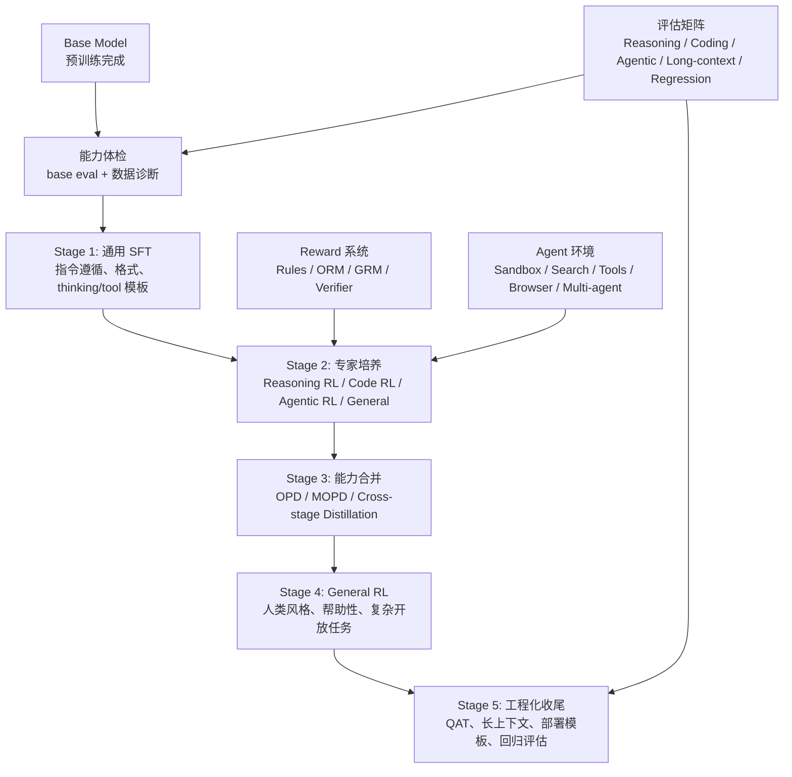
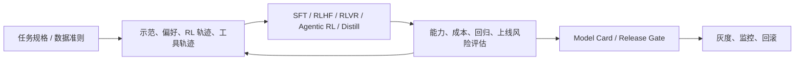
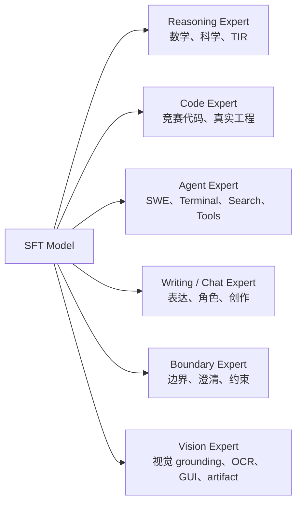
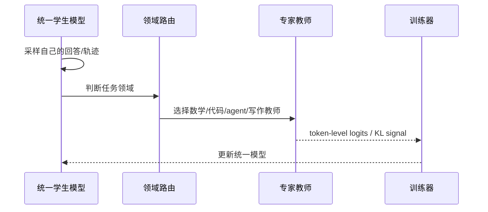

# 0. 现代后训练标准流水线

这章把 DeepSeek-V4、MiMo-V2-Flash、Kimi K2.5、GLM-5 这类新一代模型的 post-training 公开流程抽象成一条“从 base model 出发”的标准路线。不同团队细节不同，但总体结构正在收敛：



如果你只记一件事：现代后训练的核心不是单点算法，而是**多能力专家训练 + on-policy 能力合并 + 大规模 agentic 环境**。SFT、RLVR、DPO、OPD 都只是这条流水线中的工具，真正决定效果的是你怎样安排阶段、怎样构造数据和怎样评估回归。

## 为什么旧流水线不够了

早期 instruction model 的常见路线是：

```text
Base
-> SFT
-> Reward Model
-> PPO/RLHF
-> Eval
```

这条路线仍然有价值，但无法充分覆盖现代模型的目标。早期助手模型主要解决“会不会听指令、回答是否更符合人类偏好”；现代模型还要解决“会不会长链推理、会不会写代码、会不会在工具环境里行动、能否把多个专家能力合成一个统一模型”。

- 推理模型需要多档 thinking effort，而不是单一回答风格。
- Agent 模型需要在真实环境中读文件、改代码、搜索、执行、恢复错误。
- 多模态模型需要图文联合 RL 和视觉 verifier。
- 大模型往往有多个专家能力，顺序训练会产生“跷跷板”：数学涨了，写作掉了；agent 涨了，通用聊天变差。
- 部署端需要低延迟、低精度、长上下文、KV cache 复用，这些约束必须进入后训练。

DeepSeek-V4 把 post-training 概括为先训练多个领域专家，再通过 OPD 合并到统一模型；MiMo-V2-Flash 把这个思路扩展成 Multi-Teacher On-Policy Distillation；GLM-5 使用 Reasoning RL、Agentic RL、General RL 的顺序流程，并用 cross-stage distillation 缓解回归；Kimi K2.5 则把 agent swarm 和多模态/视觉 agentic RL 放到了核心位置。

## 工业界公开资料里的共同模式

如果把 DeepSeek、Qwen、Llama、OpenAI、Anthropic 等公开论文和工程文章放在一起看，工业界后训练大致有几条长期稳定的主线。这里安全只作为上线约束出现，不作为本教程主轴；主轴仍然是能力训练、数据闭环和工程化评估。

| 主线 | 公开做法 | 对教程的启发 |
|---|---|---|
| 冷启动 + RL | DeepSeek-R1 用少量 long-CoT cold start 提升可读性，再做 reasoning RL；Qwen3 用 Long-CoT cold start + Reasoning RL | SFT 负责把 base 拉到可训练状态，RL 负责让模型自己探索更强策略 |
| RL 生成数据再 SFT | DeepSeek-R1 在 reasoning RL 收敛后，用 rejection sampling 生成约 600k reasoning 数据，再混入通用 SFT；Qwen3 mode fusion 也用 RL 模型生成 thinking 数据 | 后训练不是线性一次过，而是“RL 探索 -> 过滤好轨迹 -> 再 SFT/蒸馏”的循环 |
| 大模型教小模型 | DeepSeek-R1 直接蒸馏到 Qwen/Llama 小模型；Qwen3 强调 strong-to-weak distillation，报告中说小模型蒸馏比完整四阶段训练更省 | 对 4B 教学模型，先学会用强教师蒸馏，往往比从零大规模 RL 更现实 |
| 偏好与产品体验 | InstructGPT/Llama 3 使用 SFT、偏好数据、reward model、DPO/RLHF 等迭代提升助手体验；Anthropic 公开经验强调 agent 要先用简单可测工作流 | 偏好优化放在能力训练之后，解决“更好用、更稳定、更符合场景”的问题 |
| 工具与 agent | Anthropic 把 workflow/agent 分开，强调简单可组合、工具接口清晰、环境反馈；OpenAI/Anthropic 都公开了工具、agent、eval 相关产品化接口 | Agentic RL 的核心不是 tool call 格式，而是环境、工具文档、transcript、成本和成功率 |

这些公开资料不会暴露全部生产细节，但足够说明一件事：顶级团队不是把某个 loss 跑大，而是在维护一套持续迭代系统。



配套代码：把工业流程缩小成一个阶段路由器。它不会替你训练模型，但会强迫每条数据、每个 checkpoint、每次评估都有明确归属。

```python
from dataclasses import dataclass


@dataclass
class TrainingSignal:
    name: str
    method: str
    data_key: str
    eval_key: str
    risk_key: str


STAGE_REGISTRY = {
    "instruction": TrainingSignal("instruction", "sft", "messages", "ifeval", "format_regression"),
    "preference": TrainingSignal("preference", "dpo_or_rlhf", "chosen_rejected", "pairwise_win", "over_refusal"),
    "reasoning": TrainingSignal("reasoning", "grpo_rlvr", "ground_truth", "math_code_pass", "length_hacking"),
    "agent": TrainingSignal("agent", "agentic_rl", "tool_trajectory", "task_success", "tool_misuse"),
    "release": TrainingSignal("release", "eval_gate", "risk_cases", "regression_eval", "deployment_risk"),
}


def choose_stage(example: dict) -> TrainingSignal:
    if example.get("agent_name"):
        return STAGE_REGISTRY["agent"]
    if example.get("reward_model", {}).get("ground_truth") is not None:
        return STAGE_REGISTRY["reasoning"]
    if "chosen" in example and "rejected" in example:
        return STAGE_REGISTRY["preference"]
    if example.get("release_gate_case"):
        return STAGE_REGISTRY["release"]
    return STAGE_REGISTRY["instruction"]
```

真实训练时，这个 registry 会落到数据字段、verl 配置、评估表和 model card。工业界公开资料里反复出现的 technical report、system/model card、benchmark matrix、release gate，本质上都是在防止训练阶段之间“说不清目标”和“没有可复现证据”。

## Stage 0：Base Model 体检

从 base model 开始，不要立刻 SFT。先做能力体检。

| 维度 | 看什么 |
|---|---|
| 通用知识 | MMLU、C-Eval、GPQA、SimpleQA |
| 数学推理 | GSM8K、MATH、AIME、HMMT |
| 代码 | HumanEval、MBPP、LiveCodeBench、BigCodeBench |
| Agentic | SWE-Bench、Terminal-Bench、BrowseComp、Tau2-Bench、MCP/Tool benchmarks |
| 长上下文 | LongBench、NIAH、MRCR、长文档问答 |
| 边界与风格 | 澄清、拒绝边界、幻觉率、过度拒绝率 |
| 模板遵循 | chat template、tool schema、thinking tags |

目的不是给 base model 排名，而是决定后训练预算放在哪里：base 已经很强的能力不要用低质量数据破坏；base 明显弱的能力需要 SFT 激活或专家 RL；base 在 agent 任务上不会行动，必须构建环境。没有这个体检，后面的训练就像闭着眼调参。

配套代码：一个最小 base eval runner 长这样。它不训练，只固定 prompt、采样参数和判分函数。

```python
from dataclasses import dataclass
from typing import Callable


@dataclass
class EvalExample:
    prompt: str
    answer: str
    task: str


def exact_match_score(pred: str, answer: str) -> float:
    return float(pred.strip() == answer.strip())


def run_base_eval(model, tokenizer, examples: list[EvalExample], scorer: Callable[[str, str], float]):
    rows = []
    for ex in examples:
        input_ids = tokenizer(ex.prompt, return_tensors="pt").input_ids.to(model.device)
        output_ids = model.generate(input_ids, max_new_tokens=512, temperature=0.0)
        pred = tokenizer.decode(output_ids[0, input_ids.shape[1] :], skip_special_tokens=True)
        score = scorer(pred, ex.answer)
        rows.append({"task": ex.task, "prompt": ex.prompt, "pred": pred, "answer": ex.answer, "score": score})
    return rows
```

这段代码对应后面 verl 训练里的 `data.val_files` 和 `trainer.test_freq`：训练前先定义同一套验证数据，训练中再反复跑它。

## Stage 1：通用 SFT 激活

现代 SFT 不只是“聊天问答”。它通常承担四个职责。你可以把这一阶段理解成“把 base model 拉到正确轨道上”，让后续 RL、偏好优化和蒸馏都有一个稳定起点。

1. **指令遵循**：让模型理解用户请求、system 约束、回答格式、多轮上下文。
2. **Thinking 模式**：学习 non-think、think、max-thinking、interleaved thinking、preserved thinking、turn-level thinking 等协议。
3. **Tool schema**：稳定 tool call block、参数 schema、tool observation、final answer 和 parse 失败恢复。
4. **初始 agent 轨迹**：包含代码 agent、搜索 agent、工具 agent、长上下文 agent 的高质量轨迹。

GLM-5 类流程还强调保留轨迹中的错误片段，但把错误动作 mask 掉，让模型学习如何纠错，而不是强化错误动作。

## Stage 2：专家培养

SFT 之后，不直接把所有目标混在一起 RL。现代流程更倾向训练多个专家。原因很简单：数学、代码、agent、写作的 reward、数据分布和失败模式都不同，强行混成一个训练目标会让信号互相干扰。



### Reasoning RL

目标是提升数学、科学、代码推理。常用 GRPO/PPO-like policy optimization、rule verifier、outcome reward model、difficulty filtering、rejection sampling、thinking length control 和 tool-integrated reasoning。

这类任务相对“非 agentic”：模型通常生成一个完整答案，环境判分。

### Agentic RL

Agentic RL 训练模型在环境中行动。典型环境包括代码仓库、终端、搜索、浏览器、GUI、MCP 工具和多 Agent 协作。训练信号来自最终任务结果，也来自中间工具执行、格式、成本、完成率和环境约束。

配套代码：专家训练阶段常常先按任务路由数据，而不是把所有样本混在一个 loss 里。

```python
def route_training_example(example: dict) -> str:
    ability = example.get("ability")
    data_source = example.get("data_source", "")
    if ability == "math" or "gsm8k" in data_source or "math" in data_source:
        return "reasoning_rl"
    if ability == "code" or "apps" in data_source:
        return "code_rl"
    if example.get("agent_name") is not None:
        return "agentic_rl"
    if ability == "boundary":
        return "boundary_alignment"
    return "general_sft_or_preference"


def build_mixture_batch(examples: list[dict]):
    buckets = {}
    for ex in examples:
        buckets.setdefault(route_training_example(ex), []).append(ex)
    return buckets
```

在 verl 的 MOPD/多数据训练里，类似的路由通常会落到 `data_source`、`ability`、`agent_name` 这些字段上。

## Stage 3：OPD / MOPD 能力合并

多个专家不能简单顺序训练到一个模型上。顺序训练常见问题是后训练覆盖前训练、专家风格冲突、agent 能力提升但通用聊天变差、旧的边界和格式习惯被新领域数据冲淡。

因此现代流程使用 OPD/MOPD：

1. 学生模型按当前策略生成轨迹。
2. 判断当前样本属于哪个领域。
3. 让对应专家教师给 token-level 分布信号。
4. 用 reverse KL 或等价 policy loss 更新学生。
5. 必要时混入 outcome reward advantage。



它的关键是 on-policy：学生在自己会到达的状态上学习教师，而不是只模仿离线数据。

配套代码：MOPD 的核心是“按样本 key 选教师”。

```python
class TeacherRouter:
    def __init__(self, teachers: dict[str, object], default_key: str = "general"):
        self.teachers = teachers
        self.default_key = default_key

    def select(self, example: dict):
        key = example.get("data_source", self.default_key)
        return self.teachers.get(key, self.teachers[self.default_key])


teachers = {
    "openai/gsm8k": "math_teacher",
    "code_dataset": "code_teacher",
    "agent_dataset": "agent_teacher",
    "general": "chat_teacher",
}
router = TeacherRouter(teachers)
teacher = router.select({"data_source": "openai/gsm8k"})
```

verl 里对应的是 `distillation.teacher_key=data_source` 和 `distillation.teacher_models.<name>.key`。如果数据的 `data_source` 写错，MOPD 会把样本送给错误教师。

## Stage 4：General RL 与人类风格对齐

专家合并后，还需要一个 general alignment 阶段。它处理开放式产品体验：指令遵循、事实正确、简洁自然、情绪智能、写作质量、角色扮演、翻译、多轮一致性和边界行为。

奖励系统通常是混合的：

| 奖励类型 | 优点 | 风险 |
|---|---|---|
| Rule-based reward | 精确、可解释 | 覆盖范围窄 |
| ORM | 低方差、训练效率高 | 容易 reward hacking |
| GRM | 能评价复杂开放任务 | 方差高、成本高 |
| Human anchors | 自然、人类风格强 | 贵、规模小 |

现代做法不是只选一个 reward，而是按任务组合。

## Stage 5：工程化收尾

前沿模型把部署约束也放进 post-training：

- QAT：让模型适应 INT4/FP4/FP8 等低精度部署。
- 长上下文训练：保证 128K、256K、1M context 下行为稳定。
- rollout 服务优化：异步 rollout、prefix cache、prefill/decode 分离、故障恢复。
- token budget RL：降低冗余 thinking token。
- quick instruction：把搜索触发、query 生成、意图分类等辅助任务并入同一个模型，复用 KV cache。
- final regression eval：确保专家合并后没有大规模能力回退。

配套代码：把每个阶段的产物显式记录下来，避免“哪个 checkpoint 来自哪个数据”说不清。

```python
from dataclasses import dataclass, asdict
import json


@dataclass
class StageRecord:
    stage: str
    model_path: str
    train_files: list[str]
    val_files: list[str]
    method: str
    command: str
    best_checkpoint: str | None = None
    eval_report: str | None = None


def append_stage_record(path: str, record: StageRecord):
    with open(path, "a", encoding="utf-8") as f:
        f.write(json.dumps(asdict(record), ensure_ascii=False) + "\n")
```

这类记录和 verl 的 `trainer.project_name`、`trainer.experiment_name`、checkpoint 目录一起，构成一次训练的可复现链路。

## 一个可落地的教学版流程

真实前沿模型需要巨大算力。教育项目可以缩小成这个版本：

1. **Base 体检**：选 Qwen/Llama/DeepSeek/Kimi 类小模型，跑数学、代码、工具和通用评估。
2. **SFT 激活**：训练通用指令、thinking 模式、tool schema、基础 agent 轨迹。
3. **Reasoning RL**：用 GSM8K/MATH/代码题做 GRPO/RLVR。
4. **Agentic RL**：用小型文件编辑、搜索、terminal sandbox 任务训练多轮行动。
5. **Preference / General RL**：用 DPO 或 GRM/LLM judge 优化回答质量。
6. **OPD/MOPD 模拟**：把 reasoning expert、agent expert、chat expert 当教师，做小规模 on-policy distillation。
7. **回归评估**：数学、代码、agent、聊天、边界行为、长度、成本全部复测。
8. **部署收尾**：固定模板、导出 adapter、写 model card、设回滚。

## 现代后训练能力矩阵

| 能力 | SFT | RL | OPD/MOPD | 评估 |
|---|---|---|---|---|
| 指令遵循 | 主力 | 可用 general RL 修 | 可保留 | IFEval、人工 |
| 数学推理 | 激活格式 | 主力 | 合并专家 | GSM8K、MATH、AIME |
| 代码生成 | 激活格式 | 主力 | 合并专家 | LiveCodeBench、MBPP |
| 代码 Agent | 初始轨迹 | 主力 | 合并专家 | SWE-Bench、Terminal-Bench |
| 搜索 Agent | 初始轨迹 | 主力 | 合并专家 | BrowseComp、HLE w/ tools |
| 工具调用 | schema | 主力 | 合并专家 | Tau2、Tool-Decathlon、MCP |
| 写作/聊天 | 主力 | general RL | 防回退 | Arena、人工 |
| 边界行为 | 主力 | general RL | 防回退 | red-team、拒绝率、澄清率 |
| 多模态 | 对齐数据 | 视觉 RL | 跨模态合并 | grounding、OCR、GUI |
| 长上下文 | 长样本 SFT | 长轨迹 RL | 防遗忘 | LongBench、NIAH |

## 本章结论

现代 post-training 的标准顺序可以概括为：

```text
Base eval
-> 通用 SFT 激活
-> 多领域专家训练（Reasoning / Code / Agent / Chat / Vision）
-> OPD/MOPD 统一能力
-> General RL 与人类风格对齐
-> QAT、长上下文、部署和回归评估
```

后面的章节会分别展开每个环节。尤其是 Agentic RL，它不再是“工具调用小功能”，而是现代模型能力上限的重要来源。

## 资料来源

- [DeepSeek-V4 Technical Report](https://huggingface.co/deepseek-ai/DeepSeek-V4-Pro/blob/main/DeepSeek_V4.pdf)
- [DeepSeek-R1 Technical Report](https://arxiv.org/abs/2501.12948)
- [Qwen3 Technical Report](https://arxiv.org/abs/2505.09388)
- [The Llama 3 Herd of Models](https://arxiv.org/abs/2407.21783)
- [MiMo-V2-Flash Technical Report](https://arxiv.org/pdf/2601.02780)
- [Kimi K2.5: Visual Agentic Intelligence](https://arxiv.org/pdf/2602.02276)
- [GLM-5: from Vibe Coding to Agentic Engineering](https://arxiv.org/pdf/2602.15763)
- [OpenAI InstructGPT](https://arxiv.org/abs/2203.02155)
- [OpenAI: Learning to reason with LLMs](https://openai.com/index/learning-to-reason-with-llms/)
- [Anthropic: Building effective agents](https://www.anthropic.com/research/building-effective-agents)
