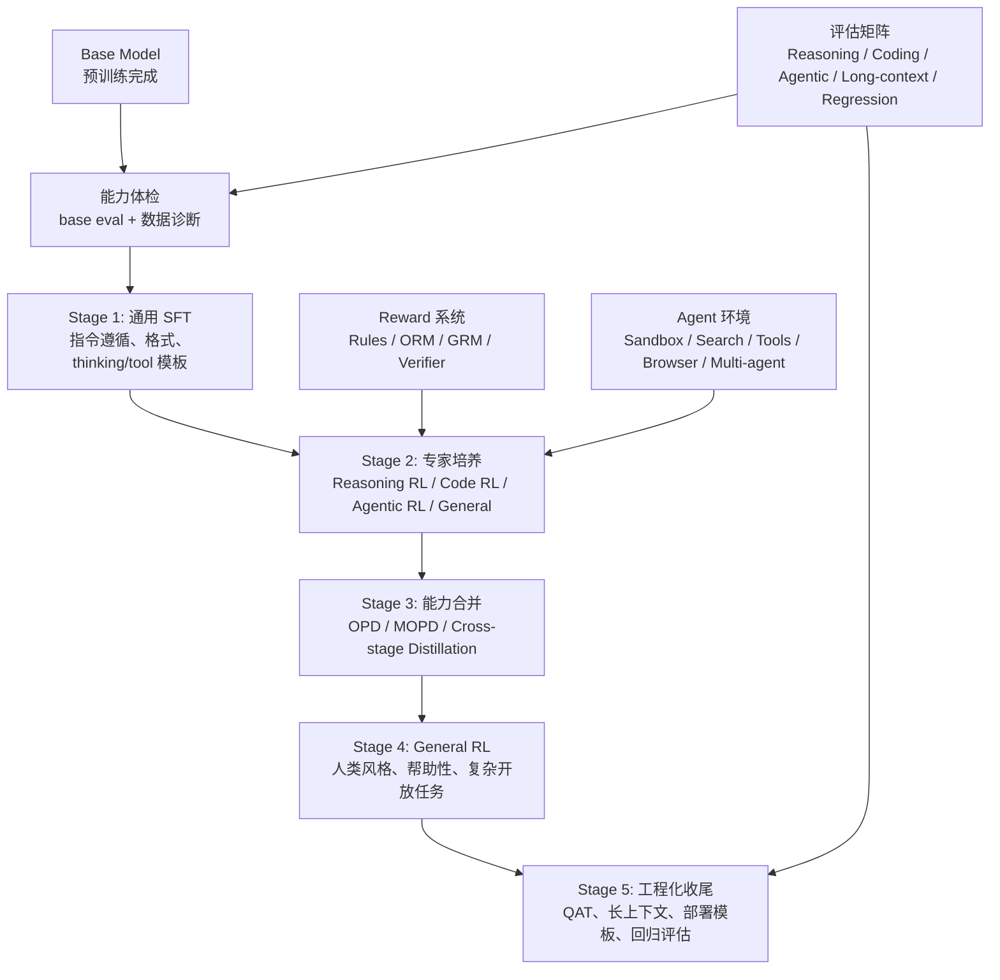
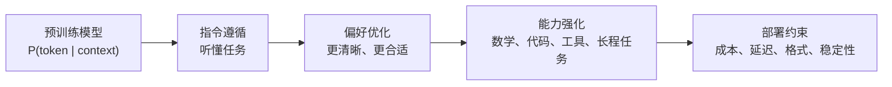
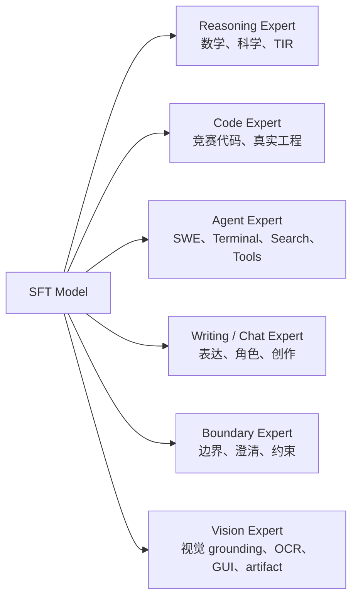
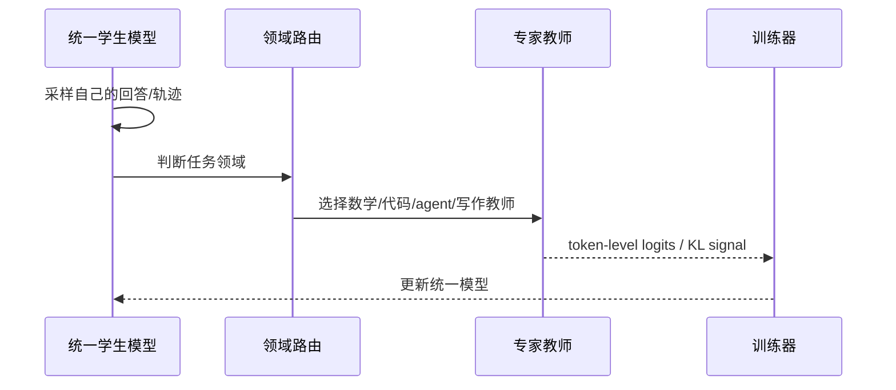

# 1. Post-Training 全景与现代流水线

Post-training 不是一个单独算法，而是一套把预训练模型变成可用模型的工程流程。它横跨数据、模板、thinking 协议、工具协议、损失函数、奖励、评估、部署和人类反馈。你可以把它理解成“行为工程”：预训练给模型知识和语言能力，后训练决定这些能力在真实任务中怎样被调用、约束和组合。

这章先建立完整地图：

- Post-training 到底在改变模型的什么行为？
- SFT、RL、DPO、OPD/MOPD 分别在流水线里处于什么位置？
- 现代模型为什么不再只是 `SFT -> RLHF`？
- 一个训练项目应该怎样从最小实验逐步走向生产？

## 一张完整地图

现代后训练的核心不是单点算法，而是**多能力专家训练 + on-policy 能力合并 + 大规模 agentic 环境**。SFT、RLVR、DPO、OPD 都只是这条流水线中的工具，真正决定效果的是你怎样安排阶段、怎样构造数据和怎样评估回归。



早期 instruction model 的常见路线是：

```text
Base
-> SFT
-> Reward Model
-> PPO/RLHF
-> Eval
```

这条路线仍然有价值，但无法充分覆盖现代模型的目标。早期助手模型主要解决“会不会听指令、回答是否更符合人类偏好”；现代模型还要解决“会不会长链推理、会不会写代码、会不会在工具环境里行动、能否把多个专家能力合成一个统一模型”。

- 推理模型需要多档 thinking effort，而不是单一回答风格。
- Agent 模型需要在真实环境中读文件、改代码、搜索、执行、恢复错误。
- 多模态模型需要图文联合 RL 和视觉 verifier。
- 大模型往往有多个专家能力，顺序训练会产生“跷跷板”：数学涨了，写作掉了；agent 涨了，通用聊天变差。
- 部署端需要低延迟、低精度、长上下文、KV cache 复用，这些约束必须进入后训练。

DeepSeek-V4 把 post-training 概括为先训练多个领域专家，再通过 OPD 合并到统一模型；MiMo-V2-Flash 把这个思路扩展成 Multi-Teacher On-Policy Distillation；GLM-5 使用 Reasoning RL、Agentic RL、General RL 的顺序流程，并用 cross-stage distillation 缓解回归；Kimi K2.5 则把 agent swarm 和多模态/视觉 agentic RL 放到了核心位置。

## 从预训练到后训练

预训练的目标通常是预测下一个 token。模型在海量文本上学到语言、知识和推理模式，但它不一定知道“应该如何作为一个助手行动”。比如，一个 base model 可能会继续写用户的问题，也可能输出网页里的残缺格式；它不是故意不听话，而是训练目标没有明确要求它遵循指令、调用工具或在最后给出可判分答案。

后训练关注的是行为分布：



你可以把模型看成一个会从很多可能回答中抽样的策略。Post-training 改变的不是“是否记住某条知识”，而是“在给定上下文下，哪些回答更容易被采样出来”。因此，同一个模型经过不同后训练，可能知识差不多，但行为完全不同：一个更像聊天助手，一个更像数学解题器，一个更擅长工具调用。

## 四类训练信号

### 1. 示范信号

SFT 使用示范数据：给定输入，训练模型输出指定答案。它的目标是让模型学会任务格式和初始行为。对 base model 来说，SFT 经常是第一步，因为后续的 DPO、RLVR 或 OPD 都需要一个基本能按格式生成的初始策略。

示范信号强在稳定、便宜、可控；弱在它只告诉模型“模仿这个”，不告诉模型“为什么另一个回答更差”。如果一个任务有很多正确写法，SFT 只能把模型推向示范里的那一种，而不是直接学习“什么样的回答更好”。

### 2. 偏好信号

偏好数据告诉模型：同一个 prompt 下，回答 A 比回答 B 更好。DPO、ORPO、SimPO、KTO 等方法直接把偏好对转成 loss；RLHF 通常先训练 reward model，再用 RL 优化。

偏好信号适合处理风格、帮助性、简洁性、解释清晰度等难以程序判分的目标。它的关键不是“chosen 绝对正确”，而是“chosen 在当前 rubric 下比 rejected 更符合目标”。

### 3. 环境奖励

RL 使用环境反馈。模型生成答案、代码、工具调用或多轮动作，环境给 reward。数学题、代码题、检索题、Terminal-Bench 类任务都可以使用可验证奖励。这里的环境可以很简单，例如一个答案解析器；也可以很复杂，例如一个能运行测试、读写文件和返回日志的 sandbox。

环境奖励的优点是可以超越固定示范，让模型探索更好的策略。缺点是 reward 设计难，训练稳定性更敏感。reward 如果写错，模型会非常认真地优化错误目标，这就是 reward hacking。

### 4. 教师分布

蒸馏让学生学习教师模型的输出或概率分布。普通 off-policy 蒸馏常见做法是先由教师生成数据，再用 SFT 训练学生。OPD 则让学生当前策略生成轨迹，再让教师在这些轨迹上提供 KL 信号。

教师分布比单个答案更丰富：它不仅告诉学生“应该输出什么”，也隐含了“哪些 token 是次优但合理的”。这对小模型尤其重要，因为小模型容量有限，直接模仿一个长答案未必学得动；学习教师在多个候选 token 上的偏好，信号会更细。

## 训练信号到 loss 的对应关系

初学者可以先用这张表定位每种方法到底在优化什么：

| 方法 | 一条数据长什么样 | 优化目标 |
|---|---|---|
| SFT | `messages = user + assistant` | 最大化 assistant token 的 log probability |
| Reward Model | `prompt + chosen + rejected` | 让 `score(chosen) > score(rejected)` |
| DPO | `prompt + chosen + rejected + reference model` | 让 policy 相比 reference 更偏向 chosen |
| PPO/RLHF | `prompt -> sampled response -> reward model score` | 提高高 reward response 的概率，并用 KL 控制偏离 |
| GRPO/RLVR | `prompt -> 同题多个 response -> rule reward` | 提高组内优于平均 reward 的 response 概率 |
| OPD | `prompt -> student response -> teacher logprob` | 让学生在自己采样到的状态上接近教师分布 |
| Agentic RL | `prompt -> action/tool/observation 轨迹 -> final reward` | 提高能完成环境任务的 action 序列概率 |

配套代码：同一条 prompt 在不同训练方法里会被包装成不同样本。

```python
prompt = [{"role": "user", "content": "解释一下什么是 GRPO。"}]

sft_example = {
    "messages": [
        *prompt,
        {"role": "assistant", "content": "GRPO 是一种按同题组内相对奖励更新策略的方法。"},
    ]
}

preference_example = {
    "prompt": prompt,
    "chosen": [{"role": "assistant", "content": "清楚、准确、适合初学者的解释。"}],
    "rejected": [{"role": "assistant", "content": "含糊、过长或错误的解释。"}],
}

rlvr_example = {
    "data_source": "openai/gsm8k",
    "prompt": prompt,
    "ability": "math",
    "reward_model": {"style": "rule", "ground_truth": "42"},
}

agentic_example = {
    "data_source": "local/terminal-task",
    "agent_name": "tool_agent",
    "prompt": prompt,
    "extra_info": {"tools": ["bash"], "max_turns": 8},
}
```

注意：方法不同，数据不是换个字段名这么简单。SFT 有监督答案，DPO 有成对偏好，RLVR 有 verifier 需要的标准答案，Agentic RL 有环境状态和工具权限。

## Stage 0：Base Model 体检

从 base model 开始，不要立刻 SFT。先做能力体检。

| 维度 | 看什么 |
|---|---|
| 通用知识 | MMLU、C-Eval、GPQA、SimpleQA |
| 数学推理 | GSM8K、MATH、AIME、HMMT |
| 代码 | HumanEval、MBPP、LiveCodeBench、BigCodeBench |
| Agentic | SWE-Bench、Terminal-Bench、BrowseComp、Tau2-Bench、MCP/Tool benchmarks |
| 长上下文 | LongBench、NIAH、MRCR、长文档问答 |
| 边界与风格 | 澄清、拒绝边界、幻觉率、过度拒绝率 |
| 模板遵循 | chat template、tool schema、thinking tags |

目的不是给 base model 排名，而是决定后训练预算放在哪里：base 已经很强的能力不要用低质量数据破坏；base 明显弱的能力需要 SFT 激活或专家 RL；base 在 agent 任务上不会行动，必须构建环境。没有这个体检，后面的训练就像闭着眼调参。

配套代码：一个最小 base eval runner 长这样。它不训练，只固定 prompt、采样参数和判分函数。

```python
from dataclasses import dataclass
from typing import Callable


@dataclass
class EvalExample:
    prompt: str
    answer: str
    task: str


def exact_match_score(pred: str, answer: str) -> float:
    return float(pred.strip() == answer.strip())


def run_base_eval(model, tokenizer, examples: list[EvalExample], scorer: Callable[[str, str], float]):
    rows = []
    for ex in examples:
        input_ids = tokenizer(ex.prompt, return_tensors="pt").input_ids.to(model.device)
        output_ids = model.generate(input_ids, max_new_tokens=512, temperature=0.0)
        pred = tokenizer.decode(output_ids[0, input_ids.shape[1] :], skip_special_tokens=True)
        score = scorer(pred, ex.answer)
        rows.append({"task": ex.task, "prompt": ex.prompt, "pred": pred, "answer": ex.answer, "score": score})
    return rows
```

这段代码对应后面 verl 训练里的 `data.val_files` 和 `trainer.test_freq`：训练前先定义同一套验证数据，训练中再反复跑它。

## Stage 1：通用 SFT 激活

现代 SFT 不只是“聊天问答”。它通常承担四个职责。你可以把这一阶段理解成“把 base model 拉到正确轨道上”，让后续 RL、偏好优化和蒸馏都有一个稳定起点。

1. **指令遵循**：让模型理解用户请求、system 约束、回答格式、多轮上下文。
2. **Thinking 模式**：学习 non-think、think、max-thinking、interleaved thinking、preserved thinking、turn-level thinking 等协议。
3. **Tool schema**：稳定 tool call block、参数 schema、tool observation、final answer 和 parse 失败恢复。
4. **初始 agent 轨迹**：包含代码 agent、搜索 agent、工具 agent、长上下文 agent 的高质量轨迹。

GLM-5 类流程还强调保留轨迹中的错误片段，但把错误动作 mask 掉，让模型学习如何纠错，而不是强化错误动作。

## Stage 2：专家培养

SFT 之后，不直接把所有目标混在一起 RL。现代流程更倾向训练多个专家。原因很简单：数学、代码、agent、写作的 reward、数据分布和失败模式都不同，强行混成一个训练目标会让信号互相干扰。



Reasoning RL 目标是提升数学、科学、代码推理。常用 GRPO/PPO-like policy optimization、rule verifier、outcome reward model、difficulty filtering、rejection sampling、thinking length control 和 tool-integrated reasoning。这类任务相对“非 agentic”：模型通常生成一个完整答案，环境判分。

Agentic RL 训练模型在环境中行动。典型环境包括代码仓库、终端、搜索、浏览器、GUI、MCP 工具和多 Agent 协作。训练信号来自最终任务结果，也来自中间工具执行、格式、成本、完成率和环境约束。

配套代码：专家训练阶段常常先按任务路由数据，而不是把所有样本混在一个 loss 里。

```python
def route_training_example(example: dict) -> str:
    ability = example.get("ability")
    data_source = example.get("data_source", "")
    if ability == "math" or "gsm8k" in data_source or "math" in data_source:
        return "reasoning_rl"
    if ability == "code" or "apps" in data_source:
        return "code_rl"
    if example.get("agent_name") is not None:
        return "agentic_rl"
    if ability == "boundary":
        return "boundary_alignment"
    return "general_sft_or_preference"


def build_mixture_batch(examples: list[dict]):
    buckets = {}
    for ex in examples:
        buckets.setdefault(route_training_example(ex), []).append(ex)
    return buckets
```

在 verl 的 MOPD/多数据训练里，类似的路由通常会落到 `data_source`、`ability`、`agent_name` 这些字段上。

## Stage 3：OPD / MOPD 能力合并

多个专家不能简单顺序训练到一个模型上。顺序训练常见问题是后训练覆盖前训练、专家风格冲突、agent 能力提升但通用聊天变差、旧的边界和格式习惯被新领域数据冲淡。

因此现代流程使用 OPD/MOPD：

1. 学生模型按当前策略生成轨迹。
2. 判断当前样本属于哪个领域。
3. 让对应专家教师给 token-level 分布信号。
4. 用 reverse KL 或等价 policy loss 更新学生。
5. 必要时混入 outcome reward advantage。



它的关键是 on-policy：学生在自己会到达的状态上学习教师，而不是只模仿离线数据。

配套代码：MOPD 的核心是“按样本 key 选教师”。

```python
class TeacherRouter:
    def __init__(self, teachers: dict[str, object], default_key: str = "general"):
        self.teachers = teachers
        self.default_key = default_key

    def select(self, example: dict):
        key = example.get("data_source", self.default_key)
        return self.teachers.get(key, self.teachers[self.default_key])


teachers = {
    "openai/gsm8k": "math_teacher",
    "code_dataset": "code_teacher",
    "agent_dataset": "agent_teacher",
    "general": "chat_teacher",
}
router = TeacherRouter(teachers)
teacher = router.select({"data_source": "openai/gsm8k"})
```

verl 里对应的是 `distillation.teacher_key=data_source` 和 `distillation.teacher_models.<name>.key`。如果数据的 `data_source` 写错，MOPD 会把样本送给错误教师。

## Stage 4：General RL 与人类风格对齐

专家合并后，还需要一个 general alignment 阶段。它处理开放式产品体验：指令遵循、事实正确、简洁自然、情绪智能、写作质量、角色扮演、翻译、多轮一致性和边界行为。

奖励系统通常是混合的：

| 奖励类型 | 优点 | 风险 |
|---|---|---|
| Rule-based reward | 精确、可解释 | 覆盖范围窄 |
| ORM | 低方差、训练效率高 | 容易 reward hacking |
| GRM | 能评价复杂开放任务 | 方差高、成本高 |
| Human anchors | 自然、人类风格强 | 贵、规模小 |

现代做法不是只选一个 reward，而是按任务组合。

## Stage 5：工程化收尾

前沿模型把部署约束也放进 post-training：

- QAT：让模型适应 INT4/FP4/FP8 等低精度部署。
- 长上下文训练：保证 128K、256K、1M context 下行为稳定。
- rollout 服务优化：异步 rollout、prefix cache、prefill/decode 分离、故障恢复。
- token budget RL：降低冗余 thinking token。
- quick instruction：把搜索触发、query 生成、意图分类等辅助任务并入同一个模型，复用 KV cache。
- final regression eval：确保专家合并后没有大规模能力回退。

配套代码：把每个阶段的产物显式记录下来，避免“哪个 checkpoint 来自哪个数据”说不清。

```python
from dataclasses import dataclass, asdict
import json


@dataclass
class StageRecord:
    stage: str
    model_path: str
    train_files: list[str]
    val_files: list[str]
    method: str
    command: str
    best_checkpoint: str | None = None
    eval_report: str | None = None


def append_stage_record(path: str, record: StageRecord):
    with open(path, "a", encoding="utf-8") as f:
        f.write(json.dumps(asdict(record), ensure_ascii=False) + "\n")
```

这类记录和 verl 的 `trainer.project_name`、`trainer.experiment_name`、checkpoint 目录一起，构成一次训练的可复现链路。

## 现代后训练能力矩阵

| 能力 | SFT | RL | OPD/MOPD | 评估 |
|---|---|---|---|---|
| 指令遵循 | 主力 | 可用 general RL 修 | 可保留 | IFEval、人工 |
| 数学推理 | 激活格式 | 主力 | 合并专家 | GSM8K、MATH、AIME |
| 代码生成 | 激活格式 | 主力 | 合并专家 | LiveCodeBench、MBPP |
| 代码 Agent | 初始轨迹 | 主力 | 合并专家 | SWE-Bench、Terminal-Bench |
| 搜索 Agent | 初始轨迹 | 主力 | 合并专家 | BrowseComp、HLE w/ tools |
| 工具调用 | schema | 主力 | 合并专家 | Tau2、Tool-Decathlon、MCP |
| 写作/聊天 | 主力 | general RL | 防回退 | Arena、人工 |
| 边界行为 | 主力 | general RL | 防回退 | red-team、拒绝率、澄清率 |
| 多模态 | 对齐数据 | 视觉 RL | 跨模态合并 | grounding、OCR、GUI |
| 长上下文 | 长样本 SFT | 长轨迹 RL | 防遗忘 | LongBench、NIAH |

## 常见路线怎么选

不同目标不需要同一条完整流水线。先明确任务，再选训练信号。

| 目标 | 推荐路线 | 核心风险 |
|---|---|---|
| 基础 instruction model | Base -> SFT -> DPO/RLHF -> Eval | 偏好数据弱时，只会学到表面风格 |
| 推理模型 / RLVR | Base/SFT -> thinking 格式 -> GRPO/RLVR -> 长度控制 -> benchmark | reward 解析错误、思考长度膨胀 |
| 工具使用与 Agentic RL | tool SFT -> 多轮环境 -> sandbox/tool reward -> Agentic RL -> 合并与回归 | 环境成本高，工具轨迹容易不可复现 |
| 领域模型 | 通用模型 -> 领域 SFT -> 领域偏好 -> 回归评估 | 领域分数上升但通用能力遗忘 |
| 统一复杂模型 | Base eval -> 通用 SFT -> 多专家 RL -> OPD/MOPD -> General RL -> 部署收尾 | 专家能力互相覆盖，必须有回归矩阵 |

## 一套可靠的实验顺序

不要一上来就跑大训练。可靠的流程是：

1. **定义任务**：要提升哪个能力？怎样算成功？
2. **建立 baseline**：原模型在评估集上表现如何？
3. **检查数据渲染**：decode 3 到 5 条 token，确认模板、EOS、mask 正确。
4. **小样本过拟合**：让模型在 16 到 64 条样本上明显学会。
5. **短训练**：跑几十步，看 loss、reward、KL、样本输出是否合理。
6. **扩大训练**：增加数据、batch、步数。
7. **独立评估**：固定 benchmark + 人工错误分析。
8. **消融实验**：验证到底是数据、算法还是超参带来提升。

<div class="warning">

**常见反模式**

只看训练 loss 或平均 reward 就宣布成功。Post-training 的目标是改变模型在真实任务上的行为，训练指标只是诊断信号，不是最终证据。

</div>

## 方法边界

| 方法 | 最擅长 | 不擅长 |
|---|---|---|
| SFT | 格式、风格、流程、初始能力 | 探索、偏好排序、长程环境反馈 |
| DPO | 用偏好对改回答质量 | 没有偏好数据、需要探索的任务 |
| RLHF | 复杂人类偏好目标 | 成本高，reward model 可能被利用 |
| GRPO/RLVR | 可验证的数学、代码、工具任务 | reward 稀疏或不可判分的开放问题 |
| OPD | 教师能力迁移、学生轨迹纠错 | 教师太弱或教师成本太高时收益有限 |
| SDFT | 新任务训练时保持旧能力 | 目标任务需要强探索时不够 |
| Agentic RL | 代码、搜索、工具、长程任务 | 环境构建和 rollout 基础设施成本高 |
| GRM | 复杂开放任务、rubric 评估 | 成本高、方差高，需要防 reward hacking |

## verl 的工程抽象

本教程的实战主线使用 `verl-main`。你可以把 verl 的训练拆成几层：

- `examples/data_preprocess/`：把原始数据转成 SFT、RL、Agentic、偏好训练需要的 parquet。
- `examples/sft/`：SFT 训练脚本，入口是 `verl.trainer.sft_trainer`。
- `examples/grpo_trainer/`：GRPO/RLVR 脚本，入口是 `verl.trainer.main_ppo`。
- `examples/on_policy_distillation_trainer/`：OPD/MOPD 脚本，通过 `distillation.*` 配置启动教师资源池。
- `docs/sglang_multiturn/` 和 `docs/start/agentic_rl.rst`：多轮工具、异步 rollout 和 agent loop。
- `verl/utils/reward_score/`：内置 reward function，也可以用 `reward.custom_reward_function.*` 指向自己的 reward。
- `verl/model_merger`：把 FSDP/Megatron checkpoint 转成 Hugging Face 模型目录。

这套拆法有一个重要启发：后训练不是“调用一个 trainer”。你需要同时拥有数据层、rollout 层、reward 层、评估层和 checkpoint 运维层。很多训练失败表面上是算法不收敛，实际是数据 schema、模板、reward 或导出流程出了问题。

## 你应该优先掌握的五个问题

1. **训练 token 是哪些？**  
   SFT 时是不是只训练 assistant？是否误把 user/system 也训练了？

2. **模型使用什么模板？**  
   Qwen、Llama、DeepSeek、Kimi、GPT-OSS 的聊天模板和 thinking 模式都不同。

3. **奖励是否真的代表目标？**  
   数学 reward 是否能正确解析答案？代码 reward 是否安全运行？

4. **训练是否偏离原模型太远？**  
   RL/DPO 中 KL 或 beta 控制了模型离参考策略的距离。

5. **评估是否独立？**  
   训练数据泄漏、prompt 格式不一致、采样温度不同，都会让结果失真。

<div class="checkpoint">

**本章结论**

现代 post-training 的标准顺序可以概括为：

```text
Base eval
-> 通用 SFT 激活
-> 多领域专家训练（Reasoning / Code / Agent / Chat / Vision）
-> OPD/MOPD 统一能力
-> General RL 与人类风格对齐
-> QAT、长上下文、部署和回归评估
```

如果只记一句话：Post-training 的核心不是某个算法名，而是“用合适的训练信号，稳定地移动模型行为分布”。后面每章都围绕这个句子展开。

</div>

## 资料来源

- [DeepSeek-V4 Technical Report](https://huggingface.co/deepseek-ai/DeepSeek-V4-Pro/blob/main/DeepSeek_V4.pdf)
- [DeepSeek-R1 Technical Report](https://arxiv.org/abs/2501.12948)
- [Qwen3 Technical Report](https://arxiv.org/abs/2505.09388)
- [The Llama 3 Herd of Models](https://arxiv.org/abs/2407.21783)
- [MiMo-V2-Flash Technical Report](https://arxiv.org/pdf/2601.02780)
- [Kimi K2.5: Visual Agentic Intelligence](https://arxiv.org/pdf/2602.02276)
- [GLM-5: from Vibe Coding to Agentic Engineering](https://arxiv.org/pdf/2602.15763)
- [OpenAI InstructGPT](https://arxiv.org/abs/2203.02155)
- [OpenAI: Learning to reason with LLMs](https://openai.com/index/learning-to-reason-with-llms/)
- [Anthropic: Building effective agents](https://www.anthropic.com/research/building-effective-agents)
