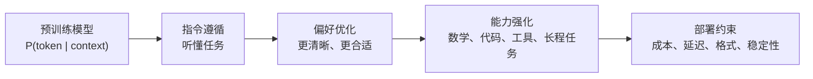
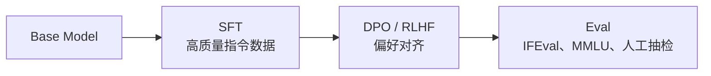
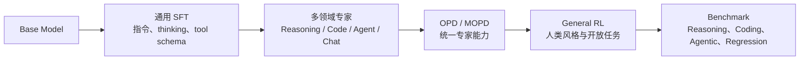
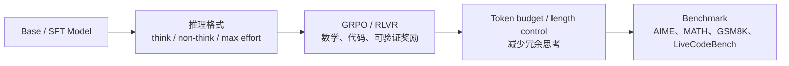
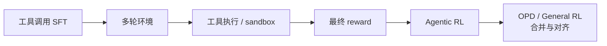
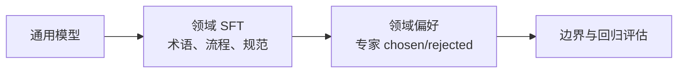

# 1. Post-Training 全景

Post-training 不是一个单独算法，而是一组把预训练模型变成可用模型的工程流程。它横跨数据、模板、thinking 协议、工具协议、损失函数、奖励、评估、部署和人类反馈。你可以把它理解成“行为工程”：预训练给模型知识和语言能力，后训练决定这些能力在真实任务中怎样被调用、约束和组合。

这章先回答三个问题：

- 我们到底在改变模型的什么行为？
- SFT、RL、DPO、OPD 分别在流水线里处于什么位置？
- 一个训练项目应该怎样从最小实验逐步走向生产？

## 从预训练到后训练

预训练的目标通常是预测下一个 token。模型在海量文本上学到语言、知识和推理模式，但它不一定知道“应该如何作为一个助手行动”。比如，一个 base model 可能会继续写用户的问题，也可能输出网页里的残缺格式；它不是故意不听话，而是训练目标没有明确要求它遵循指令、调用工具或在最后给出可判分答案。

后训练关注的是行为分布：



你可以把模型看成一个会从很多可能回答中抽样的策略。Post-training 改变的不是“是否记住某条知识”，而是“在给定上下文下，哪些回答更容易被采样出来”。因此，同一个模型经过不同后训练，可能知识差不多，但行为完全不同：一个更像聊天助手，一个更像数学解题器，一个更擅长工具调用。

## 四类训练信号

### 1. 示范信号

SFT 使用示范数据：给定输入，训练模型输出指定答案。它的目标是让模型学会任务格式和初始行为。对 base model 来说，SFT 经常是第一步，因为后续的 DPO、RLVR 或 OPD 都需要一个基本能按格式生成的初始策略。

示范信号强在稳定、便宜、可控；弱在它只告诉模型“模仿这个”，不告诉模型“为什么另一个回答更差”。如果一个任务有很多正确写法，SFT 只能把模型推向示范里的那一种，而不是直接学习“什么样的回答更好”。

### 2. 偏好信号

偏好数据告诉模型：同一个 prompt 下，回答 A 比回答 B 更好。DPO、ORPO、SimPO、KTO 等方法直接把偏好对转成 loss；RLHF 通常先训练 reward model，再用 RL 优化。

偏好信号适合处理风格、帮助性、简洁性、解释清晰度等难以程序判分的目标。它的关键不是“chosen 绝对正确”，而是“chosen 在当前 rubric 下比 rejected 更符合目标”。

### 3. 环境奖励

RL 使用环境反馈。模型生成答案、代码、工具调用或多轮动作，环境给 reward。数学题、代码题、检索题、Terminal-Bench 类任务都可以使用可验证奖励。这里的环境可以很简单，例如一个答案解析器；也可以很复杂，例如一个能运行测试、读写文件和返回日志的 sandbox。

环境奖励的优点是可以超越固定示范，让模型探索更好的策略。缺点是 reward 设计难，训练稳定性更敏感。reward 如果写错，模型会非常认真地优化错误目标，这就是 reward hacking。

### 4. 教师分布

蒸馏让学生学习教师模型的输出或概率分布。普通 off-policy 蒸馏常见做法是先由教师生成数据，再用 SFT 训练学生。OPD 则让学生当前策略生成轨迹，再让教师在这些轨迹上提供 KL 信号。

教师分布比单个答案更丰富：它不仅告诉学生“应该输出什么”，也隐含了“哪些 token 是次优但合理的”。这对小模型尤其重要，因为小模型容量有限，直接模仿一个长答案未必学得动；学习教师在多个候选 token 上的偏好，信号会更细。

## 训练信号到 loss 的对应关系

初学者可以先用这张表定位每种方法到底在优化什么：

| 方法 | 一条数据长什么样 | 优化目标 |
|---|---|---|
| SFT | `messages = user + assistant` | 最大化 assistant token 的 log probability |
| Reward Model | `prompt + chosen + rejected` | 让 `score(chosen) > score(rejected)` |
| DPO | `prompt + chosen + rejected + reference model` | 让 policy 相比 reference 更偏向 chosen |
| PPO/RLHF | `prompt -> sampled response -> reward model score` | 提高高 reward response 的概率，并用 KL 控制偏离 |
| GRPO/RLVR | `prompt -> 同题多个 response -> rule reward` | 提高组内优于平均 reward 的 response 概率 |
| OPD | `prompt -> student response -> teacher logprob` | 让学生在自己采样到的状态上接近教师分布 |
| Agentic RL | `prompt -> action/tool/observation 轨迹 -> final reward` | 提高能完成环境任务的 action 序列概率 |

后面的章节会把这些目标逐一写成简化 Python 代码。真实框架会多出分布式、padding、缓存和 rollout 服务，但 loss 的核心形式不变。

配套代码：同一条 prompt 在不同训练方法里会被包装成不同样本。

```python
prompt = [{"role": "user", "content": "解释一下什么是 GRPO。"}]

sft_example = {
    "messages": [
        *prompt,
        {"role": "assistant", "content": "GRPO 是一种按同题组内相对奖励更新策略的方法。"},
    ]
}

preference_example = {
    "prompt": prompt,
    "chosen": [{"role": "assistant", "content": "清楚、准确、适合初学者的解释。"}],
    "rejected": [{"role": "assistant", "content": "含糊、过长或错误的解释。"}],
}

rlvr_example = {
    "data_source": "openai/gsm8k",
    "prompt": prompt,
    "ability": "math",
    "reward_model": {"style": "rule", "ground_truth": "42"},
}

agentic_example = {
    "data_source": "local/terminal-task",
    "agent_name": "tool_agent",
    "prompt": prompt,
    "extra_info": {"tools": ["bash"], "max_turns": 8},
}
```

注意：方法不同，数据不是换个字段名这么简单。SFT 有监督答案，DPO 有成对偏好，RLVR 有 verifier 需要的标准答案，Agentic RL 有环境状态和工具权限。

## 常见流水线

### 基础 instruction model



这是最传统的助手模型路线。SFT 建立指令遵循，偏好优化处理开放式质量判断。如果你的目标是做一个问答助手、客服助手或写作助手，这条路线通常是最稳的起点。

### 现代统一模型：专家训练 + OPD/MOPD



这是 DeepSeek-V4、MiMo-V2-Flash、GLM-5 这类报告中更接近现代形态的路线。SFT 负责激活基础行为；领域专家负责把数学、代码、agent、写作等能力推高；OPD/MOPD 把专家能力合并回统一模型；general RL 再对开放式产品体验做最后修正。这个流程的重点是避免顺序训练互相覆盖：数学涨了，代码不能掉；agent 变强了，普通聊天也不能变差。

### 推理模型 / RLVR



推理模型更依赖 RL。原因是很多推理能力不是简单模仿可以学出的：模型需要尝试不同路径，并根据最终正确性更新。DeepSeek-R1 这类路线还会把 RL 产生的高质量推理轨迹筛出来，再回灌到 SFT 或蒸馏数据里，形成“探索 -> 过滤 -> 再训练”的数据飞轮。

### 工具使用与 Agentic RL



工具使用不是“生成一个 JSON”这么简单。现代 agentic RL 会把代码仓库、终端、搜索、浏览器、MCP 工具、多 agent 协作都做成环境，让模型在观察、行动、反馈之间循环。只有环境交互能暴露工具调用后的真实后果：参数写错、命令失败、搜索结果不相关、测试没通过，这些都不是单轮 SFT 能充分表达的。

### 领域模型



领域模型的核心风险是遗忘。它在目标领域变好，同时可能在通用能力、格式遵循或普通对话上变差。因此评估集必须同时包含目标任务和保留任务。只看领域分数，很容易得到一个“专业但不好用”的模型。

## 一套可靠的实验顺序

不要一上来就跑大训练。可靠的流程是：

1. **定义任务**：要提升哪个能力？怎样算成功？
2. **建立 baseline**：原模型在评估集上表现如何？
3. **检查数据渲染**：decode 3 到 5 条 token，确认模板、EOS、mask 正确。
4. **小样本过拟合**：让模型在 16 到 64 条样本上明显学会。
5. **短训练**：跑几十步，看 loss、reward、KL、样本输出是否合理。
6. **扩大训练**：增加数据、batch、步数。
7. **独立评估**：固定 benchmark + 人工错误分析。
8. **消融实验**：验证到底是数据、算法还是超参带来提升。

<div class="warning">

**常见反模式**

只看训练 loss 或平均 reward 就宣布成功。Post-training 的目标是改变模型在真实任务上的行为，训练指标只是诊断信号，不是最终证据。

</div>

## 方法边界

| 方法 | 最擅长 | 不擅长 |
|---|---|---|
| SFT | 格式、风格、流程、初始能力 | 探索、偏好排序、长程环境反馈 |
| DPO | 用偏好对改回答质量 | 没有偏好数据、需要探索的任务 |
| RLHF | 复杂人类偏好目标 | 成本高，reward model 可能被利用 |
| GRPO/RLVR | 可验证的数学、代码、工具任务 | reward 稀疏或不可判分的开放问题 |
| OPD | 教师能力迁移、学生轨迹纠错 | 教师太弱或教师成本太高时收益有限 |
| SDFT | 新任务训练时保持旧能力 | 目标任务需要强探索时不够 |
| Agentic RL | 代码、搜索、工具、长程任务 | 环境构建和 rollout 基础设施成本高 |
| GRM | 复杂开放任务、rubric 评估 | 成本高、方差高，需要防 reward hacking |

## verl 的工程抽象

本教程的实战主线使用 `verl-main`。你可以把 verl 的训练拆成几层：

- `examples/data_preprocess/`：把原始数据转成 SFT、RL、Agentic、偏好训练需要的 parquet。
- `examples/sft/`：SFT 训练脚本，入口是 `verl.trainer.sft_trainer`。
- `examples/grpo_trainer/`：GRPO/RLVR 脚本，入口是 `verl.trainer.main_ppo`。
- `examples/on_policy_distillation_trainer/`：OPD/MOPD 脚本，通过 `distillation.*` 配置启动教师资源池。
- `docs/sglang_multiturn/` 和 `docs/start/agentic_rl.rst`：多轮工具、异步 rollout 和 agent loop。
- `verl/utils/reward_score/`：内置 reward function，也可以用 `reward.custom_reward_function.*` 指向自己的 reward。
- `verl/model_merger`：把 FSDP/Megatron checkpoint 转成 Hugging Face 模型目录。

这套拆法有一个重要启发：后训练不是“调用一个 trainer”。你需要同时拥有数据层、rollout 层、reward 层、评估层和 checkpoint 运维层。很多训练失败表面上是算法不收敛，实际是数据 schema、模板、reward 或导出流程出了问题。

## 你应该优先掌握的五个问题

1. **训练 token 是哪些？**  
   SFT 时是不是只训练 assistant？是否误把 user/system 也训练了？

2. **模型使用什么模板？**  
   Qwen、Llama、DeepSeek、Kimi、GPT-OSS 的聊天模板和 thinking 模式都不同。

3. **奖励是否真的代表目标？**  
   数学 reward 是否能正确解析答案？代码 reward 是否安全运行？

4. **训练是否偏离原模型太远？**  
   RL/DPO 中 KL 或 beta 控制了模型离参考策略的距离。

5. **评估是否独立？**  
   训练数据泄漏、prompt 格式不一致、采样温度不同，都会让结果失真。

<div class="checkpoint">

**本章结论**

Post-training 的核心不是某个算法名，而是“用合适的训练信号，稳定地移动模型行为分布”。后面每章都围绕这个句子展开。

</div>
