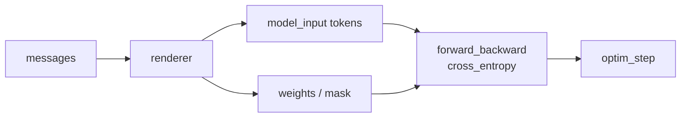

# 3. SFT：把行为写进模型

SFT，全称 Supervised Fine-Tuning，是大模型后训练的第一块地基。它不神秘：给模型很多输入和理想输出，让模型更倾向于生成这些输出。真正需要小心的是，SFT 看起来像“普通监督学习”，但它训练的是语言模型在某个上下文下的下一个 token 分布，所以数据模板、mask 和评估方式都会直接改变训练目标。

但 SFT 的难点不在“调用训练接口”，而在三件事：

- 训练什么 token；
- 数据是否代表你想要的行为；
- 如何判断模型是真的学会，而不是只在训练 loss 上变好。

## SFT 的目标

对一条对话样本：

```text
system: 你是一个严谨的中文数学助教。
user: 什么是 KL 散度？
assistant: KL 散度衡量两个概率分布之间的差异...
```

SFT 通常只让模型学习 assistant 的 token。直觉上就是最大化：

```text
P(assistant_answer | system, user)
```

在 token 层面，loss 是 assistant token 的交叉熵。user/system 是条件，不是目标。换句话说，模型可以“看见”用户问题和系统约束，但我们不希望它学习去生成用户问题或系统约束。



## SFT loss 长什么样

SFT 本质上是 masked next-token prediction。给模型完整上下文，让它预测下一个 token，但只在 assistant 答案区域计算 loss。这个“masked”非常重要，因为同一段 token 序列里既有条件，也有目标；如果不区分，模型会学到错误角色。

极简 PyTorch 实现：

```python
import torch
import torch.nn.functional as F


def sft_loss(logits, input_ids, loss_mask):
    """教学版 SFT loss。

    logits: [batch, seq_len, vocab]，模型对每个位置的下一个 token 分布
    input_ids: [batch, seq_len]，完整 token 序列
    loss_mask: [batch, seq_len]，assistant 目标 token 为 1，其余为 0
    """
    # 第 t 个 logits 用来预测第 t+1 个 token，所以要左移/右移对齐。
    shift_logits = logits[:, :-1, :].contiguous()
    shift_labels = input_ids[:, 1:].contiguous()
    shift_mask = loss_mask[:, 1:].float().contiguous()

    token_loss = F.cross_entropy(
        shift_logits.view(-1, shift_logits.size(-1)),
        shift_labels.view(-1),
        reduction="none",
    ).view_as(shift_labels)

    return (token_loss * shift_mask).sum() / shift_mask.sum().clamp_min(1.0)
```

一条数据进来时，训练发生的是：

```python
batch = {
    "input_ids": input_ids,
    "attention_mask": attention_mask,
    "loss_mask": loss_mask,
}

outputs = model(
    input_ids=batch["input_ids"],
    attention_mask=batch["attention_mask"],
)
loss = sft_loss(outputs.logits, batch["input_ids"], batch["loss_mask"])
loss.backward()
optimizer.step()
optimizer.zero_grad()
```

verl 的 `sft_loss` 也是这个逻辑：取模型输出的 log probability，用 `loss_mask` 或 `response_mask` 只累计目标 token 的负 log probability，再按有效 token 数归一化。复杂处在 padding、sequence parallel、FSDP 和动态 batch，而不是 loss 本身。初学者先把这个最小 loss 看懂，再看框架源码会轻松很多。

## SFT 适合学什么

SFT 最适合把“示范中稳定存在的行为”写进模型。只要一个行为可以被高质量示范，而且不需要模型通过试错才能知道好坏，SFT 通常就是最便宜、最稳定的起点。

典型场景：

- 聊天格式：回答结构、Markdown、JSON schema。
- 角色风格：客服、助教、代码审查、法律摘要。
- 领域流程：医学分诊、财务报表解读、工单处理。
- 初始能力：基础 instruction following、工具调用格式。
- 边界行为：明显需要澄清、拒绝、转用工具或说明限制的场景。

不适合只靠 SFT 解决的场景：

- 没有唯一答案的质量偏好；
- 需要尝试后才能知道对错的任务；
- 数学/代码中“最终正确性”比示范过程更重要的问题；
- 多轮工具任务中行动后果非常关键的问题。

## 工业 insight：SFT 是行为启动器

OpenAI 的 InstructGPT 公开流程里，SFT 是第一步：先让模型看到人工写的理想回答，学会 instruction-following 的基本姿势，然后才进入 comparison、reward model 和 PPO。DeepSeek-R1 和 Qwen3 的公开报告也有同样的工程直觉：先用少量高质量 long-CoT/cold-start 数据把 base 拉到“会按格式推理、可读、可判分”的状态，再进入更强的 reasoning RL。

这说明 SFT 在工业流程里通常不是“最终对齐”，而是做三件事：

- 把 base model 拉进可用的聊天、推理或工具格式；
- 给后续偏好标注和 RL rollout 提供足够好的初始策略；
- 把稳定、可示范、低争议的行为写入模型。

SFT 常见工业问题和处理方式：

| 问题 | 现象 | 常见处理 |
|---|---|---|
| 标注风格过拟合 | 模型变得模板化、啰嗦、像标注手册 | 混合多来源示范，控制重复模板 |
| 边界样本粗糙 | 多约束、困难题、工具失败恢复学不好 | 把样本拆成可直接答、需要推理、需要工具、需要拒绝或澄清 |
| 长度偏差 | 越训越长，评估 win-rate 虚高 | 记录长度，偏好阶段加入简洁性和成本 |
| 后续 RL 难采样 | SFT 模型格式不稳，reward parser 经常失败 | 先小样本过拟合格式，再扩数据 |

配套代码：工业里不会把所有 SFT 样本等权混合。下面这个教学版打分器把“格式、长度、边界标签、数据来源”先显式化，避免把 SFT 当成无脑拼数据。

```python
def score_sft_example(example: dict) -> dict:
    messages = example["messages"]
    assistant = messages[-1]["content"]
    source = example.get("source", "unknown")

    has_assistant = messages[-1]["role"] == "assistant"
    length = len(assistant.split())
    has_refusal = any(x in assistant for x in ["不能帮助", "无法协助", "不应该"])
    needs_boundary_behavior = example.get("boundary_case") is True

    score = 1.0
    score -= 0.5 * float(not has_assistant)
    score -= 0.2 * float(length > 1200)
    score -= 0.3 * float(has_refusal and not needs_boundary_behavior)
    score += 0.2 * float(source in {"human_expert", "verified_teacher"})

    return {
        "score": max(score, 0.0),
        "length": length,
        "boundary_case": needs_boundary_behavior,
        "source": source,
    }


def build_sft_mixture(examples: list[dict], min_score=0.8):
    kept = []
    stats = {"human_expert": 0, "synthetic": 0, "boundary_case": 0, "filtered": 0}
    for ex in examples:
        meta = score_sft_example(ex)
        if meta["score"] < min_score:
            stats["filtered"] += 1
            continue
        if meta["boundary_case"]:
            stats["boundary_case"] += 1
        stats[meta["source"]] = stats.get(meta["source"], 0) + 1
        kept.append({**ex, "sft_meta": meta})
    return kept, stats
```

这段代码对应真实项目里的数据门禁：先过滤明显坏样本，再按来源和任务配比。后续 DPO/RLHF 再处理“哪种好回答更好”这种细粒度偏好。

## verl 中的最小 SFT 闭环

本站实战主线使用 `Qwen/Qwen3-4B-Base` 和本地 `verl-main`。在 verl 里，SFT 数据先转成 parquet，每行包含 `messages`：

```json
{
  "messages": [
    {
      "role": "user",
      "content": "问题文本 ... Let's think step by step and output the final answer after \"####\"."
    },
    {
      "role": "assistant",
      "content": "推理过程 ... #### 72"
    }
  ]
}
```

准备 GSM8K SFT 数据：

```bash
cd verl-main
python examples/data_preprocess/gsm8k_multiturn_sft.py \
  --local_save_dir ~/data/gsm8k_sft
```

运行 Qwen3-4B-Base LoRA SFT：

```bash
cd verl-main
MODEL_PATH=Qwen/Qwen3-4B-Base \
PROJECT_NAME=llm-posttrain-cookbook \
EXPERIMENT_NAME=qwen3-4b-base-gsm8k-sft \
USE_PEFT=1 \
LORA_RANK=32 \
LORA_ALPHA=16 \
MICRO_BATCH_SIZE_PER_GPU=8 \
LR=1e-4 \
TOTAL_EPOCHS=1 \
bash examples/sft/gsm8k/run_qwen3_8b_fsdp.sh \
  8 \
  ~/checkpoints/qwen3-4b-base-sft \
  data.train_files=$HOME/data/gsm8k_sft/train.parquet \
  data.val_files=$HOME/data/gsm8k_sft/test.parquet \
  trainer.logger='["console"]'
```

脚本名里虽然有 `qwen3_8b`，但真正使用的模型由 `MODEL_PATH` 和 `model.path` 决定。初学者读 verl 示例脚本时要分清两件事：文件名只是样例命名，Hydra override 和环境变量才是真正进入训练配置的内容。

关键配置：

| 配置 | 作用 |
|---|---|
| `data.messages_key=messages` | 从 parquet 的 `messages` 字段读取多轮对话 |
| `model.path=Qwen/Qwen3-4B-Base` | 训练起点模型 |
| `model.lora_rank=32` | LoRA adapter 容量 |
| `optim.lr=1e-4` | LoRA SFT 学习率起点 |
| `trainer.default_local_dir` | checkpoint 保存目录 |

完整实战见 [15. SFT 实战：用 verl 激活 Qwen3-4B-Base](./15-verl-sft-qwen3.md)。

## 第一件事：小样本过拟合

正式训练前，先做一个小样本过拟合实验。拿 16 到 64 条高质量样本，训练到模型几乎能复现。这个步骤看起来浪费时间，但它能最快发现 tokenizer、renderer、mask、学习率、保存加载这些基础问题。

目的不是得到好模型，而是验证管线：

- 数据能正常加载；
- renderer 和 tokenizer 匹配；
- mask 正确；
- loss 会下降；
- 保存后采样能看到行为变化；
- eval 脚本能跑通。

如果小样本都学不会，扩大数据只会扩大问题。一个健康的 SFT 管线，至少应该能在很小的数据上明显降低 loss，并在采样时看到输出格式接近训练样本。

## 数据配比

SFT 数据常见来源：

| 数据类型 | 价值 | 风险 |
|---|---|---|
| 人工高质量示范 | 行为最稳，适合关键任务 | 成本高，规模小 |
| 强模型合成数据 | 规模大，覆盖面广 | 可能继承教师模型偏差 |
| 真实用户日志 | 贴近产品分布 | 隐私、噪声、低质量回答 |
| 专家流程数据 | 领域能力强 | 格式不统一，标注成本高 |
| 失败案例修复 | 定向补洞 | 容易过拟合局部问题 |

一个实用配比策略：

- 用少量人工样本定义风格和边界；
- 用合成数据扩覆盖；
- 用真实日志补高频场景；
- 用评估错误反向生成修复样本；
- 保留一部分通用 instruction 数据防止能力变窄。

## 学习率和 LoRA rank

SFT 常用 LoRA，因为它便宜、快、容易回滚。

经验起点：

| 场景 | 学习率 | LoRA rank | 备注 |
|---|---:|---:|---|
| 小模型简单格式 | `2e-4` 到 `5e-4` | 16 到 32 | 先小规模验证 |
| 聊天 SFT | `1e-4` 到 `5e-4` | 32 到 64 | 数据质量决定上限 |
| 复杂推理示范 | `5e-5` 到 `2e-4` | 64 到 128 | 注意长样本截断 |
| DPO 前置 SFT | `1e-4` 左右 | 32 到 64 | 不要过度训练 |

在本教程的 verl 实战里，`Qwen/Qwen3-4B-Base` 的 LoRA SFT 可以先从 `LR=1e-4`、`LORA_RANK=32` 起步。真实项目仍然要做 sweep。学习率过高时，模型会很快学到模板但丢掉原有能力；学习率过低时，loss 看起来稳定但行为几乎不动。

## 训练指标怎么读

SFT 常见指标：

- `train/loss`：训练交叉熵。
- `test/nll`：验证集负对数似然。
- `optim/lr`：当前学习率。
- `time/*`：训练各阶段耗时。

如何解释：

- 训练 loss 下降、验证 loss 也下降：正常。
- 训练 loss 下降、验证 loss 上升：过拟合或数据分布不一致。
- loss 几乎不动：学习率太低、mask 错、数据太难或管线错。
- loss 很快接近 0：数据重复、样本太少或目标过简单。

但 loss 不能替代行为评估。你必须采样看输出。SFT loss 下降只说明模型更像训练答案，不说明它在真实 prompt 上更有用，也不说明它没有学会坏习惯。

## SFT 的评估

SFT 评估分三类：

### 1. 格式评估

适合结构化输出任务。用程序检查 JSON 是否可 parse、字段是否齐全、工具调用 schema 是否正确。格式评估应该尽量自动化，因为格式错误常常肉眼看几条样本发现不了。

### 2. 任务评估

看模型是否完成目标。例如问答准确率、摘要事实一致性、分类准确率、代码测试通过率。任务评估要和 SFT 目标一致；如果你训练的是客服流程，就不要只看通用知识 benchmark。

### 3. 人工抽检

对开放式助手非常重要。抽检时不要只看好例子，要专门看：

- 长问题；
- 多约束问题；
- 模糊指令；
- 边界和澄清场景；
- 和训练数据相似但不完全相同的问题。

## 常见坑

### 训练了 user token

如果 mask 错误，模型可能学会预测用户消息。这会损害对话行为，采样时出现奇怪自问自答。

### 模板和部署不一致

训练用一种 chat template，部署用另一种。模型训练时学到的分隔符在推理时消失，行为会漂。

### 数据答案太长

很多合成数据喜欢写长解释。模型会学会啰嗦。要在数据中显式控制长度和风格。

### 把 benchmark 答案混进训练集

短期指标好看，真实泛化变差。评估集必须去重。

### 过度 SFT

SFT 太久可能让模型变得机械，降低多样性和推理探索能力。尤其是后面要接 RL 时，初始化过窄会影响探索。

## 一套 SFT recipe

下面这套 recipe 适合第一次做 SFT 的读者。它的目标不是一次训出最强模型，而是让你有一条能复现、能调试、能解释结果的最小路线。

1. 写 50 条人工高质量样本。
2. decode 检查 10 条。
3. 16 条样本过拟合。
4. 扩到 1k 到 10k 条混合数据。
5. 训练 100 到 500 step。
6. 每 20 到 50 step 保存 checkpoint。
7. 固定 100 条任务集做采样评估。
8. 把错误样本分类：格式错、事实错、风格错、拒绝错、长短错。
9. 针对错误补数据，不要盲目加全量数据。

<div class="checkpoint">

**本章结论**

SFT 是“把示范行为写进模型”的工具。它越像工程数据清洗，效果越稳定；越像盲目喂数据，越容易得到一个 loss 下降但不好用的模型。

</div>
