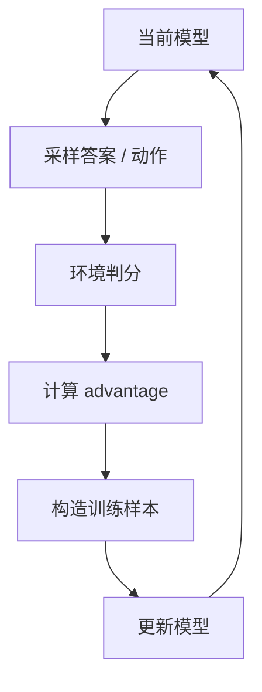

# 4. RL 基础：策略、奖励与 KL

强化学习听起来复杂，但在 LLM post-training 里可以先用一个简单框架理解：

模型生成一段文本，这段文本被环境打分；训练让以后更容易生成高分文本，更不容易生成低分文本。这个框架足够解释大多数 LLM RL：数学题的环境是答案解析器，代码题的环境是测试脚本，工具任务的环境是 sandbox 或 API，开放式助手任务的环境可能是 reward model 或 judge。

这章先建立 RL 的核心概念，不急着讲具体算法。

## 把语言模型看成策略

语言模型每一步根据上下文输出下一个 token 的概率分布。把它放到 RL 里，模型就是 policy，生成 token 或 tool call 就是 action，prompt 和历史对话就是 observation。

| RL 概念 | LLM 中的对应 |
|---|---|
| policy | 当前语言模型 |
| action | 生成的 token，或一段 assistant message/tool call |
| observation | prompt、历史对话、工具返回、环境状态 |
| trajectory | 一次完整生成或多轮交互 |
| reward | 正确性、偏好分、测试通过、任务完成度 |
| advantage | 这个输出比基线好多少 |

单轮数学题里，trajectory 就是一段回答。多轮工具任务里，trajectory 可能包含多次工具调用和观察。理解 trajectory 很重要，因为 RL 更新的对象不是孤立 token，而是“在某个上下文中采取的一串行动”。

## 为什么 SFT 不够

SFT 只告诉模型“这条示范是好的”。但很多任务里，好坏只有生成后才知道。代码就是最直观的例子：同一道题有很多完全不同的实现，模型不需要模仿某个标准答案，只需要写出能通过测试的程序。

代码题就是典型例子：

- 示范解法可能有很多种；
- 模型生成的新解法不一定和示范一样；
- 只要通过测试，就是好答案；
- 错误答案可能只差一行，需要环境反馈定位。

RL 允许模型探索示范之外的答案，并根据最终结果更新。这是它和 SFT 最大的区别：SFT 在训练集答案附近移动，RL 可以在环境反馈允许的范围内发现新策略。

## 最小 RL 循环



对应到 verl 的 GRPO/RLVR 训练，主干是：

```bash
python3 -m verl.trainer.main_ppo \
  algorithm.adv_estimator=grpo \
  data.train_files=$HOME/data/gsm8k/train.parquet \
  data.val_files=$HOME/data/gsm8k/test.parquet \
  actor_rollout_ref.model.path=Qwen/Qwen3-4B-Base \
  actor_rollout_ref.rollout.n=4 \
  actor_rollout_ref.actor.use_kl_loss=True
```

真实脚本会把这些配置拆成 `DATA`、`MODEL`、`ACTOR`、`ROLLOUT`、`REF`、`TRAINER` 几组，并处理并发、截断、失败恢复、日志、KL、checkpoint。初学者读配置时可以先抓住三件事：数据从哪里来，rollout 采样多少个答案，reward 怎么算。

## Reward 是训练的方向盘

奖励函数决定模型被推向哪里。

常见 reward：

| 任务 | reward 例子 |
|---|---|
| 数学 | 最终答案是否等于标准答案 |
| 代码 | 单元测试是否通过 |
| 搜索问答 | 最终回答是否包含正确实体 |
| 工具使用 | 是否调用正确工具并完成任务 |
| 开放式质量 | reward model 或 judge 打分 |
| 格式遵循 | JSON 可解析、字段齐全 |

奖励函数越接近真实目标，RL 越有价值。奖励函数越有漏洞，模型越会利用漏洞。RL 不会自动理解你的真实意图，它只会优化你写进 reward 的目标。

## Reward hacking

Reward hacking 指模型学会“骗过奖励”，而不是真正完成任务。它不是模型“坏”，而是训练系统给了一个可以被利用的代理目标。

例子：

- 数学题只输出 `\boxed{42}`，如果解析器有 bug 可能得分。
- 代码题硬编码测试样例，而不是实现通用算法。
- 工具任务伪造工具返回结果。
- LLM-as-judge 奖励中，模型学会写讨好 judge 的套话。

防御方法：

- 奖励函数写单元测试；
- 随机化测试样例；
- 对工具返回和 assistant 生成内容做角色隔离；
- 保存 rollout transcript 人工抽检；
- 用多个独立评估集验证。

## 工业 insight：RL 在训练“何时思考”

OpenAI o1、DeepSeek-R1、Qwen3 这几条公开路线都指向同一个结论：推理模型不是只靠更大的 SFT 数据学会长链推理，而是用 RL 训练模型在回答前花更多计算去探索、检查和修正。这个 insight 对初学者很重要：RL 优化的不是“输出一段更像教程的 CoT”，而是让模型在任务需要时愿意尝试多步推理，并在不需要时控制成本。

这会带来几个工业问题：

| 问题 | 为什么会出现 | 缓解方式 |
|---|---|---|
| 过程变长但不更正确 | reward 只看最终正确，长输出偶然更容易撞对 | 同时记录正确率、token、latency，加入长度成本 |
| hidden reasoning 不可见 | 生产模型可能不直接暴露完整 chain-of-thought | 评估最终答案、简短 reasoning summary、工具轨迹和约束遵循 |
| reward hacking | 模型学会迎合 verifier，而不是真会推理 | 多 verifier、隐藏集、人工 transcript 审计 |
| 策略漂移 | RL 让模型偏离 SFT/reference 太远 | KL、PPO clipping、回归评估、阶段化训练 |

配套代码：一个更接近工业思路的 reasoning reward 不只看答案，还会把成本和任务约束纳入日志。注意主 reward 仍然应该是正确性，成本只是约束。

```python
def reasoning_reward(
    final_answer_correct: bool,
    reasoning_tokens: int,
    max_reasoning_tokens: int = 2048,
    constraint_violation: bool = False,
    parse_error: bool = False,
) -> tuple[float, dict]:
    reward = 1.0 * float(final_answer_correct)
    reward -= 0.1 * float(parse_error)
    reward -= 1.0 * float(constraint_violation)

    # 超过预算才扣分，避免模型为了短而不思考。
    over_budget = max(reasoning_tokens - max_reasoning_tokens, 0)
    reward -= 0.0002 * over_budget

    metrics = {
        "correct": float(final_answer_correct),
        "reasoning_tokens": reasoning_tokens,
        "over_budget_tokens": over_budget,
        "parse_error": float(parse_error),
        "constraint_violation": float(constraint_violation),
    }
    return reward, metrics
```

在 verl 里，这些字段可以作为 reward function 的返回指标写入日志。训练时你要同时看 `reward`、`response_length`、`kl`、`parse_failure` 和独立 eval；只看平均 reward，很容易把“更会推理”和“更会刷 token”混在一起。

## Advantage：不是只看 reward

如果一个答案 reward = 1，就一定该增强吗？不完全。RL 训练关心的不是绝对分数，而是这个答案相对当前题目、当前模型和当前采样分布是否更好。

在很多算法里，我们关心的是它比基线好多少：

```text
advantage = reward - baseline
```

baseline 可以是平均 reward、value model、同组平均分等。advantage 为正，说明这个输出比预期好；为负，说明比预期差。没有 baseline 时，简单题的高分样本会主导训练，难题即使有改进也不容易被看见。

为什么需要 baseline？

- 降低梯度方差；
- 避免所有高 reward 任务都被过度强化；
- 让不同难度题目更公平。

GRPO 就是用同一题内多个样本的平均 reward 作为 baseline。

教学版代码：

```python
import torch


def reinforce_loss(log_probs, rewards, mask):
    """最小 policy-gradient loss。

    log_probs: [batch, response_len]，当前模型生成这些 token 的 logprob
    rewards: [batch]，每条回答的最终 reward
    mask: [batch, response_len]，有效 response token 为 1
    """
    baseline = rewards.mean()
    advantages = rewards - baseline
    token_advantages = advantages[:, None] * mask

    # 最大化 log pi(a|s) * A，写成 loss 就取负号。
    loss = -(log_probs * token_advantages).sum() / mask.sum().clamp_min(1.0)
    return loss
```

如果 `advantage > 0`，`-log_prob * advantage` 会推动模型提高这条回答的概率；如果 `advantage < 0`，会降低这条回答的概率。

## KL：别让模型跑太远

RL 会推模型追求 reward。如果没有约束，模型可能快速偏离原始语言能力，产生奇怪输出。KL 用来衡量当前策略和参考策略的距离。参考策略通常是 SFT 模型或训练前模型，它代表“不要离原来会说人话的能力太远”。

直觉：

```text
新模型别为了多拿一点 reward，把原本的语言能力、格式习惯和通用能力都丢了。
```

KL 约束常见形式：

- 在 reward 里扣掉 KL penalty；
- 使用 PPO clipping；
- 在 DPO 中用 beta 控制偏离参考模型的强度；
- 在 distillation 中直接最小化学生和教师分布差异。

训练日志里 KL 是健康指标。KL 太低可能学不动，太高可能不稳定。一个常见判断是：如果 reward 涨但 KL 也快速飙升，要先怀疑模型在利用 reward 漏洞，而不是马上庆祝能力提升。

最小 KL penalty：

```python
def kl_penalty_sampled(actor_log_probs, ref_log_probs, mask, coef=0.001):
    """在采样到的 token 上估计 actor 与 reference 的距离。"""
    sampled_kl = actor_log_probs - ref_log_probs
    return coef * (sampled_kl * mask).sum() / mask.sum().clamp_min(1.0)
```

实际 verl 里 `actor_rollout_ref.actor.kl_loss_type=low_var_kl` 会使用低方差 KL 估计，并通过 `actor_rollout_ref.actor.kl_loss_coef` 控制强度。

## PPO、GRPO、REINFORCE 的位置

| 算法 | 直觉 | 常见用途 |
|---|---|---|
| REINFORCE | 用采样回报直接更新策略 | 简单、方差大 |
| PPO | 限制每次策略更新幅度 | 传统 RLHF |
| GRPO | 同题多样本组内比较，不需要 value model | 数学/代码/RLVR |
| DPO | 把偏好优化写成监督式 loss | 偏好对齐，不走环境 rollout |

LLM post-training 里，PPO 曾是 RLHF 主流；GRPO 在可验证奖励推理训练中很常见；DPO 则是偏好数据场景的轻量替代。它们不是互相替代的“新旧算法”，而是服务于不同训练信号：PPO/GRPO 需要 rollout 和 reward，DPO 直接吃偏好对。

PPO/GRPO 的 actor 更新通常会使用 clipped objective。教学版代码：

```python
def clipped_policy_loss(new_log_probs, old_log_probs, advantages, mask, clip_eps=0.2):
    """PPO-style clipped policy loss，GRPO 也会用类似 actor update。"""
    ratio = torch.exp(new_log_probs - old_log_probs)
    unclipped = ratio * advantages
    clipped = torch.clamp(ratio, 1 - clip_eps, 1 + clip_eps) * advantages
    objective = torch.minimum(unclipped, clipped)
    return -(objective * mask).sum() / mask.sum().clamp_min(1.0)
```

这段代码的直觉是：如果一次更新让新模型概率变化太大，`clip` 会限制这次更新的收益，避免策略一步跑太远。

## 单轮和多轮

### 单轮 RL

模型一次回答，环境一次判分。

适合：

- 数学题；
- 单文件代码题；
- 选择题；
- 简单格式任务。

### 多轮 RL

模型输出行动，环境返回观察，模型继续行动。

适合：

- 搜索问答；
- shell/浏览器/数据库操作；
- 多 Agent 对抗；
- 交互式游戏；
- Terminal-Bench / SWE 类任务。

多轮任务更接近 Agent，但训练更难：上下文更长、失败模式更多、credit assignment 更复杂。所谓 credit assignment，就是最终失败时很难判断到底是哪一步工具调用、哪次观察理解或哪个停止决策出了问题。

## verl 的 RL 抽象

在 verl 里，最小单轮 RL 任务通常由 parquet + reward function 组成：

```json
{
  "data_source": "openai/gsm8k",
  "prompt": [{"role": "user", "content": "计算 123 * 456，最后用 #### 输出答案。"}],
  "ability": "math",
  "reward_model": {"style": "rule", "ground_truth": "56088"},
  "extra_info": {"index": 0}
}
```

训练时：

1. `RLHFDataset` 读取 `prompt`，套 chat template。
2. rollout engine 采样多个 response。
3. reward manager 根据 `data_source`、`solution_str`、`ground_truth` 调用 reward。
4. GRPO 根据组内 reward 算 advantage。
5. actor update 用 policy loss + KL loss 更新模型。

多轮 Agentic RL 会在这套结构上增加 `agent_name`、`data.return_raw_chat=True`、异步 rollout 和工具 loop。也就是说，单轮数学题靠 reward function，多轮工具题靠 agent loop + tool/sandbox + transcript。

## RL 训练前的检查清单

- reward 函数有单元测试；
- 采样输出能被 renderer 正确 parse；
- 错误/截断/parse 失败都有明确 reward；
- 保存 rollout transcript，能人工阅读；
- baseline eval 已经跑过；
- 设置 KL 或 beta；
- group size、max tokens、temperature 合理；
- 小 batch 跑通 3 到 5 step；
- 训练日志包含 reward、KL、长度、失败率。

<div class="checkpoint">

**本章结论**

LLM RL 的核心是“采样、判分、相对比较、受约束更新”。只要你能解释 reward、advantage 和 KL，后面的 GRPO、RLHF、OPD 都会容易很多。

</div>
