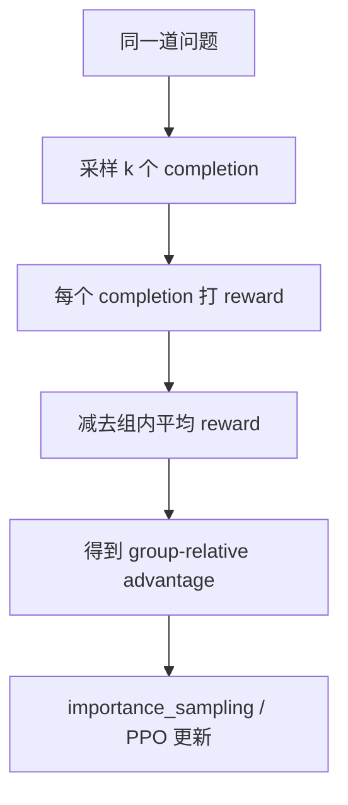

# 5. GRPO 与 RLVR 实战

RLVR 是 Reinforcement Learning with Verifiable Rewards，也就是用可验证奖励做强化学习。它是近年来推理模型训练最重要的方向之一，因为它把“回答好不好”从主观判断变成了程序可以检查的结果。

GRPO 是 RLVR 中常用的一类算法：同一道题采样多个答案，用组内相对表现作为训练信号。你可以先把它理解成“同题内部竞赛”：同一道题的几个回答互相比较，答得比同组平均更好的会被增强，答得更差的会被压低。

## 为什么可验证奖励重要

开放式回答很难判分，但很多能力可以被程序验证。只要你能写出一个可靠的 verifier，就可以把模型自己的探索变成训练信号。

- 数学题：最终数值是否正确；
- 代码题：测试是否通过；
- 工具任务：是否调用正确工具并完成目标；
- 搜索问答：最终答案是否包含标准实体；
- 终端任务：脚本是否通过测试；
- 多轮游戏：最终胜负或得分。

可验证奖励的价值在于：模型可以生成不在示范数据里的新解法，只要结果正确就能得到正反馈。对数学和代码尤其如此，因为正确解法往往不止一种，强行模仿单一示范反而会限制模型探索。

## 工业 insight：DeepSeek-R1 式能力闭环

DeepSeek-R1 的公开报告给了一个很清晰的工业模板：不要把 reasoning RL 看成单次训练，而是看成“冷启动、RL 探索、拒绝采样、再训练、再 RL”的循环。

```text
Base
-> 少量 cold-start long-CoT SFT
-> Reasoning RL
-> rejection sampling 收集高质量推理轨迹
-> 混入通用 SFT 数据
-> 第二阶段 RL，对齐推理、可读性和通用能力
-> 蒸馏到小模型
```

这个流程对 Qwen3-4B-Base 的教学价值很大：4B 模型直接大规模 RL 容易全组全错、格式不稳、reward 稀疏；先用少量格式稳定的 SFT，再让 RL 找到新解法，最后把正确轨迹筛出来回灌 SFT，会比“一把梭 GRPO”更容易复现提升。也就是说，RL 不只是一个训练阶段，它还可以成为数据生产器。

配套代码：一个最小 rejection sampling 过滤器。它把 RL rollout 里的高分样本转成后续 SFT 数据。

```python
def select_reasoning_traces(rollout_rows, min_reward=1.0, max_tokens=4096):
    """从 RL rollout 中筛出可回灌 SFT 的推理轨迹。

    rollout_rows 每行包含 prompt、response、reward、metrics。
    """
    selected = []
    for row in rollout_rows:
        response = row["response"]
        metrics = row.get("metrics", {})
        if row["reward"] < min_reward:
            continue
        if metrics.get("parse_error", 0) > 0:
            continue
        if metrics.get("response_tokens", len(response.split())) > max_tokens:
            continue
        selected.append(
            {
                "messages": [
                    *row["prompt"],
                    {"role": "assistant", "content": response},
                ],
                "source": "rl_rejection_sampling",
                "extra_info": {
                    "reward": row["reward"],
                    "origin_step": row.get("global_step"),
                },
            }
        )
    return selected
```

这段代码对应工业里的一个关键 insight：RL 不只是直接产出最终模型，也可以产出更好的训练数据。DeepSeek-R1 报告里把 reasoning RL 后筛出的高质量轨迹继续用于训练，说明“数据飞轮”本身就是后训练能力的一部分。

## GRPO 的直觉

对每道题采样 `group_size` 个答案：

```text
题目 P
  答案 1 reward = 0
  答案 2 reward = 1
  答案 3 reward = 0
  答案 4 reward = 1
```

组内平均 reward = 0.5。于是：

```text
advantage = reward - 0.5
```

正确答案 advantage = +0.5，错误答案 advantage = -0.5。模型被更新为更倾向正确样本，更少生成错误样本。这里没有单独训练 value model，因为同一道题的多个回答已经给出了一个局部 baseline。



## 为什么要组内比较

不同题目难度不同。直接比较 reward 会让简单题和难题混在一起。比如简单题大多数回答都对，难题大多数回答都错；如果只看全局 reward，训练会偏向简单题，难题里少数有价值的探索信号可能被淹没。

组内比较的好处：

- 同一道题的样本共享难度；
- 不需要训练 value model；
- reward 只要能区分同题答案好坏；
- 实现简单，适合数学和代码。

坏处也很明确：

- 如果同组全对或全错，advantage 全是 0，没有学习信号；
- group size 太小，估计噪声大；
- 采样温度太低，组内多样性不够。

## GRPO loss 的教学版实现

GRPO 可以拆成两步：

1. 同一个 prompt 的多个回答，先按组计算 advantage。
2. 用 PPO-style clipped policy loss 更新 actor。

假设 batch 已经按 `prompt_id` 标出哪些回答来自同一道题：

```python
import torch


def grpo_advantages(rewards, prompt_ids, normalize_by_std=True, eps=1e-6):
    """按 prompt 分组计算 group-relative advantage。

    rewards: [batch]，每条 response 的最终 reward
    prompt_ids: [batch]，同一道题的多个 response 共享同一个 id
    """
    advantages = torch.zeros_like(rewards, dtype=torch.float32)
    for pid in prompt_ids.unique():
        group = prompt_ids == pid
        group_rewards = rewards[group].float()
        adv = group_rewards - group_rewards.mean()
        if normalize_by_std and group_rewards.numel() > 1:
            adv = adv / (group_rewards.std(unbiased=False) + eps)
        advantages[group] = adv
    return advantages


def grpo_policy_loss(new_log_probs, old_log_probs, rewards, prompt_ids, response_mask, clip_eps=0.2):
    """教学版 GRPO actor loss。

    new_log_probs / old_log_probs: [batch, response_len]
    rewards: [batch]
    response_mask: [batch, response_len]
    """
    seq_adv = grpo_advantages(rewards, prompt_ids)
    token_adv = seq_adv[:, None] * response_mask

    ratio = torch.exp(new_log_probs - old_log_probs)
    unclipped = ratio * token_adv
    clipped = torch.clamp(ratio, 1 - clip_eps, 1 + clip_eps) * token_adv
    objective = torch.minimum(unclipped, clipped)
    return -(objective * response_mask).sum() / response_mask.sum().clamp_min(1.0)
```

一条 GSM8K prompt 采样 4 个回答时，`prompt_ids` 可能是：

```python
rewards = torch.tensor([0.0, 1.0, 0.0, 1.0])
prompt_ids = torch.tensor([7, 7, 7, 7])
print(grpo_advantages(rewards, prompt_ids, normalize_by_std=False))
# tensor([-0.5000,  0.5000, -0.5000,  0.5000])
```

verl 的 `compute_grpo_outcome_advantage` 做的就是这件事：按样本 index 分组，减去组内均值，可选再除以组内标准差，然后把标量 advantage broadcast 到 response token 上。broadcast 的意思是：同一条回答里的每个有效 response token 都使用同一个最终 advantage。

## 最小数学 RLVR

数学任务的环境一般包含：

- question；
- reference answer；
- prompt 格式要求；
- answer parser；
- reward function。

奖励函数例子：

```python
import re

def extract_boxed(text: str) -> str | None:
    matches = re.findall(r"\\boxed\{([^}]+)\}", text)
    return matches[-1].strip() if matches else None

def grade_answer(response: str, ground_truth: str) -> float:
    answer = extract_boxed(response)
    if answer is None:
        return 0.0
    answer = answer.replace(",", "").strip()
    ground_truth = ground_truth.replace(",", "").strip()
    return 1.0 if answer == ground_truth else 0.0
```

这只是教学版。真实数学判分会处理 LaTeX、等价表达式、单位、分数、小数误差等。判分器越粗糙，模型越容易学会钻空子；判分器越接近真实目标，RLVR 越有价值。

## verl 里的 GRPO/RLVR 数据和训练入口

本站实战主线使用 `verl-main`。单轮可验证任务在 verl 里通常不先写一个 Python env，而是把 prompt、标准答案和元信息写进 parquet。训练时，verl 会读取 prompt 做 rollout，再把模型生成的 response 和 `ground_truth` 交给 reward function。

```json
{
  "data_source": "openai/gsm8k",
  "prompt": [
    {
      "role": "user",
      "content": "问题文本 ... Let's think step by step and output the final answer after \"####\"."
    }
  ],
  "ability": "math",
  "reward_model": {
    "style": "rule",
    "ground_truth": "72"
  },
  "extra_info": {
    "split": "train",
    "index": 0
  }
}
```

准备 GSM8K RLVR 数据：

```bash
cd verl-main
python examples/data_preprocess/gsm8k.py \
  --local_save_dir ~/data/gsm8k
```

用 Qwen3-4B-Base 跑 GRPO：

```bash
cd verl-main
MODEL_PATH=Qwen/Qwen3-4B-Base \
TRAIN_FILE=$HOME/data/gsm8k/train.parquet \
TEST_FILE=$HOME/data/gsm8k/test.parquet \
PROJECT_NAME=llm-posttrain-cookbook \
EXPERIMENT_NAME=qwen3-4b-base-gsm8k-grpo \
NGPUS_PER_NODE=8 \
TRAIN_BATCH_SIZE=128 \
PPO_MINI_BATCH_SIZE=64 \
PPO_MICRO_BATCH_SIZE_PER_GPU=1 \
LOG_PROB_MICRO_BATCH_SIZE_PER_GPU=1 \
ROLLOUT_TP=1 \
ROLLOUT_N=4 \
ACTOR_LR=1e-6 \
KL_LOSS_COEF=0.001 \
TOTAL_EPOCHS=1 \
bash examples/grpo_trainer/run_qwen3_4b_fsdp.sh \
  trainer.logger='["console"]'
```

关键配置：

| 配置 | 作用 |
|---|---|
| `algorithm.adv_estimator=grpo` | 使用 GRPO advantage |
| `actor_rollout_ref.rollout.n=4` | 每题采样 4 个答案做组内比较 |
| `data.train_batch_size=128` | 每步 128 个 prompt |
| `actor_rollout_ref.actor.use_kl_loss=True` | 在 actor loss 里加 KL |
| `actor_rollout_ref.actor.kl_loss_coef=0.001` | 控制偏离 reference 的强度 |

完整实战见 [16. GRPO/RLVR 实战：用 verl 训练可验证推理](./16-verl-grpo-rlvr.md)。

## 代码 RL

代码 RL 的 reward 通常来自 sandbox 中的测试：

1. 模型生成代码。
2. 把代码放进隔离环境。
3. 运行单元测试。
4. 通过率变成 reward。

关键工程点：

- sandbox 必须隔离，不能让模型生成的代码影响宿主机；
- timeout 必须严格，防止死循环；
- 测试样例最好有隐藏集，防止 hardcode；
- stderr/stdout 要保存，便于错误分析；
- 多语言环境要固定依赖版本。

在 verl 里，这类任务通常会把 sandbox 或测试服务接进 reward function、reward model 或多轮 agent loop。关键不是训练入口不同，而是环境必须隔离、可重放、可记录。代码 reward 一旦不可复现，训练曲线就很难解释。

配套代码：一个极简代码题 reward。模型输出 Python 函数，环境把它写入临时文件并运行测试。

```python
import subprocess
import tempfile
from pathlib import Path


def grade_python_solution(solution_code: str, tests_code: str, timeout_s: int = 5) -> tuple[float, dict]:
    with tempfile.TemporaryDirectory() as tmp:
        workdir = Path(tmp)
        (workdir / "solution.py").write_text(solution_code, encoding="utf-8")
        (workdir / "test_solution.py").write_text(tests_code, encoding="utf-8")

        result = subprocess.run(
            ["python", "-m", "pytest", "-q", "test_solution.py"],
            cwd=workdir,
            text=True,
            stdout=subprocess.PIPE,
            stderr=subprocess.PIPE,
            timeout=timeout_s,
        )
        passed = result.returncode == 0
        return float(passed), {
            "passed": passed,
            "stdout": result.stdout[-2000:],
            "stderr": result.stderr[-2000:],
        }
```

真实训练不能直接在宿主机跑模型生成代码。这里是教学版；生产版要用容器、权限隔离、CPU/内存限制和网络隔离。

## 搜索与工具 RL

Search-R1 类任务更复杂。模型需要：

1. 判断是否需要搜索；
2. 生成搜索 query；
3. 阅读返回片段；
4. 决定继续搜索还是回答；
5. 给出最终答案。

这已经是多轮 RL。reward 只在最后给，但中间行动会影响最终结果。模型如果第一轮 query 写错，后面拿到的证据就会偏；如果不会停止，token 和工具成本会失控。

训练时要记录：

- 平均轮数；
- 工具调用成功率；
- query 质量；
- 上下文长度；
- 最终正确率；
- parse 失败率。

如果模型学会不调用工具就胡答，reward 或 prompt 可能有问题。如果模型无限调用工具，终止条件或成本惩罚可能不足。

配套代码：一个本地文档搜索工具，不依赖互联网，适合教学环境。

```python
class LocalSearchTool:
    def __init__(self, documents: dict[str, str]):
        self.documents = documents

    def search(self, query: str, top_k: int = 3):
        query_terms = set(query.lower().split())
        scored = []
        for doc_id, text in self.documents.items():
            score = sum(term in text.lower() for term in query_terms)
            if score > 0:
                scored.append((score, doc_id, text[:500]))
        scored.sort(reverse=True)
        return [{"doc_id": doc_id, "snippet": snippet, "score": score} for score, doc_id, snippet in scored[:top_k]]


def search_reward(final_answer: str, gold_entity: str, used_search: bool, turns: int) -> float:
    reward = 1.0 if gold_entity.lower() in final_answer.lower() else 0.0
    reward -= 0.05 * max(turns - 2, 0)
    reward -= 0.2 * float(not used_search)
    return reward
```

这个例子把“是否查资料”“答案是否包含标准实体”“轮数成本”都放进 reward。它比单纯奖励调用搜索次数更稳，因为最终正确性仍然是主目标。

## 超参起点

| 超参 | 常见起点 | 作用 |
|---|---:|---|
| `groups_per_batch` | 64 到 512 | 每步多少个不同问题 |
| `group_size` | 4 到 16 | 每题采样多少答案 |
| `learning_rate` | `1e-5` 到 `4e-5` | RL 通常低于 SFT |
| `max_tokens` | 任务相关 | 限制单次回答长度 |
| `temperature` | 0.7 到 1.2 | 提供组内多样性 |
| `kl_penalty_coef` | 任务相关 | 控制偏离参考模型 |
| `lora_rank` | 32 到 128 | 复杂推理可提高 |

调参优先级：

1. 确认 reward 正确。
2. 确认采样有多样性。
3. 控制 KL。
4. 再调 learning rate 和 batch。

## 训练健康指标

| 指标 | 健康表现 | 异常信号 |
|---|---|---|
| mean reward | 逐步上升 | 突然暴涨可能 reward 被钻空子 |
| degenerate groups | 适中 | 太高说明全对/全错，没有信号 |
| KL | 稳定小幅波动 | 快速升高说明策略漂移 |
| response length | 与任务匹配 | 越来越长可能在刷过程 |
| parse failure | 越低越好 | 说明格式没学稳 |
| eval score | 独立集上提升 | 训练 reward 涨但 eval 不涨是过拟合 |

## 常见失败模式

### 全组 reward 一样

如果同题所有 completion 都错，advantage 为 0。解决：

- 提高模型初始化能力；
- 增加 few-shot；
- 提高采样温度；
- 降低任务难度；
- 使用 SFT warm start。

### 模型只学格式，不学能力

如果 reward 包含格式分，模型可能先优化格式。格式 reward 权重要小，最终正确性要占主导。

### 长链推理变啰嗦

如果正确答案常来自长输出，模型可能学会无意义延长。可以加长度惩罚或在评估中关注 token 成本。

### 训练 reward 涨，benchmark 不涨

可能原因：

- 训练题泄漏；
- reward parser 偏离 benchmark parser；
- 过拟合 prompt 格式；
- KL 太大，通用能力掉了；
- eval 采样参数不一致。

## 一个推荐实验设计

以数学 GRPO 为例：

1. Base model 上跑 GSM8K/MATH baseline。
2. 先用 128 道训练题，`group_size=4` 跑 10 step。
3. 检查 rollout transcript，确认 reward 和格式正确。
4. 扩到 1k 道题，`group_size=8` 跑 100 step。
5. 每 20 step 跑 GSM8K 子集评估。
6. 观察 KL、长度、degenerate groups。
7. 固定最佳 checkpoint 在独立 MATH-500/AIME 子集上评估。
8. 做消融：无格式奖励、不同 group size、不同 LR。

<div class="checkpoint">

**本章结论**

RLVR 的威力来自“可验证反馈 + 策略探索”。GRPO 的实用性来自“同题组内比较”。但所有收益都依赖奖励函数真实、日志可读、评估独立。

</div>
