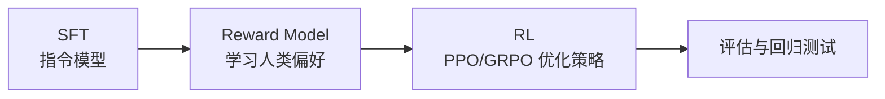

# 6. RLHF、DPO 与偏好优化

不是所有任务都有标准答案。很多时候，我们知道哪个回答更好，却很难写出程序 reward。偏好优化就是为这种场景服务的。它处理的是“质量排序”问题：同一个 prompt 下，哪个回答更清楚、更有帮助、更符合约束、更适合目标用户。

这一章讲：

- 什么是偏好数据；
- RLHF 的三阶段；
- DPO 为什么流行；
- ORPO、SimPO、KTO 这类方法应该怎样理解；
- 实战中如何选择。

## 偏好数据

偏好数据通常是三元组：

```json
{
  "prompt": "解释一下什么是 LoRA，面向初学者。",
  "chosen": "LoRA 可以理解为给模型加一个很小的可训练外挂...",
  "rejected": "LoRA is a low-rank decomposition method..."
}
```

它表达的是：

```text
chosen 比 rejected 更符合目标
```

目标可以是帮助性、清晰度、事实性、风格、简洁性，也可以是某个领域专家的判断。关键是要把目标写成稳定的 rubric，否则不同样本里的 chosen 可能代表完全不同的偏好。

## 偏好数据的质量维度

偏好优化非常依赖数据质量。要检查：

- chosen 是否真的比 rejected 好；
- 差异是否明确，还是两个都差不多；
- prompt 是否覆盖真实分布；
- rejected 是否包含常见失败模式；
- 标注准则是否稳定；
- 不同标注者是否一致；
- 是否混入“长度越长越好”的偏差。

如果 chosen 只是更长，模型会学会啰嗦。如果 chosen 总是更礼貌，模型可能牺牲直接性。如果 rejected 太弱，模型学不到细粒度偏好。偏好数据不是“好回答集合”，而是一组比较；比较双方的差异必须能代表你希望模型学习的取舍。

## RLHF 三阶段

传统 RLHF 通常是：



### 阶段 1：SFT

先得到一个能基本遵循指令的模型。没有 SFT，模型生成质量可能太差，偏好标注和 RL 都会困难。一个常见经验是：先让模型“会答”，再训练它“答得更好”。

### 阶段 2：训练 Reward Model

Reward model 输入 prompt 和回答，输出一个标量分数。训练目标是让 chosen 的分数高于 rejected。它本质上是把人类或专家的偏好压缩成一个可自动调用的打分器。

最小 reward model loss：

```python
import torch
import torch.nn.functional as F


def reward_model_pairwise_loss(chosen_scores, rejected_scores):
    """Bradley-Terry / pairwise ranking loss。

    chosen_scores: [batch]，reward model 给 chosen 的分数
    rejected_scores: [batch]，reward model 给 rejected 的分数
    """
    margin = chosen_scores - rejected_scores
    return -F.logsigmoid(margin).mean()
```

如果 `chosen_score` 比 `rejected_score` 高很多，loss 接近 0；如果 rejected 分数更高，loss 会变大。训练好的 reward model 可以接到 PPO/GRPO 里，给模型自己采样的回答打分。

### 阶段 3：RL 优化

用当前 policy 采样回答，让 reward model 打分，再用 PPO/GRPO 等 RL 方法更新 policy，同时用 KL 约束不要偏离 SFT 模型太远。这个阶段最需要监控 reward hacking：policy 可能学会讨好 reward model，而不是让真实用户更满意。

## RLHF 的优缺点

优点：

- 可以表达复杂偏好；
- reward model 可以复用到不同 prompt；
- RL 可以优化模型自己生成的回答。

缺点：

- 工程复杂，成本高；
- reward model 可能被 policy 利用；
- PPO/RL 稳定性敏感；
- 标注准则不稳会放大问题。

因此，如果你只有中等规模偏好数据，DPO 往往是更务实的起点。

## 工业 insight：偏好优化解决产品取舍，不替代能力训练

OpenAI InstructGPT、Meta Llama 3 和 Anthropic HH-RLHF 的公开资料都说明了一件事：偏好数据最适合处理“两个都能回答，但哪个更好”的问题，例如清晰度、完整性、语气、遵循约束、是否啰嗦、是否正确使用上下文。它不适合替代数学 RLVR、代码测试或 agent 环境。

工业里常见分工是：

| 目标 | 更合适的方法 | 原因 |
|---|---|---|
| 答案必须对 | RLVR / verifier / 单元测试 | 偏好标签太贵且不精确 |
| 回答更好用 | DPO / RLHF / LLM-as-judge preference | 人类偏好能表达开放式质量 |
| 工具策略 | Agentic RL / trajectory preference | 单轮 chosen/rejected 看不到行动后果 |
| 多能力保持 | 回归评估 + 蒸馏 + 数据混合 | 偏好优化可能牺牲某些硬能力 |

偏好优化的工业问题通常不是公式，而是数据偏差：

- 标注者偏好“更长”，模型就学会拖长；
- rejected 太弱，模型只学会避开垃圾答案；
- 不同 rubric 混在一起，模型不知道该更短、更礼貌还是更准确；
- reward model 训练得越好，policy 越可能找到 reward model 的漏洞；
- win-rate 上涨，但真实任务完成率不涨。

配套代码：偏好数据入训练前先做审计。这个审计不决定样本好坏，但能暴露长度偏差、弱负例和 rubric 混乱。

```python
def audit_preference_pair(row: dict) -> dict:
    chosen = row["chosen"]
    rejected = row["rejected"]
    rubric = row.get("rubric", "unknown")

    chosen_len = len(chosen.split())
    rejected_len = len(rejected.split())
    length_ratio = chosen_len / max(rejected_len, 1)
    too_easy = rejected_len < 20 or "I don't know" in rejected

    return {
        "rubric": rubric,
        "chosen_len": chosen_len,
        "rejected_len": rejected_len,
        "length_ratio": length_ratio,
        "length_bias_risk": float(length_ratio > 1.8),
        "weak_negative_risk": float(too_easy),
    }


def summarize_preference_audit(rows):
    audits = [audit_preference_pair(row) for row in rows]
    n = max(len(audits), 1)
    return {
        "length_bias_rate": sum(x["length_bias_risk"] for x in audits) / n,
        "weak_negative_rate": sum(x["weak_negative_risk"] for x in audits) / n,
        "rubrics": sorted({x["rubric"] for x in audits}),
    }
```

在真实项目里，如果 `length_bias_rate` 很高，先修数据，不要急着换 DPO/ORPO/SimPO。算法只能放大数据里的偏好，不能自动知道你的产品真正想要什么。

## DPO 的直觉

DPO 全称 Direct Preference Optimization。它绕过显式 reward model，直接用偏好对训练 policy。对很多团队来说，DPO 是偏好优化的第一站，因为它比完整 RLHF 简单，训练形态更接近监督学习。

直觉上，DPO 做两件事：

1. 提高模型生成 chosen 的相对概率；
2. 降低模型生成 rejected 的相对概率；
3. 同时参考一个 reference model，避免偏离太远。

`beta` 控制偏离强度：

- beta 小：更新更激进；
- beta 大：更保守，更贴近 reference。

常见起点：

```text
learning_rate = 1e-5
dpo_beta = 0.1
batch_size = 256
```

## DPO loss 的教学版实现

DPO 不显式训练 reward model。它直接比较 policy 对 chosen 和 rejected 的相对偏好，并减去 reference model 的相对偏好。

先写一个工具函数：计算某条回答在模型下的总 log probability。

```python
import torch
import torch.nn.functional as F


def sequence_logprob(logits, labels, mask):
    """计算一条 answer 的 log pi(answer | prompt)。

    logits: [batch, seq_len, vocab]
    labels: [batch, seq_len]，目标 token
    mask: [batch, seq_len]，answer token 为 1，prompt/pad 为 0
    """
    log_probs = F.log_softmax(logits, dim=-1)
    token_log_probs = torch.gather(log_probs, dim=-1, index=labels[..., None]).squeeze(-1)
    return (token_log_probs * mask).sum(dim=-1)
```

DPO loss：

```python
def dpo_loss(
    policy_chosen_logps,
    policy_rejected_logps,
    ref_chosen_logps,
    ref_rejected_logps,
    beta=0.1,
):
    policy_logratio = policy_chosen_logps - policy_rejected_logps
    ref_logratio = ref_chosen_logps - ref_rejected_logps
    logits = beta * (policy_logratio - ref_logratio)
    return -F.logsigmoid(logits).mean()
```

一条样本的直觉：

```text
如果 policy 相比 reference 更偏向 chosen，logits 变大，loss 下降。
如果 policy 偏向 rejected，logits 变小，loss 上升。
```

这里的 reference 很重要。它防止 policy 只是无约束地把 chosen 概率推高，而是要求“相对初始模型更偏向 chosen”。如果没有 reference 或约束，模型可能为了偏好数据上的收益牺牲原有语言质量。

## verl 中的偏好数据入口

在本教程的 verl 实战主线里，偏好数据先落到 parquet。`examples/data_preprocess/full_hh_rlhf.py` 可以生成三种 split：

```bash
cd verl-main
python examples/data_preprocess/full_hh_rlhf.py \
  --split rm \
  --local_save_dir ~/data/full_hh_rlhf
```

`rm` split 的核心字段是：

```json
{
  "prompt": "Human: Can you explain ...",
  "chosen": "Assistant: A clearer, safer, more useful answer...",
  "rejected": "Assistant: A worse answer..."
}
```

如果要把偏好数据转成监督数据，使用：

```bash
python examples/data_preprocess/full_hh_rlhf.py \
  --split sft \
  --local_save_dir ~/data/full_hh_rlhf
```

如果要进入 reward-model-driven RL，使用：

```bash
python examples/data_preprocess/full_hh_rlhf.py \
  --split rl \
  --local_save_dir ~/data/full_hh_rlhf
```

verl 里 DPO/online DPO 属于可扩展训练方式；初学者更建议先掌握 SFT、GRPO/RLVR 和 reward 数据闭环，再把偏好优化接到通用回答质量、风格和简洁性上。相关实战入口见 [17. OPD、偏好与 Agentic RL](./17-verl-opd-agent-preference.md)。

## DPO 适合什么

DPO 适合：

- 已有稳定偏好对；
- 目标是回答质量、风格、简洁性或领域偏好；
- 不想训练 reward model；
- 不想引入复杂 RL rollout；
- SFT 模型已经基本会做任务。

DPO 不适合：

- 任务好坏必须通过执行环境判断；
- 需要模型探索新策略；
- 偏好数据很弱或冲突很大；
- chosen/rejected 长度和格式偏差严重。

## ORPO、SimPO、KTO 怎么看

这些方法都试图简化或改进偏好优化。初学者不用先记公式，可以按训练信号理解。

| 方法 | 需要数据 | 粗略理解 |
|---|---|---|
| DPO | chosen/rejected 成对偏好 | 直接提高 chosen 相对 rejected 的概率 |
| ORPO | SFT 数据 + 偏好倾向 | 把监督学习和 odds ratio 偏好项合在一起 |
| SimPO | chosen/rejected | 不显式依赖 reference model 的简化偏好优化 |
| KTO | 单条好/坏反馈 | 用 prospect theory 风格处理非成对反馈 |
| IPO | chosen/rejected | 对 DPO 目标做稳定性改造 |

实战建议：先用 DPO 建 baseline。只有当数据形态或稳定性问题明确时，再试其他方法。

配套代码：这些方法的真实论文细节不同，但可以先用教学版理解它们处理的信号。

### SimPO：直接比较平均 logprob

SimPO 不依赖 reference model，常用长度归一后的 sequence logprob。

```python
def masked_average_logprob(token_logps, mask):
    return (token_logps * mask).sum(dim=-1) / mask.sum(dim=-1).clamp_min(1.0)


def simpo_loss(chosen_token_logps, rejected_token_logps, chosen_mask, rejected_mask, beta=2.0, gamma=0.5):
    chosen = masked_average_logprob(chosen_token_logps, chosen_mask)
    rejected = masked_average_logprob(rejected_token_logps, rejected_mask)
    logits = beta * (chosen - rejected - gamma)
    return -torch.nn.functional.logsigmoid(logits).mean()
```

直觉：chosen 的平均 logprob 应该比 rejected 高出一个 margin。

### ORPO：SFT loss 加偏好项

ORPO 可以粗略理解为“chosen 仍做监督学习，同时加入 chosen/rejected 的 odds 偏好约束”。

```python
def orpo_style_loss(chosen_nll, chosen_logps, rejected_logps, beta=0.1):
    """教学版 ORPO-like loss，不覆盖论文所有数值细节。"""
    preference_term = -torch.nn.functional.logsigmoid(chosen_logps - rejected_logps).mean()
    return chosen_nll + beta * preference_term
```

直觉：它不像 DPO 那样把偏好训练完全独立出来，而是把“模仿 chosen”和“压低 rejected”放进同一次训练。

### KTO：单条好/坏反馈

KTO 适合没有成对 chosen/rejected、只有“这个回答好/坏”的数据。教学版可以写成：

```python
def kto_style_loss(policy_logps, ref_logps, labels, beta=0.1):
    """labels: 1 表示 desirable，0 表示 undesirable。"""
    log_ratio = policy_logps - ref_logps
    good_loss = -torch.nn.functional.logsigmoid(beta * log_ratio)
    bad_loss = -torch.nn.functional.logsigmoid(-beta * log_ratio)
    return torch.where(labels.bool(), good_loss, bad_loss).mean()
```

直觉：好样本让 policy 相对 reference 更愿意生成，坏样本让 policy 相对 reference 更不愿意生成。

## 偏好优化的数据陷阱

### 长度偏差

chosen 总是比 rejected 长，模型会学会更长，不一定更好。需要长度归一、人工抽检或构造长度相近的偏好对。

### 单一偏好过度

如果某一类偏好数据过多，模型可能把它学成通用规则。例如所有 chosen 都更长，模型就会变长；所有 chosen 都很委婉，模型就会变得不够直接。需要保留正常帮助性、准确性和简洁性评估。

### 标注准则混乱

有些 chosen 因为更礼貌，有些因为更准确，有些因为更短。混在一起时，模型可能学不到清晰方向。

### rejected 太容易

如果 rejected 都是明显垃圾答案，模型只学会避开低级错误，无法提升高阶质量。

## 偏好优化的评估

不要只看 DPO loss。建议：

- 固定 prompt 集，比较 before/after；
- 人工 blind review；
- 用独立 judge model 做 pairwise win-rate；
- 监控长度、格式错误率和任务完成率；
- 保留帮助性、准确性和简洁性评估；
- 抽查 chosen/rejected 相似 prompt 上的泛化。

一个实用评估表：

| 维度 | 指标 |
|---|---|
| 帮助性 | pairwise win-rate、任务完成率 |
| 边界行为 | 该澄清时是否澄清、该使用工具时是否使用工具 |
| 简洁性 | 平均输出长度、冗余率 |
| 事实性 | 人工 fact check、引用正确率 |
| 稳定性 | 多次采样一致性 |

## RLHF 什么时候值得上

如果你满足这些条件，RLHF 可能值得：

- 有大量偏好数据；
- reward model 能在独立集上稳定排序；
- 任务目标无法用 DPO 充分优化；
- 有能力监控 reward hacking；
- 有工程资源跑 rollout、KL、checkpoint 和人工评估。

否则，SFT + DPO 通常是更好的第一版。先用简单方法建立可解释 baseline，再决定是否需要完整 RLHF。

<div class="checkpoint">

**本章结论**

偏好优化解决的是“哪个回答更好”。DPO 是务实起点，RLHF 是更复杂但更强的路线。偏好数据的质量、长度偏差和评估设计，往往比算法名字更重要。

</div>
