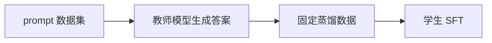
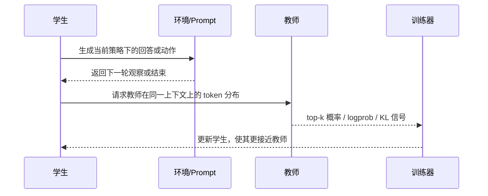
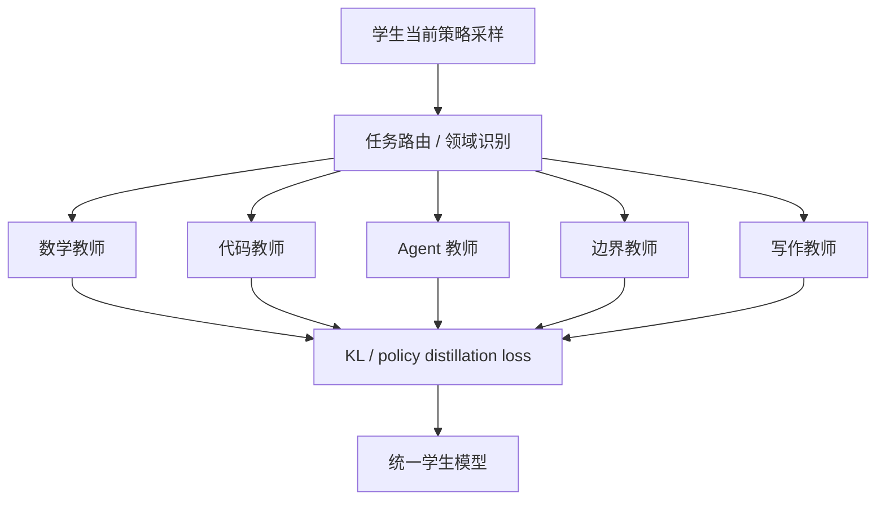
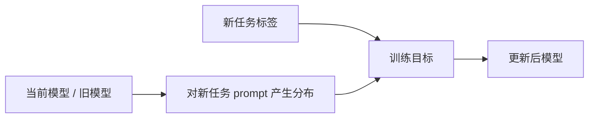

# 7. 蒸馏、SDFT 与 OPD

蒸馏的核心问题是：如何把一个强模型、强策略或已有模型的行为，迁移到另一个模型里。它不是简单复制文本，而是把“教师为什么更会做这类任务”的信号转移给学生模型。

这章重点讲四类方法：

- off-policy distillation：用教师生成的固定数据训练学生；
- on-policy distillation，也就是 OPD：学生自己生成轨迹，教师在这些轨迹上给分布信号；
- multi-teacher OPD，也就是 MOPD：多个专家教师共同蒸馏一个统一学生；
- SDFT：用自蒸馏约束缓解新任务训练带来的遗忘。

## 为什么需要蒸馏

强模型通常贵、慢、难部署。蒸馏可以把它的能力迁移到：

- 更小模型；
- 更便宜模型；
- 私有部署模型；
- 特定领域模型；
- LoRA adapter；
- 低延迟推理服务。

蒸馏不只是“复制答案”。更好的蒸馏会学习教师的概率分布：哪些 token 高概率，哪些 token 低概率，哪些替代表达仍然合理。SFT 只给学生一个正确 token，KL 蒸馏会给学生一个更软的目标分布，因此信息量更大。

## 工业 insight：小模型后训练优先学蒸馏

DeepSeek-R1 的公开结果很适合小白理解蒸馏价值：强 reasoning 模型产生高质量推理数据后，可以把能力蒸馏到 Qwen/Llama 等更小模型上。Qwen3 报告也明确使用 strong-to-weak distillation，并指出对小模型来说，从强模型蒸馏通常比完整复刻大模型后训练流程更省资源。

对本教程主角 `Qwen/Qwen3-4B-Base` 来说，这个 insight 很务实：

- 4B 模型可以跑 SFT/GRPO，但不一定有算力从零复现强 reasoning RL；
- 强教师生成的正确轨迹可以显著降低冷启动难度；
- 蒸馏数据仍然要过 verifier，不能盲信教师；
- 对工具/agent 任务，最好蒸馏完整轨迹，而不是只蒸馏最终答案。

配套代码：一个强教师数据生成和 verifier 过滤的最小闭环。这里的 verifier 可以是数学判分器、代码测试、格式检查器或人工审核结果。

```python
def build_verified_distill_data(prompts, teacher, tokenizer, verifier):
    distilled = []
    for prompt_messages in prompts:
        prompt_text = tokenizer.apply_chat_template(
            prompt_messages,
            add_generation_prompt=True,
            tokenize=False,
        )
        input_ids = tokenizer(prompt_text, return_tensors="pt").input_ids.to(teacher.device)
        output_ids = teacher.generate(input_ids, max_new_tokens=2048, temperature=0.7, do_sample=True)
        answer = tokenizer.decode(output_ids[0, input_ids.shape[1] :], skip_special_tokens=True)

        verdict = verifier(prompt_messages, answer)
        if not verdict["passed"]:
            continue

        distilled.append(
            {
                "messages": [*prompt_messages, {"role": "assistant", "content": answer}],
                "source": "strong_teacher_verified",
                "extra_info": {"verifier_score": verdict["score"]},
            }
        )
    return distilled
```

这段代码和普通 synthetic SFT 的区别是：教师只是候选生成器，verifier 才决定样本能不能进训练集。DeepSeek-R1 式流程里，rejection sampling 和蒸馏都依赖这个思想。

## Off-policy distillation

最常见做法：

1. 准备 prompt 数据集。
2. 用教师模型生成回答。
3. 把 `(prompt, teacher_answer)` 当作 SFT 数据训练学生。



优点：

- 简单；
- 可离线生成；
- 容易复现；
- 可以人工过滤。

缺点：

- 学生只见到教师轨迹，不见自己会犯的错；
- 单答案 SFT 会损失教师分布信息；
- 如果教师答案太长或太强，学生可能学不动；
- 对多轮任务，固定轨迹很难覆盖学生偏离后的状态。

配套代码：off-policy distillation 可以先生成教师答案，再当 SFT 数据训练学生。

```python
def build_teacher_sft_example(tokenizer, teacher, prompt_messages):
    prompt_text = tokenizer.apply_chat_template(
        prompt_messages,
        add_generation_prompt=True,
        tokenize=False,
    )
    input_ids = tokenizer(prompt_text, return_tensors="pt").input_ids.to(teacher.device)
    output_ids = teacher.generate(input_ids, max_new_tokens=1024, temperature=0.7, do_sample=True)
    answer = tokenizer.decode(output_ids[0, input_ids.shape[1] :], skip_special_tokens=True)

    return {
        "messages": [
            *prompt_messages,
            {"role": "assistant", "content": answer},
        ]
    }
```

这段代码生成的是固定教师轨迹。后续学生 SFT 时，学生只会模仿这个 answer；如果学生推理时走到不同中间状态，教师不会再纠正它。这就是 off-policy 蒸馏的核心限制：数据便宜稳定，但不覆盖学生自己的错误分布。

## OPD：On-Policy Distillation

OPD 的关键变化：轨迹来自学生当前策略。学生先按照自己当前能力生成回答或动作，教师再在这些真实状态上给 token-level 信号。

流程：



这有两个重要好处：

- 教师纠正的是学生真实会到达的状态；
- 多轮任务中，学生偏离后也能得到教师信号。

因此 OPD 介于 RL 和蒸馏之间：它有 on-policy rollout，但优化目标是贴近教师，而不是最大化环境 reward。如果你已经有一个强教师，却没有稳定 reward，OPD 往往比硬写 reward 更容易起步。

## MOPD：Multi-Teacher On-Policy Distillation

现代模型很少只有一个教师。更常见的情况是：

- 数学教师强；
- 代码教师强；
- agent 教师强；
- 边界/风险教师稳；
- 写作/聊天教师自然；
- 视觉教师擅长 grounding 和 GUI。

MOPD 的目标是把这些专家合并成一个统一模型。



它解决的是顺序训练回退问题：如果先训数学再训 agent，数学可能掉；先训写作再训代码，代码可能变啰嗦；先训工具再训聊天，普通回答可能变机械。MOPD 让学生在自己的 on-policy 分布上接收多个专家的 token-level 信号，减少能力互相覆盖。

实践时要注意：

- 路由要可靠，否则数学题找写作教师会污染信号；
- 不同教师的 chat template 和 thinking 协议要统一；
- 每类专家能力都要有独立回归评估；
- 教师不要盲目越多越好，冲突教师会让学生目标不稳定；
- 对 agent 轨迹，教师信号要覆盖多轮状态，而不是只看最终答案。

## Cross-stage Distillation

GLM-5 类流程还强调 cross-stage distillation：把某一阶段得到的强能力或强轨迹，蒸馏给下一阶段模型，缓解阶段之间的能力回退。

可以把它理解为“每一阶段训练完，都把好行为保存成教师信号”，下一阶段不只是优化新 reward，也要保留旧阶段已经学到的策略。这样做比简单混入旧数据更细，因为教师分布能告诉学生哪些替代 token 也合理。

这在现代流程中特别重要：

```text
Reasoning RL -> Agentic RL -> General RL
```

如果只按顺序训练，general RL 可能把长链推理压短，agentic RL 可能把聊天风格变机械。Cross-stage distillation 是在阶段之间架桥。

## OPD 和 RL 的关系

| 维度 | RLVR | OPD |
|---|---|---|
| 轨迹来源 | 学生当前策略 | 学生当前策略 |
| 训练信号 | reward / advantage | 教师分布 / KL |
| 是否需要环境判分 | 通常需要 | 可以不需要 |
| 适合任务 | 可验证正确性 | 能力迁移、行为稳定 |
| 风险 | reward hacking | 教师成本、教师偏差 |

OPD 可以用于没有明确 reward 的任务，也可以和 reward 结合。例如多轮工具任务中，reward 很稀疏，但教师能给每一步更密集的行为信号。你可以把最终 reward 看成“结果是否成功”，把教师 KL 看成“过程是否像强策略”。

## KL 蒸馏

蒸馏常用 KL divergence 衡量学生分布和教师分布的差异。

直觉：

```text
在同一个上下文和同一个位置，学生给每个 token 的概率应该接近教师。
```

完整词表 KL 成本高，所以工程上常用 top-k teacher distribution：只取教师概率最高的若干 token 来训练。这样能显著降低通信和存储成本，尤其适合大教师、小学生的训练设置。

## 蒸馏 loss 的教学版实现

### 1. 普通 forward KL 蒸馏

如果能拿到完整教师 logits，forward KL 可以写成：

```python
import torch
import torch.nn.functional as F


def forward_kl_distill_loss(student_logits, teacher_logits, mask, temperature=1.0):
    """让学生分布接近教师分布。

    student_logits / teacher_logits: [batch, seq_len, vocab]
    mask: [batch, seq_len]，只在 response token 上蒸馏
    """
    student_logp = F.log_softmax(student_logits / temperature, dim=-1)
    teacher_p = F.softmax(teacher_logits / temperature, dim=-1)
    teacher_logp = F.log_softmax(teacher_logits / temperature, dim=-1)

    token_kl = (teacher_p * (teacher_logp - student_logp)).sum(dim=-1)
    return (token_kl * mask).sum() / mask.sum().clamp_min(1.0)
```

这比 SFT 的单答案监督更丰富：SFT 只告诉学生“这个 token 是标签”，KL 蒸馏告诉学生“教师对整个词表的概率分布是什么”。

### 2. top-k 教师蒸馏

真实系统通常不传完整词表 logits，而是只传教师 top-k token 和对应 logprob。教学版：

```python
def topk_forward_kl_loss(student_logits, teacher_topk_ids, teacher_topk_logps, mask):
    """只在教师 top-k token 上近似 forward KL。

    teacher_topk_ids: [batch, seq_len, k]
    teacher_topk_logps: [batch, seq_len, k]
    """
    student_logp = F.log_softmax(student_logits, dim=-1)
    student_topk_logps = torch.gather(student_logp, dim=-1, index=teacher_topk_ids)
    teacher_probs = teacher_topk_logps.exp()

    token_kl = (teacher_probs * (teacher_topk_logps - student_topk_logps)).sum(dim=-1)
    return (token_kl * mask).sum() / mask.sum().clamp_min(1.0)
```

verl 的 `compute_forward_kl_topk` 就是这个方向：教师服务返回 top-k token logprob，学生在同一位置取对应 token 的 logprob，再计算 KL。

### 3. OPD 为什么多了 on-policy

OPD 的 loss 看起来像蒸馏，但数据不是教师固定生成的，而是学生当前策略生成的：

```python
def one_opd_step(student, teacher, tokenizer, prompt_ids, optimizer):
    # 1. 学生自己采样一条 response，这是 on-policy 状态分布。
    sampled = student.generate(prompt_ids, max_new_tokens=256, do_sample=True)

    # 2. 在 prompt + sampled response 上，让教师给 token 分布。
    with torch.no_grad():
        teacher_logits = teacher(sampled).logits

    # 3. 学生也在同一条轨迹上 forward。
    student_logits = student(sampled).logits

    # 4. 只蒸馏 response 区域，不蒸馏 prompt。
    mask = torch.zeros_like(sampled)
    mask[:, prompt_ids.shape[1] :] = 1

    loss = forward_kl_distill_loss(student_logits[:, :-1], teacher_logits[:, :-1], mask[:, 1:])
    loss.backward()
    optimizer.step()
    optimizer.zero_grad()
```

这段代码省略了分布式、top-k、rollout logprob、teacher pool 和 KL estimator，但说明了 OPD 的本质：**学生走到哪里，教师就在哪里教**。这句话是区分 OPD 和普通蒸馏的核心。

## Prompt distillation

Prompt distillation 关注的是把长提示词、复杂规则或系统 prompt 内化到模型里。

例子：

原来每次调用都要带很长 system prompt：

```text
你是某公司客服。回答必须遵守 20 条政策...
```

训练后，模型即使在短 prompt 下也能遵守这些规则。这可以降低上下文成本，提高部署稳定性。

风险是规则变化后模型不易更新。因此适合相对稳定的流程，不适合频繁变化的业务政策。

## SDFT：自蒸馏缓解遗忘

新任务 SFT 常见问题是 catastrophic forgetting：模型在新任务上变好，但旧能力下降。比如你用大量领域问答训练模型，它可能在领域术语上更准确，却在通用问答、格式遵循或推理任务上退步。

SDFT 的思路是：训练新任务时，不只看标签，还让模型保留原有分布的一部分。



它适合：

- 持续学习；
- 领域增量训练；
- 希望保留通用能力；
- 不想单独部署强教师模型。

配套代码：SDFT 可以理解为“新任务标签 loss + 旧模型分布保持 loss”。

```python
def sdft_loss(
    student_logits,
    old_model_logits,
    labels,
    label_mask,
    distill_mask,
    distill_coef=0.2,
):
    """教学版 SDFT。

    label_mask: 新任务 assistant 标签区域
    distill_mask: 希望保留旧分布的区域
    """
    sft = sft_loss(student_logits, labels, label_mask)
    keep_old = forward_kl_distill_loss(student_logits, old_model_logits, distill_mask)
    return sft + distill_coef * keep_old
```

这段代码里 `old_model_logits` 来自训练前模型。它不一定比学生强，但能告诉学生“不要在这些上下文上离原行为太远”。

## 多教师蒸馏

一个教师不一定覆盖所有能力。多教师可以按任务分配：

- 数学教师；
- 代码教师；
- 对话教师；
- 边界/风险教师；
- 工具使用教师。

关键是数据混合比例和 on-policy 分布。不要把不同教师的风格和格式随意混合，否则学生会学到冲突行为。

建议：

- 每个教师对应明确任务域；
- 每类数据单独评估；
- 控制 prompt 格式一致；
- 监控各能力之间的 trade-off。

## 蒸馏训练前的问题

1. 教师是否真的比学生强？
2. 教师强在哪些任务？
3. 学生容量是否足够？
4. 目标是复制答案、复制风格，还是复制推理能力？
5. 是否需要保留旧能力？
6. 教师调用成本是否可接受？
7. 蒸馏评估是否能区分“像教师”和“真的正确”？

最后一点很关键。学生像教师不一定好，如果教师错了，蒸馏会稳定复制错误。

## OPD 的实践 recipe

一个推理 OPD 实验可以这样做：

1. 用 SFT 或已有 checkpoint 初始化学生。
2. 准备 DeepMath/MATH/GSM8K 等 prompt。
3. 学生对 prompt 采样回答。
4. 教师在学生生成路径上提供 token 分布。
5. 用 KL loss 更新学生。
6. 每隔 N step 跑 AIME/MATH-500/GSM8K 评估。
7. 抽查学生回答是否真的更正确，而不是只更像教师。

多轮 OPD 则把 prompt 换成工具环境或 agent loop，让学生在真实交互中生成轨迹。

## verl 中的 OPD 入口

本站实战主线使用 `verl-main/examples/on_policy_distillation_trainer/run_qwen3_8b_fsdp.sh`。对本教程的主角，可以把学生设为 `Qwen/Qwen3-4B-Base`，教师设为同 Qwen3 家族的更强模型：

```bash
cd verl-main
STUDENT_MODEL=Qwen/Qwen3-4B-Base \
TEACHER_MODEL=Qwen/Qwen3-8B \
PROJECT_NAME=llm-posttrain-cookbook \
EXPERIMENT_NAME=qwen3-4b-base-opd-from-qwen3-8b \
NGPUS_PER_NODE=8 \
TEACHER_WORLD_SIZE=2 \
TRAIN_BATCH_SIZE=64 \
PPO_MINI_BATCH_SIZE=64 \
ROLLOUT_TP=1 \
TEACHER_TP=1 \
ACTOR_LR=1e-6 \
DISTILLATION_LOSS_MODE=k1 \
USE_POLICY_GRADIENT=True \
DISTILLATION_TOPK=64 \
TOTAL_EPOCHS=1 \
bash examples/on_policy_distillation_trainer/run_qwen3_8b_fsdp.sh \
  trainer.logger='["console"]'
```

关键配置：

| 配置 | 作用 |
|---|---|
| `distillation.enabled=True` | 开启 OPD |
| `distillation.teacher_models.teacher_model.model_path` | 教师模型 |
| `distillation.distillation_loss.loss_mode` | 蒸馏 KL/估计器类型 |
| `distillation.distillation_loss.use_policy_gradient` | 使用 PG OPD 还是直接 KL |
| `distillation.distillation_loss.use_task_rewards` | 是否叠加任务 reward |

多教师 OPD/MOPD 用 `distillation.teacher_key=data_source` 路由不同样本到不同教师。完整实战见 [17. OPD、偏好与 Agentic RL](./17-verl-opd-agent-preference.md)。

## 常见失败模式

### 教师答案太难

学生容量小，直接学长 CoT 或复杂工具策略会失败。可以先 SFT warm start，或降低任务难度。

### 蒸馏过度

学生完全追随教师风格，失去原有简洁性、多样性或领域边界。需要保留通用评估和 KL/混合数据控制。

### 教师偏差复制

教师在某类问题上有系统错误，学生会继承。蒸馏前要先评估教师。

### On-policy 采样质量太差

学生早期轨迹全是垃圾，教师信号利用率低。解决方案是先 SFT，或混入 off-policy 数据。

## 什么时候选哪种蒸馏

| 场景 | 推荐方法 |
|---|---|
| 快速复制教师问答风格 | Off-policy SFT |
| 压缩推理能力 | SFT warm start + OPD |
| 多轮工具行为迁移 | OPD / 多轮 distillation |
| 合并多个专家能力 | MOPD / cross-stage distillation |
| 新任务训练但要保留旧能力 | SDFT |
| 多能力综合学生 | 多教师蒸馏 + 分域评估 |

<div class="checkpoint">

**本章结论**

蒸馏的本质是能力迁移。Off-policy 简单，OPD 更贴近学生真实分布，SDFT 更关注保留旧能力。选择哪种方法，取决于你要迁移的是答案、风格、推理过程还是多轮行为。

</div>
