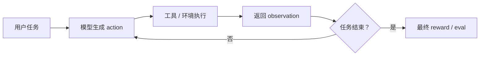
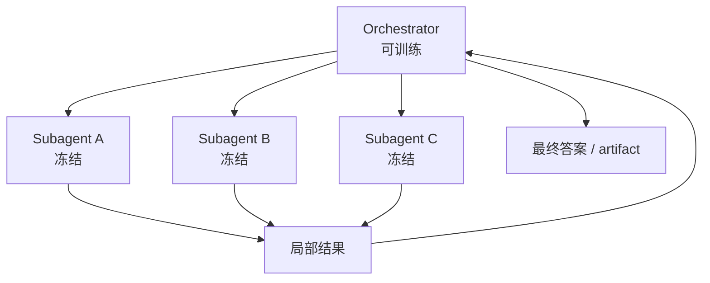

# 8. 工具、Agentic RL 与多轮环境

当模型开始调用工具，post-training 就从“回答问题”变成“在环境中行动”。这类任务包括搜索、写代码、跑测试、查数据库、操作终端、浏览网页、操作 GUI、多 Agent 协作等。行动和回答最大的不同是：行动会改变环境，环境又会反过来影响下一步决策。

这一章讲现代 agentic RL。它已经不是附属模块，而是 DeepSeek-V4、MiMo-V2-Flash、Kimi K2.5、GLM-5 等前沿模型共同强调的主线能力。

## 工业 insight：先做可测 workflow，再做自由 agent

Anthropic 的 agent 工程文章把 workflow 和 agent 区分得很清楚：workflow 是预先定义好的步骤和工具链，agent 是模型动态决定步骤。这个区分非常适合训练：初学阶段先做 workflow，因为它更容易验证、复现和定位错误；等工具协议和 reward 稳定后，再让模型拥有更多自主决策。

Kimi K2.5、GLM-5 这类公开报告强调 agentic engineering、visual/terminal/code agent 和并行 agent，本质上也不是“让模型随便调用工具”，而是给它可执行环境、可观测日志、明确成功标准和成本约束。

| 阶段 | 训练对象 | 为什么这样做 |
|---|---|---|
| 固定 workflow | 参数填写、工具结果读取、最终回答 | 低方差，适合 SFT 和小规模 RL |
| 半开放 agent | 允许选择工具和是否停止 | 学习行动策略，但仍可控 |
| 长程 agent | 允许多文件、多命令、多搜索、多轮恢复 | 接近真实任务，需要 sandbox 和 transcript |
| swarm/orchestrator | 学习拆分任务和调度 subagent | 解决长上下文和长时间任务 |

配套代码：先把业务流程写成可测 workflow，再逐步放开给模型决策。

```python
class RefundWorkflow:
    """固定流程版本：适合早期 SFT/RL 数据生成。"""

    def __init__(self, tools):
        self.tools = tools

    def run(self, order_id: str, reason: str) -> dict:
        order = self.tools.get_order(order_id)
        if order.get("error"):
            return {"ok": False, "stage": "get_order", "error": order["error"]}
        policy = self.tools.check_refund_policy(order_id, reason)
        if not policy["eligible"]:
            return {"ok": False, "stage": "policy", "error": policy["reason"]}
        refund = self.tools.create_refund(order_id)
        return {"ok": refund["ok"], "stage": "refund", "refund": refund}


class RefundAgentEnv:
    """半开放版本：模型决定下一步 action，环境负责执行和评分。"""

    allowed_tools = {"get_order", "check_refund_policy", "create_refund", "final"}

    def __init__(self, tools, target_order_id: str):
        self.tools = tools
        self.target_order_id = target_order_id
        self.history = []

    def step(self, action: dict):
        tool = action.get("tool")
        if tool not in self.allowed_tools:
            return {"done": True, "reward": 0.0, "observation": "invalid tool"}
        if tool == "final":
            success = self.tools.refund_created(self.target_order_id)
            reward = 1.0 * float(success) - 0.02 * len(self.history)
            return {"done": True, "reward": reward, "observation": None}
        observation = getattr(self.tools, tool)(**action.get("arguments", {}))
        self.history.append({"action": action, "observation": observation})
        return {"done": False, "reward": 0.0, "observation": observation}
```

这个例子对应真实 agentic RL 的开发顺序：先让 workflow 证明任务可做、reward 可判，再把部分决策权交给模型。否则一上来训练自由 agent，失败时你很难知道是模型不会、工具设计差、环境有 bug，还是 reward 写错。

## 工具使用不是格式问题

很多教程把 tool calling 简化为：

```json
{"tool_name": "search", "arguments": {"query": "GRPO"}}
```

但真实工具使用包含完整闭环：

1. 判断是否需要工具；
2. 选择工具；
3. 构造参数；
4. 读取工具返回；
5. 决定继续调用还是最终回答；
6. 在失败时恢复。

只用 SFT 可以教会工具调用格式，但很难教会策略：什么时候查、查什么、查几次、如何利用结果。模型可能“看起来会调用工具”，但一旦工具返回错误、空结果或长日志，它就不知道怎样恢复。

## 什么是 Agentic RL

Agentic RL 是把模型放进可执行环境里训练。模型不是一次性输出答案，而是反复做：

```text
观察 -> 思考 -> 行动 -> 工具返回 -> 再思考 -> 再行动 -> 完成任务
```

训练目标不是“这句话像不像示范”，而是“这条轨迹最终是否完成任务，并且成本、格式、权限约束、可恢复性是否可接受”。

| 非 agentic RL | Agentic RL |
|---|---|
| 单轮生成 | 多轮交互 |
| 答案一次判分 | 轨迹最终验收 |
| 数学、选择题、单文件代码 | SWE、Terminal、Search、Browser、Tool workflows |
| reward 解析相对简单 | reward 需要环境、sandbox、日志和 verifier |
| 上下文短 | 上下文长，工具结果多 |
| rollout 成本可控 | rollout 长尾严重，基础设施很重要 |

## 多轮环境

多轮任务的基本结构：



这和 Agent 运行循环非常像。训练时需要把整个轨迹记录下来，而不是只记录最终答案。没有 transcript，你只能看到任务失败，却不知道失败发生在工具选择、参数构造、观察理解还是最终总结。

## 一个最小 Agentic RL 环境

先不用浏览器、终端和真实 API。用一个计算器工具理解多轮环境。这个小环境虽然简单，但包含 agentic RL 的全部骨架：reset、step、observation、done、reward 和 metrics。

```python
import json


class CalculatorEnv:
    def __init__(self, question, answer):
        self.question = question
        self.answer = str(answer)
        self.turns = 0

    def reset(self):
        self.turns = 0
        return [
            {"role": "system", "content": "你可以调用 calculator(expression)，最后用 final 回答。"},
            {"role": "user", "content": self.question},
        ]

    def step(self, assistant_message):
        self.turns += 1
        content = assistant_message["content"]

        if content.startswith("tool:calculator"):
            args = json.loads(content.removeprefix("tool:calculator").strip())
            try:
                result = str(eval(args["expression"], {"__builtins__": {}}, {}))
            except Exception as exc:
                result = f"ERROR: {exc}"
            return {
                "done": False,
                "reward": 0.0,
                "messages": [{"role": "tool", "content": result}],
                "metrics": {"tool_success": float(not result.startswith("ERROR"))},
            }

        if content.startswith("final:"):
            pred = content.removeprefix("final:").strip()
            reward = 1.0 if pred == self.answer else 0.0
            return {
                "done": True,
                "reward": reward,
                "messages": [],
                "metrics": {"turns": self.turns},
            }

        return {
            "done": True,
            "reward": 0.0,
            "messages": [],
            "metrics": {"parse_error": 1.0},
        }
```

一次 rollout 的教学版：

```python
def rollout_agent(model, tokenizer, env, max_turns=4):
    messages = env.reset()
    trajectory = []

    for _ in range(max_turns):
        prompt = tokenizer.apply_chat_template(messages, add_generation_prompt=True, tokenize=False)
        assistant_message = sample_assistant_message(model, tokenizer, prompt)
        trajectory.append(assistant_message)

        step = env.step(assistant_message)
        messages.extend([assistant_message, *step["messages"]])

        if step["done"]:
            return {
                "trajectory": trajectory,
                "reward": step["reward"],
                "metrics": step["metrics"],
                "messages": messages,
            }

    return {"trajectory": trajectory, "reward": 0.0, "metrics": {"timeout": 1.0}, "messages": messages}
```

这里的 `sample_assistant_message` 在真实系统里由 rollout engine 完成。verl 的 agent loop 还要保证 token 对齐：训练时使用的 token 必须是 rollout 时模型实际生成的 token，不能重新拼接后产生偏移。

## 现代 Agentic RL 的任务族

### 1. Code Agent

模型在真实或合成仓库里工作：

- 读文件；
- 搜索符号；
- 编辑代码；
- 运行测试；
- 诊断错误；
- 继续修复；
- 最终提交。

奖励通常来自单元测试、lint、隐藏测试、人工或 LLM 评估。SWE-Bench、SWE-Bench Multilingual、真实 GitHub issue、内部工程任务都属于这一类。

关键点：

- 任务必须可恢复、可重放；
- 环境依赖要能稳定安装；
- 测试不能太容易被 hardcode；
- 工具输出要限长并可追溯；
- 每条轨迹都要保存 diff、命令、stdout/stderr。

配套代码：代码 agent 最小工具通常包括 `read_file`、`write_file`、`run_tests`。

```python
from pathlib import Path
import subprocess


class MiniRepoTools:
    def __init__(self, repo_dir: str):
        self.repo_dir = Path(repo_dir).resolve()

    def _safe_path(self, rel_path: str) -> Path:
        path = (self.repo_dir / rel_path).resolve()
        if not str(path).startswith(str(self.repo_dir)):
            raise ValueError("path escapes repo")
        return path

    def read_file(self, rel_path: str) -> str:
        return self._safe_path(rel_path).read_text(encoding="utf-8")[:8000]

    def write_file(self, rel_path: str, content: str) -> str:
        self._safe_path(rel_path).write_text(content, encoding="utf-8")
        return "ok"

    def run_tests(self) -> dict:
        result = subprocess.run(
            ["python", "-m", "pytest", "-q"],
            cwd=self.repo_dir,
            text=True,
            stdout=subprocess.PIPE,
            stderr=subprocess.PIPE,
            timeout=20,
        )
        return {
            "passed": result.returncode == 0,
            "stdout": result.stdout[-4000:],
            "stderr": result.stderr[-4000:],
        }
```

环境 reward 可以直接来自测试：

```python
def code_agent_reward(test_result: dict, edited_files: int, unsafe_attempt: bool) -> float:
    reward = 1.0 if test_result["passed"] else 0.0
    reward -= 0.02 * max(edited_files - 3, 0)
    reward -= 1.0 * float(unsafe_attempt)
    return reward
```

这里每个工具都对应 agent 轨迹中的一个 action；测试输出就是下一轮 observation。

### 2. Terminal Agent

模型在 shell 环境中完成安装、排错、数据处理、系统配置等任务。Terminal-Bench、CyberGym 类任务强调：

- 命令白名单；
- 依赖安装；
- 文件系统读写；
- 长日志处理；
- timeout 和恢复。

配套代码：一个教学版命令行工具。它只允许少量白名单命令，并限制工作目录和超时。

```python
import shlex
import subprocess
from pathlib import Path


class SafeBashTool:
    def __init__(self, workdir: str, allowed=("ls", "cat", "python", "pytest", "sed", "grep")):
        self.workdir = Path(workdir).resolve()
        self.allowed = set(allowed)

    def run(self, command: str, timeout_s: int = 10) -> dict:
        argv = shlex.split(command)
        if not argv:
            return {"ok": False, "error": "empty command"}
        if argv[0] not in self.allowed:
            return {"ok": False, "error": f"command not allowed: {argv[0]}"}

        result = subprocess.run(
            argv,
            cwd=self.workdir,
            text=True,
            stdout=subprocess.PIPE,
            stderr=subprocess.PIPE,
            timeout=timeout_s,
        )
        return {
            "ok": result.returncode == 0,
            "returncode": result.returncode,
            "stdout": result.stdout[-4000:],
            "stderr": result.stderr[-4000:],
        }
```

如何使用：

```python
tool = SafeBashTool("/tmp/task_repo")
observation = tool.run("pytest -q")
print(observation["stdout"], observation["stderr"])
```

在 agent 训练里，模型不是直接调用 Python 函数，而是生成类似：

```json
{"tool": "bash", "arguments": {"command": "pytest -q"}}
```

环境执行 `SafeBashTool.run()`，再把 stdout/stderr 作为 tool observation 追加回对话。最终 reward 通常由测试是否通过、命令是否合规、轮数成本共同决定。

### 3. Search Agent

模型通过 search/open/find 或浏览器工具做多源检索。典型 benchmark 包括 BrowseComp、HLE with tools、WideSearch。

它训练的不是“会搜索”，而是：

- 是否需要搜索；
- query 如何分解；
- 哪些来源可信；
- 如何交叉验证；
- 何时停止；
- 如何把证据压缩成答案。

配套代码：搜索 agent 不只是搜索，还要读证据并决定停止。

```python
class SearchQAEnv:
    def __init__(self, question: str, answer: str, search_tool: LocalSearchTool):
        self.question = question
        self.answer = answer.lower()
        self.search_tool = search_tool
        self.turns = 0
        self.used_search = False

    def reset(self):
        return [{"role": "user", "content": self.question}]

    def step(self, action: dict):
        self.turns += 1
        if action["tool"] == "search":
            self.used_search = True
            results = self.search_tool.search(action["arguments"]["query"])
            return {"done": False, "observation": results, "reward": 0.0}

        if action["tool"] == "final":
            answer = action["arguments"]["answer"].lower()
            reward = float(self.answer in answer)
            reward -= 0.05 * max(self.turns - 2, 0)
            reward -= 0.2 * float(not self.used_search)
            return {"done": True, "observation": None, "reward": reward}

        return {"done": True, "observation": "invalid action", "reward": 0.0}
```

这个环境能暴露搜索策略问题：不搜索会被扣分，乱搜太多会因轮数成本扣分，最终答案不含标准实体得不到主 reward。

### 4. General Tool Agent

模型面对一组业务工具、API、MCP 服务或函数调用环境。Tau2-Bench、MCPAtlas、Tool-Decathlon 等关注：

- 参数传递；
- 状态追踪；
- 多工具依赖；
- 错误恢复；
- 隐含状态推断。

配套代码：业务工具常有状态，例如订单状态会被上一步操作改变。

```python
class OrderToolEnv:
    def __init__(self):
        self.orders = {"A100": {"status": "paid", "address": "old"}}

    def get_order(self, order_id: str) -> dict:
        return self.orders.get(order_id, {"error": "not_found"})

    def update_address(self, order_id: str, address: str) -> dict:
        order = self.orders.get(order_id)
        if order is None:
            return {"ok": False, "error": "not_found"}
        if order["status"] != "paid":
            return {"ok": False, "error": "not_editable"}
        order["address"] = address
        return {"ok": True, "order": order}


def business_reward(env: OrderToolEnv) -> float:
    return float(env.orders["A100"]["address"] == "new")
```

这类任务的难点是状态追踪。模型必须先查订单，再判断能否修改，再执行更新，最后确认结果。

### 5. Browser / GUI / Artifact Agent

模型操作网页、表单、设计工具或生成 HTML/PPT/网页 artifact。奖励不只是代码能运行，还包括渲染布局、视觉质量、交互正确性。

例如 HTML slide 或前端页面训练可以使用三层 reward：

- 静态 markup 检查：DOM 结构、CSS、资源引用；
- runtime 几何检查：元素是否重叠、是否溢出、是否响应式；
- 视觉感知检查：截图质量、布局、颜色、可读性。

配套代码：GUI/网页任务的 reward 经常来自运行时检查，而不是只看 HTML 字符串。

```python
def check_no_horizontal_overflow(page) -> float:
    """Playwright 风格伪代码：页面不横向溢出得 1 分。"""
    sizes = page.evaluate(
        "() => ({scrollWidth: document.documentElement.scrollWidth, clientWidth: document.documentElement.clientWidth})"
    )
    return float(sizes["scrollWidth"] <= sizes["clientWidth"])


def check_button_visible(page, text: str) -> float:
    visible = page.get_by_text(text).is_visible()
    return float(visible)


def webpage_reward(page) -> float:
    return 0.5 * check_no_horizontal_overflow(page) + 0.5 * check_button_visible(page, "提交")
```

如果任务是“生成一个可用网页”，reward 可以由 DOM 检查、截图布局检查、交互检查共同组成。只奖励 HTML 里有某个字符串，很容易被模型钻空子。

### 6. Multi-Agent / Agent Swarm

Kimi K2.5 把 agentic RL 推到并行多 agent：一个可训练 orchestrator 动态创建冻结 subagents，学习什么时候拆任务、拆多少、如何调度、如何聚合结果。它解决的是长程任务中单 agent 顺序执行太慢、上下文太长的问题。

训练时通常只更新 orchestrator，把 subagent 输出当作环境观察，以避免端到端多 agent credit assignment 过于混乱。

配套代码：一个最小 orchestrator 执行框架。

```python
class FrozenSubAgent:
    def run(self, task: str) -> str:
        # 真实系统里这里会调用冻结模型或工具 agent。
        return f"result for: {task}"


class OrchestratorEnv:
    def __init__(self, final_answer: str):
        self.subagent = FrozenSubAgent()
        self.final_answer = final_answer
        self.spawned = 0
        self.results = []

    def step(self, action: dict):
        if action["type"] == "spawn":
            self.spawned += 1
            result = self.subagent.run(action["task"])
            self.results.append(result)
            return {"done": False, "observation": result, "reward": 0.0}

        if action["type"] == "final":
            ok = self.final_answer.lower() in action["answer"].lower()
            reward = float(ok) - 0.05 * self.spawned
            return {"done": True, "observation": None, "reward": reward}

        return {"done": True, "observation": "invalid", "reward": 0.0}
```

这个 reward 里有 `-0.05 * spawned`，目的就是防止 orchestrator 为了“看起来很努力”无限创建 subagent。

## verl 的 Agent Loop

本站实战主线使用 verl 的异步 rollout 和 tool agent loop。Agentic RL 数据需要在 parquet 中加入 `agent_name`：

```json
{
  "data_source": "openai/gsm8k",
  "agent_name": "tool_agent",
  "prompt": [
    {
      "role": "system",
      "content": "You are a math expert. You should use the `calc_gsm8k_reward` tool..."
    },
    {
      "role": "user",
      "content": "问题文本 ..."
    }
  ],
  "reward_model": {
    "style": "rule",
    "ground_truth": "72"
  },
  "extra_info": {
    "tools_kwargs": {
      "calc_gsm8k_reward": {
        "create_kwargs": {
          "ground_truth": "72"
        }
      }
    }
  }
}
```

准备工具数据：

```bash
cd verl-main
python examples/data_preprocess/gsm8k_tool_agent_loop.py \
  --local_save_dir ~/data/gsm8k_tool
```

关键训练配置：

```bash
data.return_raw_chat=True
actor_rollout_ref.rollout.mode=async
actor_rollout_ref.rollout.name=sglang
actor_rollout_ref.rollout.multi_turn.enable=True
actor_rollout_ref.rollout.multi_turn.format=hermes
actor_rollout_ref.rollout.agent.default_agent_loop=tool_agent
```

如果是无状态工具，可以用 `@function_tool`：

```python
from verl.tools.function_tool import function_tool


@function_tool
def calculator(expression: str) -> str:
    """Evaluate a simple arithmetic expression.

    Args:
        expression: A Python-style arithmetic expression, e.g. "(3+4)*5".
    """
    return str(eval(expression, {"__builtins__": {}}, {}))
```

真实生产工具必须 sandbox、timeout、限制副作用。完整实战见 [17. OPD、偏好与 Agentic RL](./17-verl-opd-agent-preference.md)。

## 工具协议设计

工具协议必须稳定。建议每个工具包含：

- 名称；
- 参数 schema；
- 返回 schema；
- 错误格式；
- 超时限制；
- 最大输出长度；
- 是否有副作用；
- 是否允许并发。

对训练尤其重要的是错误格式。模型需要看到工具失败后如何恢复，而不是只看到成功轨迹。

## Reward 设计

Agentic RL 的 reward 应该是分层的。

| 层级 | 例子 | 作用 |
|---|---|---|
| 任务结果 | 测试通过、答案正确、网页可用 | 主目标 |
| 工具执行 | 命令成功、API 参数正确、无 timeout | 提供中间信号 |
| 轨迹质量 | 步数、成本、上下文长度、重复调用 | 控制效率 |
| 权限约束 | 禁止危险命令、隐私泄露、越权访问 | 防事故 |
| 格式协议 | tool schema 可解析、final answer 存在 | 保证可执行 |
| GRM/LLM judge | 复杂开放质量、设计审美、帮助性 | 覆盖难以规则化的目标 |

不要只奖励“调用工具次数”。这会导致 spurious tool use。也不要只奖励“并行 agent 数量”。Kimi K2.5 的 PARL 思路里专门加入 sub-agent finish rate，防止模型为了并行指标乱开子任务。

教学版 reward 聚合可以写成：

```python
def agent_reward(final_success, parse_error, turns, unsafe_action):
    reward = 0.0
    reward += 1.0 * float(final_success)
    reward -= 0.2 * float(parse_error)
    reward -= 0.02 * max(turns - 2, 0)
    reward -= 1.0 * float(unsafe_action)
    return reward
```

这段代码说明一个原则：主任务成功必须占主导，格式、成本、权限约束是辅助项。否则模型可能为了少走一步而不完成任务，或为了工具奖励而乱调用工具。

## Sandbox

代码、shell、文件系统任务必须 sandbox。基本要求：

- 隔离文件系统；
- 限制网络；
- 限制 CPU/内存/时间；
- 捕获 stdout/stderr；
- 支持读写文件；
- 任务结束后 cleanup；
- 可重复运行。

代码 RL、终端 RL、Terminal-Bench 类任务都应该围绕 sandbox 设计。没有 sandbox 的代码 RL 不应该接入真实训练。

## Agentic RL 数据构造

现代 agentic 数据通常混合真实和合成。

| 来源 | 优点 | 风险 |
|---|---|---|
| 真实 GitHub issue | 分布真实，难度高 | 环境安装失败率高 |
| StackOverflow/StackExchange | 终端问题丰富 | 需要转成可验证环境 |
| 合成搜索题 | 可控、可扩展 | 可能不真实 |
| 工具调用图合成 | 覆盖多工具依赖 | 需要避免模板化 |
| 专家 agent 轨迹 | 质量高 | 成本高，风格单一 |
| Rejection sampling | 提升成功轨迹比例 | 可能降低多样性 |

一个教育项目可以先从小环境开始：

1. 文件编辑任务：给一个小 repo 和 failing test。
2. 搜索任务：给一个本地文档库和可验证答案。
3. 工具任务：给 3 到 5 个 mock API，要求完成业务流程。
4. 浏览器任务：给本地网页，要求填写表单或验证布局。

## 搜索任务

搜索 RL 的难点是 reward 稀疏。模型可能要多次搜索后才能回答。

常见指标：

| 指标 | 含义 |
|---|---|
| `turns_per_episode` | 平均交互轮数 |
| `tool_success_rate` | 工具调用是否成功 |
| `final_accuracy` | 最终答案正确率 |
| `context_tokens` | 轨迹总长度 |
| `parse_failure_rate` | 工具调用解析失败 |
| `empty_search_rate` | 搜索无结果比例 |

如果模型完全不搜索，可能是 prompt 没有明确工具价值，或基础模型太强导致短期 reward 不需要工具。如果模型搜索太多，可能缺少轮数成本或终止奖励。

## Agent Swarm / PARL

Agent swarm 是 agentic RL 的更高阶形式。单 agent 顺序执行有两个瓶颈：

- 时间线性增长：搜索 50 个来源、读 100 个文档会非常慢。
- 上下文线性膨胀：所有工具结果塞进一个上下文，模型会丢信息。

Swarm 的核心做法：



PARL 训练的是 orchestrator：

- 什么时候创建 subagent；
- 给每个 subagent 什么任务；
- 是否并行；
- 如何检查子任务完成；
- 如何聚合局部结果；
- 如何控制总成本。

奖励可以拆成：

- `r_perf`：最终任务结果；
- `r_parallel`：鼓励合理并行探索；
- `r_finish`：鼓励子任务真正完成，防止乱开子 agent；
- cost penalty：控制子 agent 数、token、时间。

初学者可以把 swarm 理解为“主动上下文管理”：不是等上下文爆了再压缩，而是提前把任务分片，让每个子 agent 在局部上下文里工作，只把关键结果回传。

## 代码与终端任务

代码/终端任务的训练流程：

1. 给模型任务说明和初始文件。
2. 模型调用 bash、编辑文件或生成代码。
3. sandbox 执行。
4. 环境返回输出。
5. 模型继续修复。
6. 最终运行测试，给 reward。

风险：

- 上下文很快变长；
- 工具输出太大；
- timeout 导致样本浪费；
- reward 延迟，credit assignment 难；
- 模型学会针对测试 hardcode。

工程策略：

- 限制每步输出长度；
- 对大输出做摘要或落盘；
- 保存完整 transcript；
- 使用隐藏测试；
- 给中间格式和权限行为少量辅助 reward。

## 多 Agent 与自博弈

多 Agent 训练可以用于博弈任务、协作任务、角色扮演、self-play、cross-play。核心问题是环境要公平、可复现，并避免多个 agent 学到互相配合但对外无用的暗号。

## SFT、RL、OPD 在工具任务里的分工

| 阶段 | 目标 |
|---|---|
| SFT | 学会工具调用格式、thinking/tool interleave、基础轨迹 |
| Agentic RL | 学会何时行动、如何根据环境反馈调整、如何完成任务 |
| OPD/MOPD | 从强 agent/code/search 专家迁移多轮策略并合并能力 |
| General RL | 修正开放式体验、风格、边界和人类偏好 |
| Eval | 用独立任务验证泛化、成本和权限约束 |

只用 SFT，模型可能会“看起来会调用工具”。加上 RL/OPD，模型才更可能真正学会行动策略。

## Transcript 是第一调试工具

多轮训练不要只看指标。每隔几步抽样阅读 transcript：

- 模型是否理解任务？
- 工具参数是否合理？
- 工具返回是否被正确使用？
- 失败后是否能恢复？
- 是否出现无意义循环？
- 最终答案是否忠于工具结果？

把 transcript 当作单元测试之外的行为日志。

## 训练基础设施要求

Agentic RL 对基础设施要求远高于单轮 RL：

- **异步 rollout**：长轨迹会拖慢同步训练，需要 decouple generation 和 training。
- **prefix/KV cache 复用**：多轮任务反复 prefill 长历史，必须复用前缀。
- **prefill/decode 分离**：避免长上下文 prefill 阻塞短 decode。
- **故障恢复**：sandbox、网络、工具服务会失败，需要 heartbeat 和 retry。
- **精确 token 对齐**：训练时 logprob 必须和 rollout token 对齐，避免 re-tokenization mismatch。
- **长尾调度**：最慢轨迹决定 step 时间，需要 timeout、分桶、调度策略。
- **环境版本化**：Dockerfile、测试、工具实现、数据版本都要可追溯。

小项目不需要一开始实现全部，但要知道这些不是“优化项”，而是 agentic RL 放大后能否稳定训练的前提。

## Agentic RL 检查清单

- 环境可重放，随机性受控。
- 工具 schema 稳定，parse 失败可记录。
- sandbox 隔离，timeout 明确。
- reward 覆盖结果、成本、权限约束、格式。
- transcript 可读，能定位失败。
- 隐藏测试或独立评估防 hardcode。
- rollout logprob 和训练 token 对齐。
- 评估区分 single-agent、tool-use、swarm、多轮长上下文。
- 监控步数、工具次数、token、失败率、成本。

## 本章结论

工具和 Agent 训练的关键不是“输出 tool call JSON”，而是构建一个能暴露行动后果的环境。SFT 负责语法和初始轨迹，Agentic RL 负责行动策略，OPD/MOPD 负责迁移与合并强 agent 能力，sandbox、transcript 和异步 rollout 基础设施负责隔离与规模化。
