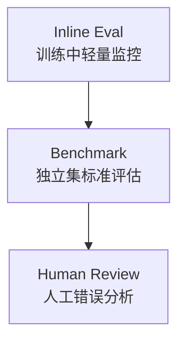

# 9. 评估体系：先量再训

好的 post-training 项目从评估开始，而不是从训练开始。没有评估，训练指标再漂亮也不知道是否真的提升。评估不是最后的验收表，而是前期决定训练路线、中期判断是否跑偏、后期决定是否发布的工具。

这一章讲如何建立评估体系。

## 为什么评估要先做

训练前先评估有三个原因：

1. 你需要 baseline，否则不知道提升幅度。
2. 你需要发现任务是否已经被模型解决。
3. 你需要确认评估脚本和数据格式正确。

如果 baseline 都跑不通，训练结果没有解释价值。很多训练项目失败，不是因为模型没有提升，而是因为一开始就没有定义“提升”。

## 评估的三层



### Inline Eval

训练中每 N step 跑一小批样本。目的是快速发现训练是否跑偏。Inline eval 不追求覆盖全面，它更像训练过程中的体温计：频繁、便宜、能及时发现异常。

适合：

- 50 到 200 条样本；
- 低成本；
- 指标稳定；
- 能在训练日志里画曲线。

配套代码：最小 inline eval。

```python
def run_inline_eval(model, tokenizer, examples, answer_parser, scorer):
    scores = []
    rows = []
    for ex in examples:
        input_ids = tokenizer(ex["prompt"], return_tensors="pt").input_ids.to(model.device)
        output_ids = model.generate(input_ids, max_new_tokens=512, temperature=0.0)
        output = tokenizer.decode(output_ids[0, input_ids.shape[1] :], skip_special_tokens=True)
        pred = answer_parser(output)
        score = scorer(pred, ex["answer"])
        scores.append(score)
        rows.append({"prompt": ex["prompt"], "output": output, "pred": pred, "answer": ex["answer"], "score": score})
    return {"mean_score": sum(scores) / max(len(scores), 1), "rows": rows}
```

verl 训练中的 `trainer.test_freq` 做的是同类事情，只是它接入了分布式 rollout、reward manager 和日志系统。它适合看趋势，不适合替代完整 benchmark。

### Benchmark

完整、独立、可复现的评估。用于比较 checkpoint。Benchmark 应该和训练数据隔离，否则你看到的可能只是记忆或格式适配，而不是泛化能力。

例如：

- GSM8K、MATH-500、AIME：数学；
- MMLU-Pro、C-Eval、GPQA：知识/选择题；
- IFEval、IFBench：指令遵循；
- MBPP、LiveCodeBench：代码；
- Terminal-Bench、SWE-bench：多轮终端/软件工程。

### Human Review

开放式任务必须人工看。人工评估不是随便看几条，而是结构化错误分析。每条错误都应该能归类到“理解错、推理错、工具错、格式错、幻觉、截断”等可行动原因。

## verl 训练中的 inline eval

verl 的训练脚本通常通过这两个参数控制训练中验证：

```bash
trainer.test_freq=5
data.val_files=$HOME/data/gsm8k/test.parquet
```

GRPO/RLVR 训练时，验证集会复用同一套 prompt 和 reward function，日志里会出现类似 `val/test_score/openai/gsm8k` 的指标。它适合做训练中监控，但不能替代完整 benchmark。

推荐做法：

1. `test_freq` 设小一点，用 50 到 200 条验证样本快速发现训练跑偏。
2. 每个重要 checkpoint 导出成 Hugging Face 模型。
3. 用独立评估脚本跑完整 GSM8K、MATH-500、IFEval、代码和边界/回归评估。
4. 保存错误样本和模型输出，做人工分类。

导出 checkpoint：

```bash
cd verl-main
python3 -m verl.model_merger merge \
  --backend fsdp \
  --local_dir checkpoints/llm-posttrain-cookbook/qwen3-4b-base-gsm8k-grpo/global_step_20/actor \
  --target_dir checkpoints/llm-posttrain-cookbook/qwen3-4b-base-gsm8k-grpo/global_step_20/actor/huggingface
```

## 评估数据设计

一个好的评估集应该有：

- 目标任务核心样本；
- 边界样本；
- 反常输入；
- 长上下文；
- 边界/拒绝/澄清样本；
- 格式严格样本；
- 保留能力样本；
- 训练分布外样本。

不要只评估你训练的数据类型。真实模型上线后会遇到分布外输入。

## 指标选择

| 任务 | 指标 |
|---|---|
| 数学 | exact match、symbolic equivalence、pass@k |
| 代码 | test pass rate、pass@k、runtime error rate |
| 指令遵循 | constraint satisfaction |
| 工具使用 | task success、turn count、tool error |
| 问答 | exact match、F1、citation precision |
| 边界行为 | 澄清率、拒绝边界、过度拒绝率 |
| 开放式质量 | pairwise win-rate、human score |

指标要和目标一致。比如做客服模型，只看 MMLU 没意义；做推理模型，只看聊天偏好也不够。

## 现代评估矩阵

现代后训练不能只跑“知识 + 数学”。至少要覆盖这些能力面：

| 能力面 | 代表评估 |
|---|---|
| Reasoning | GSM8K、MATH-500、AIME、HMMT、GPQA |
| Coding | HumanEval、MBPP、LiveCodeBench、BigCodeBench |
| Agentic coding | SWE-Bench、SWE-Bench Multilingual、Terminal-Bench |
| Search / Browse | BrowseComp、HLE with tools、WideSearch、自建检索 QA |
| Tool / API | Tau2-Bench、Tool-Decathlon、MCPAtlas、自建业务工具流 |
| GUI / Visual agent | GUI grounding、OCR、网页操作、artifact 渲染检查 |
| Long context | LongBench、NIAH、MRCR、长文档多跳问答 |
| General chat | Arena-style pairwise、人类评分、写作/翻译任务 |
| Boundary / Risk | red-team、拒绝边界、过度拒绝率 |
| Efficiency | 平均 token、thinking token、工具步数、latency、cost |

这张矩阵要贯穿全流程：Base 体检、专家训练、OPD/MOPD 合并、General RL、部署前回归都用同一套核心指标。否则每个阶段都换评估集，你就无法判断能力变化是训练带来的，还是评估口径变了。

## 工业 insight：评估是训练路线图，不只是排行榜

DeepSeek-R1、Qwen3、Llama 3、Kimi、GLM 这类公开报告都有大量 benchmark，但工业里真正重要的不是“列很多分数”，而是把评估变成训练决策：

- base eval 决定要不要先 SFT，还是直接 RL；
- RL 训练中看 reward、长度、KL、全错组比例，决定是否继续；
- rejection sampling 看 verifier pass rate，决定能不能回灌 SFT；
- OPD/MOPD 后看各能力回归，决定教师路由和混合比例；
- agent 训练看成功率、轮数、工具失败率、timeout，决定环境和工具是否要重写；
- 上线前看能力、延迟、成本和风险门禁，决定是否发布。

配套代码：一个工业化 eval gate 不只比较单个分数，而是同时检查目标提升、回归、成本和失败率。

```python
def eval_gate(report: dict, baseline: dict) -> tuple[bool, list[str]]:
    reasons = []

    target_gain = report["target_score"] - baseline["target_score"]
    if target_gain < 0.03:
        reasons.append(f"目标任务提升不足: {target_gain:.3f}")

    regression_drop = baseline["general_score"] - report["general_score"]
    if regression_drop > 0.02:
        reasons.append(f"通用能力回退过大: {regression_drop:.3f}")

    cost_increase = report["avg_tokens"] / max(baseline["avg_tokens"], 1)
    if cost_increase > 1.5:
        reasons.append(f"平均 token 成本增长过大: {cost_increase:.2f}x")

    if report.get("parse_failure_rate", 0.0) > 0.05:
        reasons.append("格式解析失败率超过 5%")

    if report.get("tool_timeout_rate", 0.0) > 0.03:
        reasons.append("工具 timeout 率超过 3%")

    return len(reasons) == 0, reasons
```

把 gate 写成代码有两个好处：第一，训练结果不再靠“看起来不错”；第二，不同 checkpoint 可以用同一套标准比较。顶级团队公开 system card/model card 的背后，本质上也是类似的评估门禁，只是规模和维度更大。

## Pass@k

代码和数学常用 pass@k：采样 k 次，只要有一次正确就算通过。它衡量模型“能不能在多次尝试中找到解”。这和 pass@1 不同：pass@1 代表单次回答质量，pass@k 更像搜索或多次采样能力。

但部署时如果只采样一次，pass@1 更重要。如果产品会做 self-consistency 或 rerank，pass@k 才更接近实际能力。

配套代码：按题目聚合 pass@k。

```python
from collections import defaultdict


def compute_pass_at_k(rows, k: int):
    """rows: 每行包含 problem_id 和 correct。"""
    groups = defaultdict(list)
    for row in rows:
        groups[row["problem_id"]].append(bool(row["correct"]))

    hits = []
    for results in groups.values():
        hits.append(any(results[:k]))
    return sum(hits) / max(len(hits), 1)
```

如果每题只采样一次，`pass@k` 没有意义。必须保证同一 `problem_id` 下有多条不同 sample。

## 错误分析

评估不只输出分数。每次评估都应该保存错误样本，并分类：

| 错误类别 | 例子 |
|---|---|
| 理解错 | 没读懂题意 |
| 推理错 | 中间步骤错误 |
| 格式错 | 没按 `\boxed{}` 或 JSON 输出 |
| 工具错 | 参数错误、调用失败 |
| 幻觉 | 编造事实 |
| 拒绝错 | 该答不答，或不该答却答 |
| 截断 | 超出 max tokens |

错误分类决定下一步该补数据、改 reward、调超参还是换模型。

配套代码：先用规则做粗分类，再人工复核。

```python
def classify_error(row):
    if row.get("truncated"):
        return "截断"
    if row.get("parse_error"):
        return "格式错误"
    if row.get("tool_error"):
        return "工具错误"
    if row.get("boundary_error"):
        return "边界行为错误"
    if row.get("pred") != row.get("answer"):
        return "推理或知识错误"
    return "正确"


def summarize_errors(rows):
    counts = {}
    for row in rows:
        key = classify_error(row)
        counts[key] = counts.get(key, 0) + 1
    total = max(sum(counts.values()), 1)
    return {k: v / total for k, v in counts.items()}
```

这类分类不需要一开始完美。关键是把“分数下降”拆成可行动原因。

## 训练指标和评估指标分开看

训练日志常见：

- loss；
- reward；
- KL；
- entropy；
- response length；
- parse failure；
- eval score。

不要把训练 reward 当成最终评估。训练 reward 是优化目标，模型会适应它；独立 benchmark 才能反映泛化。

## 评估一致性

评估要固定：

- 模型 checkpoint；
- renderer；
- system prompt；
- max tokens；
- temperature；
- stop sequences；
- answer parser；
- 数据版本；
- 依赖版本。

任何一个变化都可能影响分数。尤其是 reasoning 模型，`max_tokens` 和 thinking 模式会显著改变结果。

## LLM-as-judge

开放式任务经常用 LLM-as-judge。它方便，但有偏差。

使用建议：

- judge prompt 固定并版本化；
- 采用 pairwise 而非单独打分；
- 随机交换 A/B 顺序；
- 抽样人工校验 judge；
- 不要用被评估模型自己当唯一 judge；
- 记录 judge 的原始理由。

配套代码：pairwise judge 的请求格式应该固定并版本化。

```python
def build_pairwise_judge_prompt(user_prompt: str, answer_a: str, answer_b: str) -> str:
    return f"""你是严格评审。请比较两个回答哪个更好。

用户问题：
{user_prompt}

回答 A：
{answer_a}

回答 B：
{answer_b}

请只输出 JSON：
{{"winner": "A" 或 "B" 或 "tie", "reason": "一句话理由"}}
"""


def judge_win_rate(judge_model, rows):
    wins = 0
    total = 0
    for row in rows:
        prompt = build_pairwise_judge_prompt(row["prompt"], row["new_answer"], row["baseline_answer"])
        result = judge_model(prompt)
        wins += int('"winner": "A"' in result)
        total += 1
    return wins / max(total, 1)
```

真实评估要随机交换 A/B 顺序，否则 judge 可能有位置偏置。

## 回归评估

任何 post-training 都可能牺牲旧能力。上线前至少跑：

- 目标任务；
- 通用指令遵循；
- 边界和拒绝行为；
- 基础知识；
- 长上下文；
- 格式输出；
- 成本和延迟。

目标分数涨 5%，但拒绝率翻倍，可能不是可接受模型。

<div class="checkpoint">

**本章结论**

评估不是训练后的验收，而是训练前的设计输入。一个没有 baseline、没有错误分析、没有回归集的 post-training 项目，本质上不可调试。

</div>
