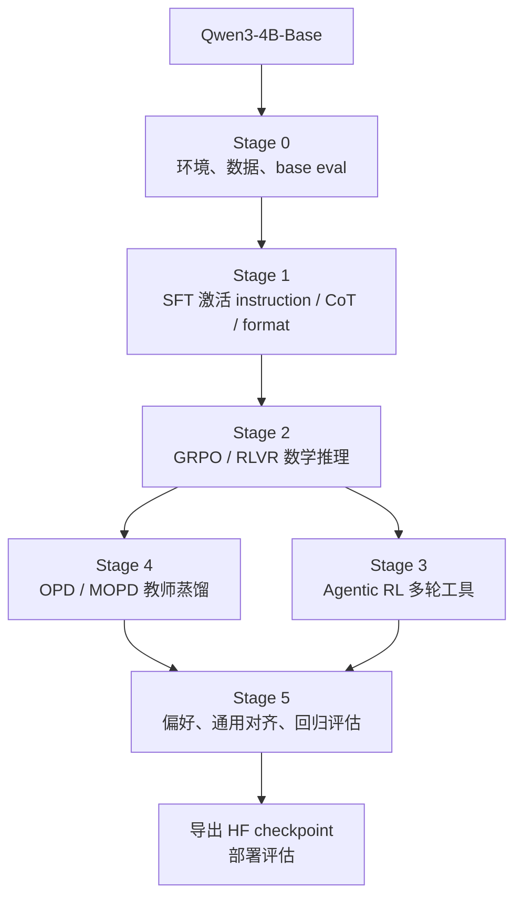

# 13. 从 Qwen3-4B-Base 出发：一条可执行的 verl 路线

前面的章节解释了现代 post-training 的地图。这一章开始把路线落到一个具体模型和一个具体框架上：

- 起点模型：`Qwen/Qwen3-4B-Base`
- 训练框架：本地 `verl-main`
- 教学任务：先用 GSM8K 跑通 SFT 和 GRPO/RLVR，再扩展到 OPD、偏好优化和 Agentic RL

为什么选 base model？因为 base model 更接近预训练结束后的状态。它有知识和语言能力，但还没有稳定的指令遵循、聊天格式、工具协议和任务偏好。用它做主线，最容易看清 post-training 每个阶段到底改变了什么。

## 总路线



教学版不要一开始追求“训练最强模型”。更合理的目标是：

1. 每个阶段都能跑通一条最小闭环。
2. 每个阶段都能看懂数据进 verl 后变成什么。
3. 每个阶段都能通过日志判断训练是否健康。
4. 最终得到一个比 base 更会遵循指令、更会数学推理、更懂工具协议的小模型。

## 把工业流程缩小到 4B 教学版

公开报告里的工业流程通常有巨大算力、内部数据和复杂评估。我们不能照抄规模，但可以照抄结构。教学版最重要的是跑通每个阶段的因果关系：哪份数据进入训练，训练产生什么轨迹或 checkpoint，评估如何决定下一步。

| 工业做法 | 教学版对应 |
|---|---|
| DeepSeek-R1 cold-start long-CoT | 先用 GSM8K/MATH 少量高质量 SFT 激活格式 |
| Reasoning RL 大规模探索 | 用 GSM8K GRPO 小步跑通 reward、group advantage、KL |
| Rejection sampling 回灌训练 | 从 rollout 里筛正确、短、可解析的轨迹转成 SFT parquet |
| Strong-to-weak distillation | 用 Qwen3-8B/14B 或更强 teacher 生成 verified SFT/OPD 信号 |
| Agentic engineering | 从本地 calculator/search/repo sandbox 开始，不直接上真实生产工具 |
| Model card / release gate | 每个 checkpoint 记录 config、数据、eval、成本和失败样本 |

配套代码：把每个阶段产出的数据显式传给下一阶段，形成小型数据飞轮。

```python
def qwen3_4b_training_flywheel(base_model: str):
    stages = []
    stages.append({"stage": "sft_cold_start", "input": base_model, "output": "sft_ckpt"})
    stages.append({"stage": "grpo_rlvr", "input": "sft_ckpt", "output": "rl_rollouts"})
    stages.append({"stage": "rejection_sampling", "input": "rl_rollouts", "output": "verified_sft_data"})
    stages.append({"stage": "sft_replay", "input": ["sft_ckpt", "verified_sft_data"], "output": "sft_replay_ckpt"})
    stages.append({"stage": "opd_from_teacher", "input": "sft_replay_ckpt", "output": "distilled_ckpt"})
    stages.append({"stage": "eval_gate", "input": "distilled_ckpt", "output": "release_candidate"})
    return stages
```

这个函数不是训练脚本，而是路线图。你每完成一项，都应该能在本地找到对应的 parquet、checkpoint、eval 报告和日志。

## 目录约定

后面的命令默认你在项目根目录：

```bash
cd /Users/meisen/Desktop/LLM-PostTrain-CookBook
```

进入 verl：

```bash
cd verl-main
```

推荐目录：

```text
~/data/
  gsm8k_sft/
    train.parquet
    test.parquet
  gsm8k/
    train.parquet
    test.parquet
  gsm8k_tool/
    train.parquet
    test.parquet

~/checkpoints/
  qwen3-4b-base-sft/
  qwen3-4b-base-grpo/
```

本站已经把 `verl-main/` 写入 `.gitignore`。本地可以引用源码和脚本，未来部署站点时不会把整个训练框架塞进 GitHub Pages。

## Stage 0：准备环境和模型

verl 的训练通常需要 Linux + NVIDIA GPU + CUDA 环境，Mac 本机更适合看教程、改配置和准备数据，不适合直接训练 Qwen3-4B。你可以在一台 GPU 机器上克隆同样的项目，再运行本教程命令。先在本机理解数据和配置，再把训练迁移到 GPU 机器，会比直接在远程机器上摸索更稳。

基础安装可以参考 `verl-main/README.md` 和 `verl-main/docs/start/install.rst`。教学版先记住三件事：

- SFT 可以用 `torchrun -m verl.trainer.sft_trainer`。
- GRPO/PPO/OPD 这类 RL 入口通常是 `python3 -m verl.trainer.main_ppo`。
- verl 的样例脚本把配置拆成 `DATA`、`MODEL`、`ACTOR`、`ROLLOUT`、`REF`、`TRAINER` 等数组，最后用 Hydra override 传给训练器。

建议先准备模型缓存：

```bash
export MODEL_PATH=Qwen/Qwen3-4B-Base
```

如果网络访问 Hugging Face 不稳定，可以先把模型下载到本地目录，然后把 `MODEL_PATH` 指向本地路径：

```bash
export MODEL_PATH=/data/models/Qwen3-4B-Base
```

## Stage 1：SFT 激活

SFT 的任务是让 base model 学会“用户问、助手答”的格式，掌握基础指令遵循和答案样式。对 GSM8K 来说，SFT 数据是一条 `messages`。这一步不追求最终数学能力最强，而是让模型输出可解析、可继续 RL 的答案格式。

```json
{
  "messages": [
    {
      "role": "user",
      "content": "Janet has 3 apples ... Let's think step by step and output the final answer after \"####\"."
    },
    {
      "role": "assistant",
      "content": "Janet starts with 3 apples ... #### 12"
    }
  ]
}
```

准备数据：

```bash
cd verl-main
python examples/data_preprocess/gsm8k_multiturn_sft.py \
  --local_save_dir ~/data/gsm8k_sft
```

训练命令：

```bash
cd verl-main
MODEL_PATH=Qwen/Qwen3-4B-Base \
PROJECT_NAME=llm-posttrain-cookbook \
EXPERIMENT_NAME=qwen3-4b-base-gsm8k-sft \
USE_PEFT=1 \
LORA_RANK=32 \
LORA_ALPHA=16 \
MICRO_BATCH_SIZE_PER_GPU=8 \
LR=1e-4 \
TOTAL_EPOCHS=1 \
bash examples/sft/gsm8k/run_qwen3_8b_fsdp.sh \
  8 \
  ~/checkpoints/qwen3-4b-base-sft \
  data.train_files=$HOME/data/gsm8k_sft/train.parquet \
  data.val_files=$HOME/data/gsm8k_sft/test.parquet \
  trainer.logger='["console"]'
```

脚本名里有 `qwen3_8b`，但它通过 `MODEL_PATH` 覆盖模型，所以可以用于 `Qwen/Qwen3-4B-Base`。训练器看的是 `model.path`，不是脚本文件名。

## Stage 2：GRPO / RLVR 数学推理

SFT 之后，模型已经知道基本格式。RLVR 让模型自己采样答案，再用规则 reward 判断最终答案是否正确。这里的关键变化是：模型不再只模仿训练答案，而是开始通过 verifier 反馈探索新解法。

准备 RL 数据：

```bash
cd verl-main
python examples/data_preprocess/gsm8k.py \
  --local_save_dir ~/data/gsm8k
```

训练命令：

```bash
cd verl-main
MODEL_PATH=Qwen/Qwen3-4B-Base \
TRAIN_FILE=$HOME/data/gsm8k/train.parquet \
TEST_FILE=$HOME/data/gsm8k/test.parquet \
PROJECT_NAME=llm-posttrain-cookbook \
EXPERIMENT_NAME=qwen3-4b-base-gsm8k-grpo \
NGPUS_PER_NODE=8 \
TRAIN_BATCH_SIZE=128 \
PPO_MINI_BATCH_SIZE=64 \
PPO_MICRO_BATCH_SIZE_PER_GPU=1 \
LOG_PROB_MICRO_BATCH_SIZE_PER_GPU=1 \
ROLLOUT_TP=1 \
ROLLOUT_N=4 \
ACTOR_LR=1e-6 \
KL_LOSS_COEF=0.001 \
TOTAL_EPOCHS=1 \
SAVE_FREQ=20 \
TEST_FREQ=5 \
bash examples/grpo_trainer/run_qwen3_4b_fsdp.sh \
  trainer.logger='["console"]'
```

如果显存足够，正式实验可以把 `TRAIN_BATCH_SIZE` 提到 256 或 512，把 `ROLLOUT_N` 提到 8。初学阶段先用小 batch 看 transcript 和 reward 是否正确。

## Stage 3：Agentic RL

Agentic RL 不是让模型只输出一个答案，而是让它在多轮环境里调用工具、观察结果、继续行动。verl 的关键开关是：

```bash
data.return_raw_chat=True
actor_rollout_ref.rollout.mode=async
actor_rollout_ref.rollout.multi_turn.enable=True
actor_rollout_ref.rollout.agent.default_agent_loop=tool_agent
```

准备一个带 `agent_name` 和工具参数的数据集：

```bash
cd verl-main
python examples/data_preprocess/gsm8k_tool_agent_loop.py \
  --local_save_dir ~/data/gsm8k_tool
```

这类训练对工具协议、token 对齐和 trace 要求更高。建议先读 [17. OPD、偏好与 Agentic RL](./17-verl-opd-agent-preference.md)，再跑完整命令。第一次做 agentic RL 时，不要直接上复杂仓库任务，先用 calculator、local search 或小型 repo sandbox 验证环境闭环。

## Stage 4：OPD / MOPD

OPD 的核心是：学生模型自己采样，教师模型在学生走到的状态上给 token-level 信号。对 4B 学生，常见配置是：

```bash
STUDENT_MODEL=Qwen/Qwen3-4B-Base
TEACHER_MODEL=Qwen/Qwen3-8B
```

如果有更强同族教师，可以换成 14B、32B 或内部 expert。OPD 的训练入口仍是 `main_ppo`，但会额外打开 `distillation.enabled=True` 并启动教师推理资源池。你要同时关注任务分数和教师相似度：学生更像教师不一定代表任务更好。

## Stage 5：偏好、通用对齐和回归评估

偏好优化不是第一天必须跑的阶段。对这个教学项目，更推荐顺序是：

1. SFT 让 base 能正常对话。
2. GRPO/RLVR 让数学推理奖励跑通。
3. Agentic RL 让工具环境闭环跑通。
4. OPD 把强教师行为迁移回来。
5. 再用偏好数据或 LLM judge 修回答风格、边界行为和简洁性。

每个阶段结束都要保留：

- `MODEL_PATH` 和 checkpoint；
- 数据生成脚本和 parquet 路径；
- 完整训练命令；
- eval 分数；
- 10 到 30 条代表性输出；
- 失败样本分类。

## 算力建议

| 阶段 | 教学最小配置 | 更稳配置 | 说明 |
|---|---:|---:|---|
| SFT LoRA | 1 到 4 张高显存 GPU | 8 GPU | 先跑通数据和 mask |
| GRPO/RLVR | 4 GPU | 8 GPU | rollout + ref logprob 会吃显存 |
| OPD | 学生 GPU + 教师 GPU | 8 到 16 GPU | 教师模型越大，资源越重 |
| Agentic RL | 多 GPU + 工具服务 | 多节点更稳 | 长轨迹需要异步 rollout |

不要用大规模训练掩盖基础错误。最有价值的第一步是小样本过拟合和短 run，确认 loss、reward、KL、长度、parse failure 都合理。

## 你应该从哪里开始

如果你今天只有一个目标，按这个顺序做：

1. 读 [14. 数据、Reward 与 parquet](./14-verl-data-reward.md)，理解 verl 吃什么数据。
2. 跑 [15. SFT 实战](./15-verl-sft-qwen3.md)，把 base model 激活。
3. 跑 [16. GRPO/RLVR 实战](./16-verl-grpo-rlvr.md)，看 reward 和 group sampling。
4. 最后读 [17. OPD、偏好与 Agentic RL](./17-verl-opd-agent-preference.md)，进入现代后训练的复杂阶段。

<div class="checkpoint">

**本章结论**

从 `Qwen/Qwen3-4B-Base` 出发，最稳的教学路线是：SFT 激活、GRPO/RLVR 学可验证推理、Agentic RL 学工具行动、OPD/MOPD 合并教师能力，最后用偏好和回归评估收尾。后面的章节会把每一步展开成数据样式、参数解释和可执行命令。

</div>
