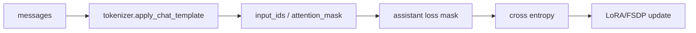

# 15. SFT 实战：用 verl 激活 Qwen3-4B-Base

SFT 是这条路线的第一个训练阶段。目标不是把模型训练到最强，而是让 `Qwen/Qwen3-4B-Base` 从“基础续写模型”变成“能按聊天格式回答、能遵循简单指令、能输出指定答案格式”的模型。这个阶段更像给模型安装一个稳定的行为接口，为后面的 GRPO/RLVR 和 OPD 做准备。

本章会完整走一遍：

1. 准备 SFT parquet。
2. 看懂 verl 的 SFT 脚本。
3. 用 Qwen3-4B-Base 运行 LoRA SFT。
4. 判断训练是否健康。
5. 为后续 GRPO/RLVR 准备 checkpoint。

## 本章使用的 verl 文件

你会频繁看到这些本地文件：

```text
verl-main/examples/data_preprocess/gsm8k_multiturn_sft.py
verl-main/examples/sft/gsm8k/run_qwen3_8b_fsdp.sh
verl-main/verl/trainer/sft_trainer.py
verl-main/verl/trainer/config/sft_trainer_engine.yaml
```

脚本名里的 `qwen3_8b` 只是示例默认模型。我们通过环境变量覆盖成 `Qwen/Qwen3-4B-Base`。读 verl 示例脚本时，要优先看最后传入 trainer 的配置，而不是只看文件名。

## Step 1：准备数据

```bash
cd verl-main
python examples/data_preprocess/gsm8k_multiturn_sft.py \
  --local_save_dir ~/data/gsm8k_sft
```

生成结果：

```text
~/data/gsm8k_sft/
  train.parquet
  test.parquet
```

抽样检查：

```bash
python - <<'PY'
import os
import pandas as pd

path = os.path.expanduser("~/data/gsm8k_sft/train.parquet")
df = pd.read_parquet(path)
print(df.columns.tolist())
print(df.iloc[0]["messages"])
PY
```

你应该看到 `messages` 字段，形如：

```json
[
  {
    "role": "user",
    "content": "问题文本 ... Let's think step by step and output the final answer after \"####\"."
  },
  {
    "role": "assistant",
    "content": "推理过程 ... #### 72"
  }
]
```

## Step 2：理解 SFT 脚本

`examples/sft/gsm8k/run_qwen3_8b_fsdp.sh` 的关键部分可以理解成：

```bash
torchrun --standalone --nnodes=1 --nproc_per_node=${nproc_per_node} \
  -m verl.trainer.sft_trainer \
  data.train_files=$HOME/data/gsm8k/train.parquet \
  data.val_files=$HOME/data/gsm8k/test.parquet \
  data.micro_batch_size_per_gpu=${MICRO_BATCH_SIZE_PER_GPU} \
  data.messages_key=messages \
  optim.lr=${LR} \
  engine=fsdp \
  model.path="${MODEL_PATH}" \
  trainer.default_local_dir="${save_path}" \
  trainer.total_epochs=${TOTAL_EPOCHS}
```

对应关系：

| 配置 | 含义 |
|---|---|
| `model.path` | base model 或上阶段 checkpoint |
| `data.train_files` | SFT 训练 parquet |
| `data.messages_key=messages` | 从 parquet 的 `messages` 字段读对话 |
| `data.micro_batch_size_per_gpu` | 每张卡一次 forward/backward 的样本数 |
| `optim.lr` | 学习率 |
| `engine=fsdp` | 用 FSDP 分布式训练 |
| `trainer.default_local_dir` | checkpoint 保存目录 |

LoRA 相关环境变量：

| 变量 | 推荐起点 |
|---|---:|
| `USE_PEFT` | `1` |
| `LORA_RANK` | `32` |
| `LORA_ALPHA` | `16` |
| `LORA_TARGETS` | `all-linear` |

## Step 3：小样本 smoke test

正式训练前，先跑一个短实验。目标是验证数据、模板、loss、保存目录都没问题。

```bash
cd verl-main
MODEL_PATH=Qwen/Qwen3-4B-Base \
PROJECT_NAME=llm-posttrain-cookbook \
EXPERIMENT_NAME=qwen3-4b-base-sft-smoke \
USE_PEFT=1 \
LORA_RANK=32 \
LORA_ALPHA=16 \
MICRO_BATCH_SIZE_PER_GPU=4 \
LR=1e-4 \
TOTAL_EPOCHS=1 \
bash examples/sft/gsm8k/run_qwen3_8b_fsdp.sh \
  8 \
  ~/checkpoints/qwen3-4b-base-sft-smoke \
  data.train_files=$HOME/data/gsm8k_sft/train.parquet \
  data.val_files=$HOME/data/gsm8k_sft/test.parquet \
  trainer.logger='["console"]'
```

如果显存不够，先把 `MICRO_BATCH_SIZE_PER_GPU` 降到 1 或 2。`micro_batch_size` 主要影响显存，不应该改变算法本质。smoke test 的目标是证明管线正确，不是追求最终分数。

## Step 4：正式 SFT 起点

smoke test 正常后，再跑完整训练：

```bash
cd verl-main
MODEL_PATH=Qwen/Qwen3-4B-Base \
PROJECT_NAME=llm-posttrain-cookbook \
EXPERIMENT_NAME=qwen3-4b-base-gsm8k-sft \
USE_PEFT=1 \
LORA_RANK=32 \
LORA_ALPHA=16 \
MICRO_BATCH_SIZE_PER_GPU=8 \
LR=1e-4 \
TOTAL_EPOCHS=2 \
bash examples/sft/gsm8k/run_qwen3_8b_fsdp.sh \
  8 \
  ~/checkpoints/qwen3-4b-base-sft \
  data.train_files=$HOME/data/gsm8k_sft/train.parquet \
  data.val_files=$HOME/data/gsm8k_sft/test.parquet \
  trainer.logger='["console","wandb"]'
```

如果只是教程实验，把 `TOTAL_EPOCHS=1` 即可。GSM8K SFT 数据不大，重复训练太久容易过拟合格式和训练题。

## Step 5：全参还是 LoRA

初学者建议先 LoRA：

| 方式 | 优点 | 风险 |
|---|---|---|
| LoRA | 便宜、快、容易回滚 | 容量有限 |
| 全参 | 上限更高，适合正式阶段 | 显存、恢复、稳定性成本高 |

如果你要全参 SFT：

```bash
USE_PEFT=0 \
MODEL_PATH=Qwen/Qwen3-4B-Base \
bash examples/sft/gsm8k/run_qwen3_8b_fsdp.sh \
  8 \
  ~/checkpoints/qwen3-4b-base-sft-full \
  data.train_files=$HOME/data/gsm8k_sft/train.parquet \
  data.val_files=$HOME/data/gsm8k_sft/test.parquet
```

全参学习率要更保守，可以从 `1e-5` 到 `5e-5` 试起；LoRA 可以从 `1e-4` 起步。

## SFT 训练到底在学什么

对一条样本：

```text
user: 问题 + 输出格式要求
assistant: 推理过程 + #### 答案
```

训练器做的事可以简化为：



所以 SFT 学到的是：

- 用户问题后应该进入 assistant 回答；
- 数学题要逐步推理；
- 最终答案要放在 `####` 后；
- 回答长度和风格接近示范数据。

它不能保证模型真的“发现”了新推理策略。这个阶段更像把行动空间从 base 的自由续写收窄到可训练、可评估的助手行为。真正利用结果反馈提升推理能力，要等下一章的 GRPO/RLVR。

## 一条样本在 verl 里的流转

把前面教学代码和 verl 对起来：

```text
parquet.messages
-> MultiTurnSFTDataset
-> tokenizer.apply_chat_template
-> input_ids / attention_mask / loss_mask
-> TrainingWorker forward
-> verl.workers.utils.losses.sft_loss
-> optimizer step
```

对应字段：

| 教学代码变量 | verl 中的含义 |
|---|---|
| `messages` | parquet 里的 `data.messages_key=messages` |
| `input_ids` | dataset 渲染后的完整 token |
| `loss_mask` | assistant 目标 token mask |
| `logits` / `log_probs` | model forward 输出 |
| `sft_loss` | `verl.workers.utils.losses.sft_loss` |

教学版 SFT loss 是：

```python
loss = -sum(log p_model(target_token) * loss_mask) / sum(loss_mask)
```

verl 里为了效率会直接用模型返回的 `log_probs`，而不是在教程代码里手动 `F.cross_entropy`。数学上等价：都是最大化 assistant 目标 token 的 log probability。

## 训练健康指标

先看这些：

| 指标 | 健康表现 | 问题信号 |
|---|---|---|
| train loss | 逐步下降 | 完全不动说明数据、LR 或 mask 有问题 |
| val loss | 不明显上升 | 很快上升说明过拟合 |
| throughput | 稳定 | 大幅波动可能有长样本或 I/O 问题 |
| checkpoint | 正常保存 | 保存失败会影响后续 RL |

loss 下降不代表模型一定变好。SFT 后必须采样看输出：

- 是否能按 assistant 身份回答；
- 是否遵循 `####` 格式；
- 是否出现明显复读或自问自答；
- 是否回答比 base 更稳定；
- 是否在非数学问题上明显退化。

## 常见错误

### 用了 RL 数据做 SFT

RL 数据字段是 `prompt`，SFT 脚本默认读 `messages`。如果你想用 RL 数据转 SFT，要显式构造 assistant 答案。

### 模型路径没有覆盖

脚本默认是 `Qwen/Qwen3-8B`。本教程必须显式写：

```bash
MODEL_PATH=Qwen/Qwen3-4B-Base
```

### batch 太大 OOM

先降：

```bash
MICRO_BATCH_SIZE_PER_GPU=1
```

再考虑打开更激进的 offload 或缩短 max length。

### SFT 后直接以为推理变强

GSM8K SFT 让模型更会输出推理格式，但真正提升可验证正确性，通常还要接 GRPO/RLVR。

## 下一步

SFT 结束后，你有两个选择：

- 教学最简单：GRPO 仍从 `Qwen/Qwen3-4B-Base` 跑，观察 RL 本身的效果。
- 更符合现代流程：把 SFT checkpoint 作为 `MODEL_PATH`，再接 GRPO/RLVR。

第二种更实用。GRPO 初始模型如果完全不会按格式回答，reward 会大量为 0，训练信号很弱。

<div class="checkpoint">

**本章结论**

SFT 的关键不是“跑一条命令”，而是确认 `messages`、chat template、assistant loss mask 和 checkpoint 都正确。用 `Qwen/Qwen3-4B-Base` 做 SFT 时，先 LoRA smoke test，再扩大训练，最后用采样和验证集确认模型已经被激活。

</div>
