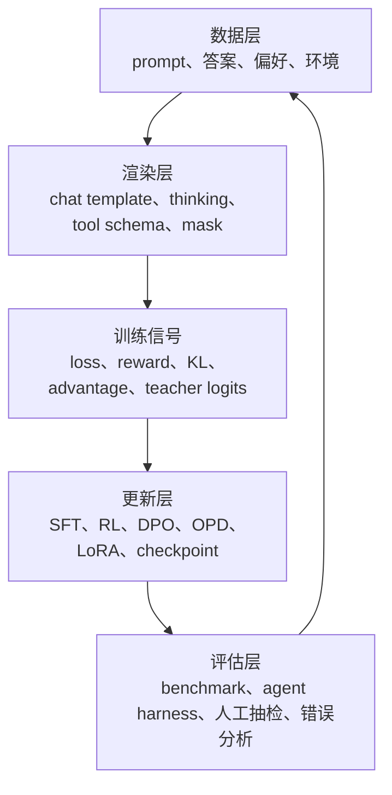
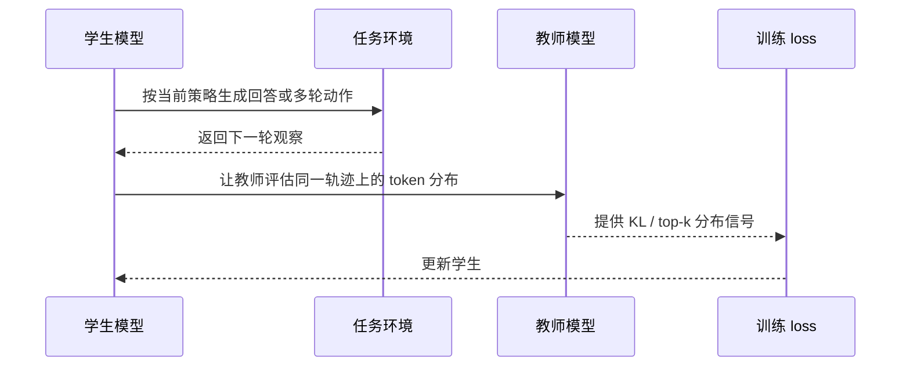

# 10 分钟快速入门

这章只做一件事：让你在十分钟内知道 LLM post-training 的地图。你暂时不用记公式，也不用急着分清每篇论文里的细节。先建立一个更重要的判断力：当一个模型出现能力问题时，应该用哪类训练信号去修，而不是看到新算法就直接套。

后训练不是“把模型再训练一下”。它更像一套行为塑形流程：先让基础模型能听懂任务和输出正确格式，再用可验证奖励、偏好数据、教师模型或工具环境，把它推向更强的推理、更稳定的工具使用和更好的产品体验。

如果按 DeepSeek-V4、MiMo-V2-Flash、Kimi K2.5、GLM-5 这些现代公开流程来抽象，标准顺序已经变成：

```text
Base Model
-> 通用 SFT 激活
-> 多领域专家训练：Reasoning RL / Code RL / Agentic RL / General
-> OPD/MOPD 或 cross-stage distillation 合并专家能力
-> General RL 和人类风格对齐
-> 长上下文、QAT、部署与回归评估
```

后面章节会按这个顺序展开。

## 一句话理解 post-training

预训练让模型学会“语言世界的统计规律”。Post-training 让模型学会“在具体任务和人类约束下怎么行动”。这句话很关键，因为很多初学者会把模型的知识能力和行为能力混在一起：一个 base model 可能知道某个数学定理，也可能见过很多代码，但它不一定知道在聊天界面里应该怎样组织答案，更不一定知道遇到工具返回错误时如何恢复。

一个基础模型可能已经知道很多数学、代码和常识，但它不一定知道：

- 用户问问题时应该按什么格式回答；
- 什么时候需要拒绝，什么时候应该追问；
- 推理题应该输出短答案还是完整过程；
- 工具调用应该用哪个 schema；
- 两个都能回答的问题里，哪一个更符合人类偏好；
- 多轮任务里，当前动作会不会影响后面的奖励。

Post-training 的工作就是把这些行为写进模型。写入方式不止一种：能示范的行为用 SFT，能自动判分的能力用 RLVR，难以写规则但能比较好坏的体验用偏好优化，想迁移强模型能力时用蒸馏或 OPD。

## 最小术语表

下面这张表先给直觉，不追求严格论文定义。你可以把它当成导航：看到一个缩写时，先问它使用的训练信号是什么，再问它适合改哪类行为。

| 术语 | 中文理解 | 最常见作用 |
|---|---|---|
| SFT | 监督微调，用“输入 -> 标准答案”训练 | 学格式、风格、任务流程 |
| RL | 强化学习，模型先生成，再按奖励更新 | 学探索、推理、工具使用 |
| RLVR | Reinforcement Learning with Verifiable Rewards | 用可程序验证的奖励训练数学、代码、工具任务 |
| RLHF | 人类反馈强化学习 | 用偏好数据训练 reward model，再用 RL 优化 |
| DPO | Direct Preference Optimization | 不训练显式 reward model，直接从偏好对更新策略 |
| GRPO | Group Relative Policy Optimization | 每题采样一组答案，用组内相对好坏训练 |
| OPD | On-Policy Distillation | 学生先自己在当前策略下生成，再让教师给分布信号 |
| SDFT | Self-Distillation Fine-Tuning | 用模型自身分布约束新任务训练，缓解遗忘 |
| LoRA | 低秩适配器 | 只训练少量参数，降低成本 |
| Renderer | 聊天模板和 token 转换器 | 确保数据格式和模型家族匹配 |

如果只记一个原则：算法名没有训练信号重要。SFT 的信号来自“标准答案”，DPO 的信号来自“chosen 比 rejected 更好”，GRPO/RLVR 的信号来自“环境判分”，OPD 的信号来自“教师在学生轨迹上的分布”。理解了信号来源，你就能判断它为什么有效，也能判断它什么时候会失效。

## 先看一张选择表

| 你遇到的问题 | 首选方法 | 为什么 |
|---|---|---|
| 模型不会按你的业务格式回答 | SFT | 格式和流程是监督学习最擅长的 |
| 模型会答，但风格不像你想要的 | SFT + 偏好优化 | SFT 定方向，偏好优化修细节 |
| 模型数学/代码题会错，但答案可自动判分 | RLVR / GRPO | 可验证奖励比人工标注更直接 |
| 模型回答清晰度、简洁性、帮助性不好平衡 | DPO 或 RLHF | 这些目标通常是“哪个更好”，不是简单对错 |
| 想把强模型的推理能力迁移到小模型 | 蒸馏 / OPD | 教师分布比单个答案包含更多信息 |
| 新任务训练后旧能力掉得厉害 | SDFT 或混合数据 | 用分布约束保留旧能力 |
| 模型要学会查资料、跑代码、操作环境 | 多轮 RL / 工具环境 | 只有环境交互能暴露行动后果 |
| 模型要学会像 agent 一样长期工作 | Agentic RL | 需要真实环境、工具执行、最终验收和长程 credit assignment |
| 多个专家能力互相打架 | OPD / MOPD | 用多教师 on-policy distillation 合并能力，减少顺序训练回退 |

## Post-training 的共同结构

无论 SFT、DPO、RL 还是蒸馏，训练都可以拆成五层。初学者常常只盯着第三层的 loss 或 reward，但真正出问题最多的是第二层和第五层：模板错了，模型看到的 token 就错了；评估错了，训练提升就没有意义。



这也是为什么本教程会反复讲 renderer、mask、parquet、reward function、eval gate 和 transcript。它们看起来不如算法名字显眼，但决定了训练到底是在优化真实目标，还是只是在优化一个写错的代理指标。

## 第一条主线：SFT

SFT 的直觉很简单：给模型看很多正确示范，让它模仿。它最适合做“行为启动”，也就是把 base model 从续写器拉到助手、解题器或工具调用者的模式里。

一个聊天 SFT 样本通常长这样：

```json
{
  "messages": [
    {"role": "system", "content": "你是一个严谨的中文数学助教。"},
    {"role": "user", "content": "解释一下什么是 KL 散度。"},
    {"role": "assistant", "content": "KL 散度衡量两个概率分布之间的差异..."}
  ]
}
```

训练时不一定所有 token 都参与 loss。常见做法是只训练 assistant 的答案，让 user/system 作为条件上下文。这就是 mask 的作用。如果 mask 写错，模型可能会学习复述用户问题，或者把 system prompt 当成要生成的文本。很多 SFT 失败不是模型太差，而是训练 token 根本选错了。

SFT 适合：

- 教模型一个稳定输出格式；
- 注入领域术语和流程；
- 让基础模型获得初始 instruction-following 能力；
- 为后续 RL 或 DPO 提供初始化。

SFT 不适合：

- 仅靠一个标准答案解决“哪个回答更好”的偏好问题；
- 让模型通过探索发现新策略；
- 解决奖励稀疏的多轮交互问题。

## 第二条主线：偏好优化

很多任务没有唯一标准答案。比如：

用户问：“帮我解释 transformer attention。”

两个回答都正确，但一个更清晰、更短、更适合初学者。偏好优化训练的不是“正确答案”，而是“chosen 比 rejected 更好”。

```json
{
  "prompt": "帮我解释 transformer attention",
  "chosen": "attention 可以理解为每个词去看其他词...",
  "rejected": "Attention is all you need. It is a mechanism..."
}
```

DPO、ORPO、SimPO、KTO 都属于这一族思路：把偏好数据变成可优化的 loss。RLHF 则通常先训练 reward model，再用 RL 优化策略。偏好优化不适合替代数学判分或代码测试；它更适合处理“已经能答，但答得还不够好”的产品体验问题。

## 第三条主线：RL / RLVR

RL 的关键差别是：模型不是只模仿已有答案，而是先生成行动，再由环境给奖励。这个“先生成，再评价”的顺序很重要，因为它允许模型发现训练集中没有出现过的新解法。

数学题可以这样训练：

1. 给同一道题采样 8 个答案。
2. 用程序检查 `\boxed{}` 里的数值是否正确。
3. 正确答案 reward = 1，错误 reward = 0。
4. 在同一题的 8 个答案中，优于平均值的更新为正，低于平均值的更新为负。

这就是 GRPO/RLVR 的典型味道。DeepSeek-R1、Qwen3 这类公开路线都说明了同一个方向：当答案可以被验证时，让模型自己探索并用 reward 更新，往往比只模仿固定解法更能提升推理能力。

RL 适合：

- 数学、代码、检索、多轮工具等可验证任务；
- 需要模型自己探索的任务；
- “最终结果”比“模仿过程”更重要的任务。

RL 的风险：

- reward 写错，模型会钻空子；
- KL 控制不好，策略会偏离太远；
- 组内样本全对或全错，学习信号为零；
- 评估不独立，训练看起来涨但泛化失败。

## 第四条主线：蒸馏与 OPD

普通蒸馏可以理解为“拿教师模型生成的数据训练学生”。这通常是 off-policy：数据来自教师或固定数据集，不一定来自学生当前策略。它的优点是简单，缺点是学生只见到教师走过的路，不一定能学会纠正自己会犯的错。

OPD 的不同点是 on-policy：学生先按当前能力生成，然后教师在学生实际走过的轨迹上提供分布/概率信号。这样训练更贴近学生真实会犯的错，也更像 RL，只是奖励信号换成了教师 KL。



这类方法适合把强模型能力迁移到更便宜、更小、更可部署的模型，同时减少纯 SFT 对单一答案的过度拟合。对本教程的 4B 主线来说，蒸馏尤其现实：很多强能力不一定要从零做大规模 RL，可以先从强教师的 verified 数据和 OPD 信号学起。

## 第一周应该怎么学

如果你从零开始，建议按这个顺序：

1. 读 [Post-Training 全景与现代流水线](./01-overview.md)，先理解从 base 到 final model 的顺序和完整地图。
2. 读 [数据、模板与 Renderer](./02-data-rendering.md)，理解为什么 chat template、thinking 和 tool schema 很重要。
3. 读 [SFT](./03-sft.md)，做一个小数据过拟合实验。
4. 读 [评估体系](./09-evaluation.md)，先学会判断模型有没有变好。
5. 再进入 [RL 基础](./04-rl-foundations.md)、[GRPO/RLVR](./05-grpo-rlvr.md) 和 [工具、Agentic RL 与多轮环境](./08-tools-multiturn-agent.md)。

## 如果你想直接动手

本站的实战主线以 `Qwen/Qwen3-4B-Base` 为 base model，用本地 `verl-main` 训练。动手路径是：

1. 读 [从 Qwen3-4B-Base 出发](./13-verl-qwen3-roadmap.md)，看完整训练顺序。
2. 读 [数据、Reward 与 parquet](./14-verl-data-reward.md)，理解 verl 的 SFT、RL、Agentic、偏好数据格式。
3. 跑 [SFT 实战](./15-verl-sft-qwen3.md)，让 base model 学会聊天和答案格式。
4. 跑 [GRPO/RLVR 实战](./16-verl-grpo-rlvr.md)，用可验证奖励训练数学推理。
5. 再读 [OPD、偏好与 Agentic RL](./17-verl-opd-agent-preference.md)，进入教师蒸馏、多教师合并和工具环境训练。

这条路径比“先学所有算法公式”更适合初学者：每读一个概念，就能在 verl 里找到对应的数据字段、训练入口和配置参数。

<div class="checkpoint">

**检查点**

如果你现在能解释“为什么 SFT 的 loss 下降不等于模型能力提升”，你已经理解了 post-training 的第一道门槛。

</div>
